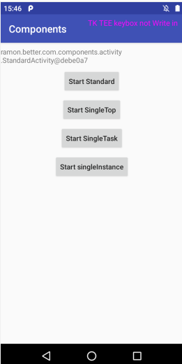

- https://blog.csdn.net/lvxiangan/article/details/42120951
- Android 开发艺术探索 - 第一章

# Activity 的启动模式

Activity 目前有四种启动模式 standard singleTop singleTask singleInstance

1. **standard**:标准模式，每次激活 Activity 时都会创建 Activity 新的实例，并放入任务栈中。

2. **singleTop** ：栈顶复用模式，如果在任务的栈顶正好存在该Activity的实例， 就重用该实例，否者就会创建新的实例并放入栈顶(即使栈中已经存在该Activity实例，只要不在栈顶，都会创建实例)。

3. **singleTask**：栈内复用模式， 如果在栈中已经有该Activity的实例，就重用该实例(会调用实例的onNewIntent())。重用时，会让该实例回到栈顶，因此在它上面的实例将会被移除栈。如果栈中不存在该实例，将会创建新的实例放入栈中。 

4. **singleInstance**：单实例模式， 在一个新栈中创建该Activity实例，并让多个应用共享该栈中的Activity实例。一旦该模式的Activity的实例存在于某个栈中，任何应用再激活该Activity时都会重用该栈中的实例，其效果相当于多个应用程序共享一个应用，不管谁激活该Activity都会进入同一个应用中。


#### Standard 标准模式

创建 StandardActivity 类

```
/**
 * Activity 的四种启动模式
 */
public class StandardActivity extends AppCompatActivity {
   
    @Override
    protected void onCreate(Bundle savedInstanceState) {
        super.onCreate(savedInstanceState);
        setContentView(R.layout.activity_standard);
        init();
    }

    private void init() {
        // 显示当前 Activity 的地址信息
        showAddressTv.setText(StandardActivity.this.toString());
        // 使用 Standard 模式启动 Activity
        standardBtn.setOnClickListener(new View.OnClickListener() {
            @Override
            public void onClick(View view) {
                Intent intent = new Intent(mContext, StandardActivity.class);
                mContext.startActivity(intent);
            }
        });
        // 使用 singleTop 模式启动 Activity
        singleTopBtn.setOnClickListener(new View.OnClickListener() {
            @Override
            public void onClick(View view) {
                Intent intent = new Intent(mContext, SingleTopActivity.class);
                mContext.startActivity(intent);
            }
        });
        // 使用 singleTask 启动模式
        singleTaskBtn.setOnClickListener(new View.OnClickListener() {
            @Override
            public void onClick(View view) {
                Intent intent = new Intent(mContext, SingleTaskActivity.class);
                mContext.startActivity(intent);
            }
        });
        singleInstanceBtn = (Button)findViewById(R.id.single_instance_btn);
        // 使用 singleInstance 启动模式
        singleInstanceBtn.setOnClickListener(new View.OnClickListener() {
            @Override
            public void onClick(View view) {
                Intent intent = new Intent(mContext, SingleInstanceActivity.class);
                startActivity(intent);
            }
        });
    }
}

```

代码非常简单，一个 `TextView` 用来显示当前 `Activity` 实例的地址，另外还有四个 `Button` 用来对应四种启动模式。



> 标准模式下，**一个任务栈中可以有多个实例，每个实例也可以属于不同的任务栈**。 在这种模式下，**谁启动了这个 `Activity`，那么这个 `Activity` 就运行在启动它的那个 `Activity` 所在的栈中（很重要）**。如 `Activity A` 启动了 `Activity B` （B为标准模式），那么 B 就会进入到 A 所在的栈中。

**注意：** 如果我们使用 `ApplicationContext` 去启动 `standard` 模式的 `Activity` 会报错：

```
E/AndroidRuntime: android.util.AndroidRuntimeException: Calling startActivity from outside of an Activity context requires the FLAG_ACTIVITY_NEW_TASK flag. Is this really what you want?
```

因为非 `Activity` 类型的 `Context` (如 `ApplicationContext`)没有任务栈，所以启动就有问题了。

解决方法是为待启动的 `Activity` 指定 `FLAG_ACTIVITY_NEW_TASK` 标志位，这样在启动的时候就会为它创建一个新的任务栈「这种效果实际就是 `singleTask` 模式启动」


接下来我们测试我们的实例，连续点击 3次 `Start StandardActivity` -> `StandardActivity` -> `StandardActivity`

> 运行 adb dumpsys activity 查看栈的情况

```
#0 TaskRecord{b73f930 #50 A=ramon.better.com.components U=0 StackId=25 sz=4} type=standard mode=fullscreen
     #3 ActivityRecord{237a932 u0 ramon.better.com.components/.activity.StandardActivity t50} type=standard mode=fullscreen
     #2 ActivityRecord{cfdc293 u0 ramon.better.com.components/.activity.StandardActivity t50} type=standard mode=fullscreen
     #1 ActivityRecord{2195c5d u0 ramon.better.com.components/.activity.StandardActivity t50} type=standard mode=fullscreen
     #0 ActivityRecord{4093a72 u0 ramon.better.com.components/.activity.StandardActivity t50} type=standard mode=fullscreen
```

#### singleTop 栈顶复用模式

同样的我们继续创建一个页面， `SingleTopActivity` 类（注意在 `AndroidManifest.xml` 中指定它的启动模式为 `singleTop`）

```
public class SingleTopActivity extends AppCompatActivity {
    private static final String TAG = "SingleTopActivityTag";
    private TextView showAddressTv;
    private Button singleTopBtn;
    private Context mContext;
    @Override
    protected void onCreate(Bundle savedInstanceState) {
        super.onCreate(savedInstanceState);
        Log.i(TAG, "onCreate called");
        setContentView(R.layout.activity_single_top);
        init();
    }

    @Override
    protected void onStart() {
        super.onStart();
        Log.i(TAG, "onStart called");
    }

    @Override
    protected void onResume() {
        super.onResume();
        Log.i(TAG, "onResume called");
    }

    // 第一次启动不会调用这个，后续启动如果 Activity 在栈顶，会调用这个方法
    @Override
    protected void onNewIntent(Intent intent) {
        super.onNewIntent(intent);
        Log.i(TAG, "onNewIntent called");
    }

    private void init() {
        mContext = SingleTopActivity.this;
        showAddressTv = (TextView) findViewById(R.id.address_show_tv);
        // 显示当前 Activity 的地址信息
        showAddressTv.setText(mContext.toString());

        singleTopBtn = (Button)findViewById(R.id.single_top_btn);
        singleTopBtn.setOnClickListener(new View.OnClickListener() {
            @Override
            public void onClick(View view) {
                Intent intent = new Intent(mContext, SingleTopActivity.class);
                startActivity(intent);
            }
        });
    }
}
```
`Activity` 如果在栈顶，它不会被重新创建，直接会被拿来使用。`onNewIntent` 方法被回调（注意 `onCreate`、`onStart` 方法不会被系统调用）。

测试实例，点击 `StartSingleTop` -> `StartSingleTop` -> `StartSingleTop`

```
#0 TaskRecord{a5f3fc5 #51 A=ramon.better.com.components U=0 StackId=26 sz=2} type=standard mode=fullscreen
     #1 ActivityRecord{240e7e0 u0 ramon.better.com.components/.activity.SingleTopActivity t51} type=standard mode=fullscreen
     #0 ActivityRecord{a475bb9 u0 ramon.better.com.components/.activity.StandardActivity t51} type=standard mode=fullscreen
```

观察结果我们发现，栈中只有两个实例，`StandardActivity` 和 `SingleTopActiivty`，我们点击了三次，但是只有一个，说明它被复用了。

#### singleTask 栈内复用模式

创建 `singleTaskActivity` 类

```
public class SingleTaskActivity extends AppCompatActivity {

    private static final String TAG = "SingleTaskActivityTag";
    private TextView showAddressTv;
    private Button singleTopBtn;
    private Button singleTaskBtn;
    private Context mContext;
    @Override
    protected void onCreate(Bundle savedInstanceState) {
        super.onCreate(savedInstanceState);
        Log.i(TAG, "onCreate called");
        setContentView(R.layout.activity_single_task);
        init();
    }

    @Override
    protected void onStart() {
        super.onStart();
        Log.i(TAG, "onStart called");
    }

    @Override
    protected void onResume() {
        super.onResume();
        Log.i(TAG, "onResume called");
    }

    // 第一次启动不会调用这个，后续启动如果 Activity 在栈顶，会调用这个方法
    @Override
    protected void onNewIntent(Intent intent) {
        super.onNewIntent(intent);
        Log.i(TAG, "onNewIntent called");
    }

    private void init() {
        mContext = SingleTaskActivity.this;
        showAddressTv = (TextView) findViewById(R.id.address_show_tv);
        // 显示当前 Activity 的地址信息
        showAddressTv.setText(mContext.toString());

        singleTopBtn = (Button)findViewById(R.id.single_task_btn);
        singleTopBtn.setOnClickListener(new View.OnClickListener() {
            @Override
            public void onClick(View view) {
                Intent intent = new Intent(mContext, SingleTaskActivity.class);
                startActivity(intent);
            }
        });

        singleTaskBtn = (Button) findViewById(R.id.standard_btn);
        singleTaskBtn.setOnClickListener(new View.OnClickListener() {
            @Override
            public void onClick(View view) {
                Intent intent = new Intent(mContext, StandardActivity.class);
                startActivity(intent);
            }
        });
    }
}

```

`StandardActivity  -> SingleTaskActivity -> StandardActivity`

此时的任务栈如下：

```
#0 TaskRecord{fe2917c #48 A=ramon.better.com.components U=0 StackId=23 sz=3} type=standard mode=fullscreen
     #2 ActivityRecord{11cbf57 u0 ramon.better.com.components/.activity.StandardActivity t48} type=standard mode=fullscreen
     #1 ActivityRecord{28e2181 u0 ramon.better.com.components/.activity.SingleTaskActivity t48} type=standard mode=fullscreen
     #0 ActivityRecord{60109ee u0 ramon.better.com.components/.activity.StandardActivity t48} type=standard mode=fullscreen
```

此时栈内有三个 `Activity` ，我们再次启动  `SingleTaskActivity` 结果如下：

```
#0 TaskRecord{fe2917c #48 A=ramon.better.com.components U=0 StackId=23 sz=2} type=standard mode=fullscreen
     #1 ActivityRecord{28e2181 u0 ramon.better.com.components/.activity.SingleTaskActivity t48} type=standard mode=fullscreen
     #0 ActivityRecord{60109ee u0 ramon.better.com.components/.activity.StandardActivity t48} type=standard mode=fullscreen
```

很明显可以看到栈内只有两个元素了，`SingleTaskActivity` 到了栈顶，而它上面的 `StandardActivity` 出栈了。（`SingleTaskActivity` 的 `onNewIntent` 方法会被调用）

> `Activity` 默认运行在默认的任务栈，也就是「包名」指定的任务栈，我们也可以通过 `TaskAffinity` 来指定 `Activity` 所需的任务栈，这个属性值不能和包名相同，否则就相当于没指定。后面详细介绍这个属性。

#### singleInstance 单实例模式

创建 `SingleInstanceActivity` 类

```
public class SingleInstanceActivity extends AppCompatActivity {
    private static final String TAG = "SingleInstanceTag";
    private TextView showAddressTv;
    private Button standardBtn;
    private Button singleInstanceBtn;
    private Context mContext;
    @Override
    protected void onCreate(Bundle savedInstanceState) {
        Log.i(TAG, "onCreate called");
        super.onCreate(savedInstanceState);
        setContentView(R.layout.activity_single_instance);
        init();
    }

    @Override
    protected void onStart() {
        super.onStart();
        Log.i(TAG, "onStart called");
    }

    @Override
    protected void onResume() {
        super.onResume();
        Log.i(TAG, "onResume called");
    }

    // 第一次启动不会调用这个，后续启动如果 Activity 在栈顶，会调用这个方法
    @Override
    protected void onNewIntent(Intent intent) {
        super.onNewIntent(intent);
        Log.i(TAG, "onNewIntent called");
    }

    private void init() {
        mContext = SingleInstanceActivity.this;
        showAddressTv = findViewById(R.id.address_show_tv);
        showAddressTv.setText(SingleInstanceActivity.this.toString());
        standardBtn = (Button) findViewById(R.id.standard_btn);
        standardBtn.setOnClickListener(new View.OnClickListener() {
            @Override
            public void onClick(View view) {
                Intent intent = new Intent(mContext, StandardActivity.class);
                mContext.startActivity(intent);
            }
        });
        singleInstanceBtn = (Button) findViewById(R.id.single_instance_btn);
        singleInstanceBtn.setOnClickListener(new View.OnClickListener() {
            @Override
            public void onClick(View view) {
                Intent intent = new Intent(mContext, SingleInstanceActivity.class);
                mContext.startActivity(intent);
            }
        });
    }
}
```


测试实例: `StandardActivity -> StartSingleInstanceActivity`

```
#0 TaskRecord{6b51022 #54 A=ramon.better.com.components U=0 StackId=29 sz=1} type=standard mode=fullscreen
     #0 ActivityRecord{2d4be37 u0 ramon.better.com.components/.activity.SingleInstanceActivity t54} type=standard mode=fullscreen
   #3 ActivityStack{45c9886 stackId=28 type=standard mode=fullscreen visible=false translucent=true, 1 tasks} type=standard mode=fullscreen
    #0 TaskRecord{3fce0c8 #53 A=ramon.better.com.components U=0 StackId=28 sz=1} type=standard mode=fullscreen
     #0 ActivityRecord{cb39723 u0 ramon.better.com.components/.activity.StandardActivity t53} type=standard mode=fullscreen
```
我们发现创建了一个新的任务栈，此时有两个任务栈， `stackId = 28 `和 `stackId = 29`

#### 其他情况： 第一种

假设目前有两个任务栈，前台任务栈的情况为 `AB`，后台任务栈的情况为 `CD`，（假设 `CD `的启动模式都是 `singleTask`）现在请求启动 `D`，那么整个后台任务栈都会被切换到前台，这个时候后退列表变成了 `ABCD`，按 back 会按顺序出栈。


如果请求启动的是 `C` 那么结果如下图


`singleTask` 模式的 `Activity` 切换到栈顶会导致它上面的 `Activity` 出栈。


#### 其他情况： 第二种

`TaskAffinity` 可以为 `Activity` 指定任务栈的名字，默认的名字是包名。 `TaskAffinity` 主要和 `singleTask` 启动模式或者 `allowTaskReparenting` 属性配合使用，其他情况下没有意义（标准模式指定的话相当于就是换了个默认的名字没有意义，`SingleTop` 指定的话类似于 `singleInstance`。`SingleInstance` 默认就会创建新栈，不用指定）

当 `TaskAffinity` 和 `singleTask` 启动模式配合使用的时候，待启动的 `Activity` 会运行在名字和 `TaskAffinity` 相同的任务栈中。

**TaskAffinity 和 allowTaskReparenting 结合使用**

当一个应用 `A` 启动了应用 `B` 的某个 `Activity` 后，如果这个 `Activity` 的 `allowTaskReparenting` 属性为 `true` 的话，那么当应用 `B` 被启动后，此 `Activity` 会直接从应用 `A` 的任务栈转移到 `B` 的任务栈中。

例： 假如有两个应用 `A` 和 `B`， `A` 启动了 `B` 的 `Activity C`，然后按 `Home` 回到桌面，单后点击 `B` 的桌面图标，**注意：这个时候并不是启动了 B 的主 Activity**，而是重新显示了已经被应用 `A` 启动的 `Activity C` 「或者说 `C` 从 `A` 的任务栈转移到了 `B` 的任务栈中。」

这么理解，由于 `A` 启动了 `C`，所以 `C` 只能运行在 `A` 的任务栈中，但是 `C` 属于 `B` 的应用，它的 `TaskAffinity` 值肯定不可能和 `A` 的任务栈相同，所以，当 `B` 被创建后， `B` 会创建自己的任务栈，这个时候系统发现 `C` 原本想要的任务栈已经被创建了，所以就把 `C` 从 `A` 的任务栈转移到 `B` 的任务栈中了。

> `allowTaskReparenting` 的主要作用是 `activity` 的迁移，即从一个 `task` 迁移到另一个 `task`，这个迁移跟 `activity` 的 `taskAffinity` 有关，必须是从一个跟该 `activity  taskAffinity` 不同的 `task` 中迁移到跟它 `taskAffinity` 相同的 `task` 中.

> 源码中的位置 ： `resetTaskIfNeededLocked` 方法


#### 如何为 Activity 指定启动模式

第一种：通过 `AndroidMenifest.xml` 指定

```
<activity
    android:name=".activity.SingleTaskActivity"
    android:launchMode="singleTask">
</activity>
```

第二种： 在 `Intent` 中设置标志位来为 `Activity` 指定启动模式

```
Intent intent = new Intent();
intent.setClass(MainActivity.this, SecondActivity.class);
intent.addFlags(Intent.FLAG_ACTIVITY_NEW_TASK);
```

两种方法的区别：
- 1、优先级上，第二种方式高于第一种方式。
- 2、两种方式限定范围上有所不同： 比如，第一种方式无法直接为 `Activity` 设定 `FLAG_ACTIVITY_CLEAR_TOP` 标识，而第二种方式无法为 `Activity` 指定 `singleInstance` 模式。

#### Activity 常用 Flag

- `FLAG_ACTIVITY_NEW_TASK`
    - 作用是为 `Activity` 指定 `singleTask` 启动模式，其效果和在 xml 中指定相同。

- `FLAG_ACTIVITY_SINGLE_TOP`
    - 作用是为 `Activity` 指定 `singleTop` 启动模式，其效果和在 xml 中相同。

- `FLAG_ACTIVITY_CLEAR_TOP`

例： 如果已经启动了四个 `Activity`：`A，B，C` 和 `D`。在 `D Activity` 里，我们要跳到 `B Activity`，同时希望 `C finish`掉，可以在 `startActivity(intent)` 里的 `intent` 里添加 `flags` 标记，如下所示：

```
Intent intent = new Intent(this, B.class);   
intent.setFlags(Intent.FLAG_ACTIVITY_CLEAR_TOP);  
startActivity(intent);  
```
这样启动 `B Activity`，就会把 `D，C` 都 `finished` 掉，如果你的 `B Activity` 的启动模式是默认的（`standard`） ，则 `B Activity` 会 `finished` 掉，再启动一个新的 `Activity B`。  如果不想重新再创建一个新的 `B Activity`，则在上面的代码里再加上：

```
intent.addFlags(Intent.FLAG_ACTIVITY_SINGLE_TOP);  
```
这样 `B Activity` 就不会再创建一个新的了，而是会重用之前的 `B Activity`，同时调用 `B Activity` 的 `onNewIntent()` 方法。

如果 `B Activity` 是 `SingleTask 启动模式`, 则会调用 B 的 `OnNewIntent` 方法。

- `FLAG_ACTIVITY_EXCLUDES_FROM_RECENTS`
    -  某些情况下我们不希望用户通过历史列表回到我们的 `Activity` 的时候这个标记比较有用，它等同于在 `XML` 为 `Activity` 指定 `android：excludeFromRecents="true"`
	
例子源码：[ActivityDemo](./ActivityDemo)
