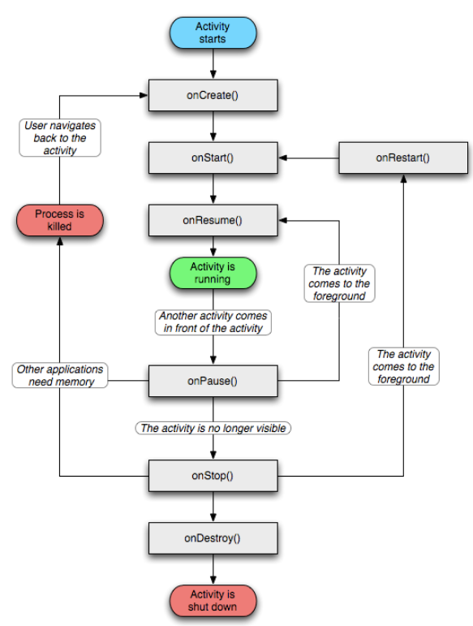
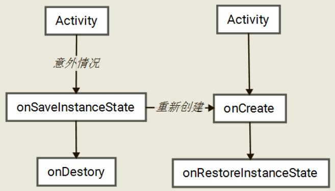
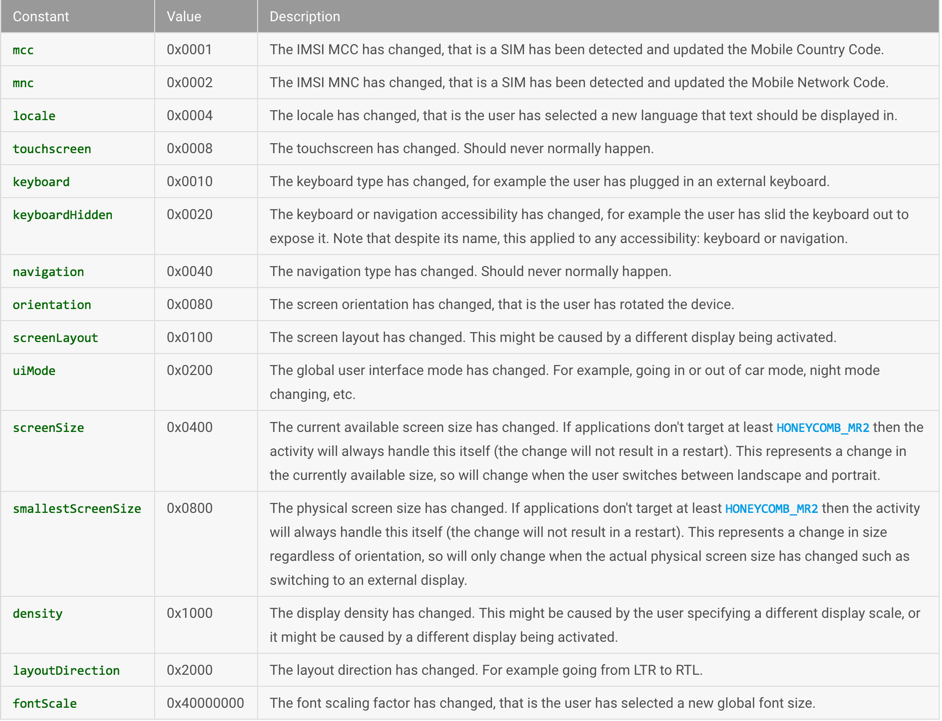

- Android 开发艺术探索 - 第一章

# Activity 的生命周期

Activity 作为四大组件之一，主要用来显示界面，用于和用户交互。下面分别介绍**典型情况下的生命周期**和**异常情况下的生命周期**。

## 典型情况下的生命周期
典型情况下的生命周期指的是有用户参与的情况下Activity所经历的生命周期。

**在正常情况下，Activity会经历如下生命周期。**

- 1.**onCreate**:表示Activity正在创建，这是生命周期的第一个方法，在这个方法中，我们可以做一些初始化的工作，比如调用setContentView去加载布局资源、初始化Activity所需的数据。
- 2.**onRestart**：表示Activity正在重新启动。一般情况下，当当前Activity从不可见状态变成可见状态时，onRestart就会调用。比如用户按Home键切换到桌面或者用户打开了一个新的Activity，这时当前的Activity就会暂停，也就是执行 onPause和onStop，接着用户又回到这个Activity。
- 3.**onStart**：表示Activity正在被启动，即将开始，这时Activity已经可见了，但是还没有出现在前台，无法与用户交互。可以理解为Activity已经显示，但是我们看不到。
- 4.**onResume**：表示Activity已经可见了，并且出现在前台并开始活动，要注意这个和onStart对比，他们都表示Activity已经可见，但是onStart的时候Activity还在后台，onResume的时候才显示到前台。
- 5.**onPause**：表示Activity正在停止，正常情况下，接着onStop就会执行，在特殊情况下，如果这个时候快速的再回到当前Activity，那么onResume就会被调用，这种操作用户很难重现。在这个方法里可以做一些存储数据、停止动画的工作，但是注意不能太耗时，因为会影响到新Activity的显示，onPause必须先执行完，新Activity的onResume才会执行。（源码中执行顺序是这样的）
- 6.**onStop**：表示Activity即将停止，可以做一些稍微重量级的回收工作，同样不能太耗时。
- 7.**onDestroy**：表示Activity即将被销毁，这是Activity生命周期中的最后一个回调，可以在这里做一些回收和资源释放。

Activity 的生命周期如下图：



#### 创建工程 LifeCycle 创建 ActivityLifeCycle.java
```
public class ActivityLifeCycle extends AppCompatActivity {

    private static final String TAG = "ActivityLifeCycleLog";
    private Context context = this;
    private int param = 1;

    //Activity创建时被调用
    @Override
    public void onCreate(Bundle savedInstanceState) {
        super.onCreate(savedInstanceState);
        Log.i(TAG, "onCreate called.");

        setContentView(R.layout.activity_life_cycle);

        Button btn = (Button) findViewById(R.id.btn);
        btn.setOnClickListener(new View.OnClickListener() {
            @Override
            public void onClick(View v) {
                Intent intent = new Intent(context, TargetActivity.class);
                startActivity(intent);
            }
        });
    }

    //Activity创建或者从后台重新回到前台时被调用
    @Override
    protected void onStart() {
        super.onStart();
        Log.i(TAG, "onStart called.");
    }

    //Activity从后台重新回到前台时被调用
    @Override
    protected void onRestart() {
        super.onRestart();
        Log.i(TAG, "onRestart called.");
    }

    //Activity创建或者从被覆盖、后台重新回到前台时被调用
    @Override
    protected void onResume() {
        super.onResume();
        Log.i(TAG, "onResume called.");
    }

    //Activity被覆盖到下面或者锁屏时被调用
    @Override
    protected void onPause() {
        super.onPause();
        Log.i(TAG, "onPause called.");
        //有可能在执行完onPause或onStop后,系统资源紧张将Activity杀死,所以有必要在此保存持久数据
    }

    //退出当前Activity或者跳转到新Activity时被调用
    @Override
    protected void onStop() {
        super.onStop();
        Log.i(TAG, "onStop called.");
    }

    //退出当前Activity时被调用,调用之后Activity就结束了
    @Override
    protected void onDestroy() {
        super.onDestroy();
        Log.i(TAG, "onDestory called.");
    }
}
```

- (1)第一次启动
```
ActivityLifeCycleLog: onCreate called.
ActivityLifeCycleLog: onStart called.
ActivityLifeCycleLog: onResume called.
```
- (2)当用户打开新的 Activity 或者回到桌面的时候

```
ActivityLifeCycleLog: onPause called.
ActivityLifeCycleLog: onStop called.
```
> 这里有一种特殊情况，如果新 Activity 采用了透明主题，那么当前Activity不会调用 onStop

- (3)当用户再次回到原Activity
```
ActivityLifeCycleLog: onRestart called.
ActivityLifeCycleLog: onStart called.
ActivityLifeCycleLog: onResume called.
```
- (4)当用户按下back键时
```
ActivityLifeCycleLog: onPause called.
ActivityLifeCycleLog: onStop called.
ActivityLifeCycleLog: onDestory called.
```
- (5)当 `Activity`被系统回收后再次打开，生命周期方法和(1)一样，**注意只是生命周期方法一样，不代表所有过程都一样**，下面会讲到。
- (6)从整个生命周期来说，`onCreate` 和 `onDestroy` 是配对的，分表标志着 `Activity` 的创建和销毁，并且只可能有一次调用。从 `Activity` 是否可见来说，`onStart` 和 `onStop` 是配对的，随着用户操作或者屏幕亮灭可能被调用多次；从 `Activity` 是否在前台，`onResume` 和 `onPause` 是配对的，随着用户操作或者屏幕亮灭可能被调用多次。

对上面生命周期的两个问题：

> 问题1：`onStart` 和 `onResume` 、` onPause` 和 `onStop` 从描述上来看差不多，对我们来说有什么实质性不同？

从实际使用过程中来说，`onStart` 和 `onResume` 、`onPause` 和 `onStop` 看起来确实差不多，甚至我们可以只保留其中一对，比如只保留 `onStart` 和 `onStop` 。`onStart` 和 `onStop` 是从 `Activity` 是否可见这个角度来回调的，`onResume` 和 `onPause` 是从 `Activity` 是否位于前台的角度回调的，除了这种区别，在实际使用中，并没有其他的明显区别。

> 问题2：假设当前 Activity 为A,如果这时用户打开一个新的Activity B，那么B的 onResume 和 A 的 onPause 那个先调用？

答案是： `onPause` 在 `onRsume` 前调用，这里不详细讲


## 异常情况下的生命周期

在介绍异常情况生命周期之前我们先来了解几个方法

```
 //Activity窗口获得或失去焦点时被调用,在onResume之后或onPause之后
    @Override
    public void onWindowFocusChanged(boolean hasFocus) {
    	super.onWindowFocusChanged(hasFocus);
    	Log.i(TAG, "onWindowFocusChanged called.");
    }

    /**
     * Activity被系统杀死时被调用.
     * 例如:屏幕方向改变时,Activity被销毁再重建;当前Activity处于后台,系统资源紧张将其杀死.
     * 另外,当跳转到其他Activity或者按Home键回到主屏时该方法也会被调用,系统是为了保存当前View组件的状态.
     * 在onPause之前被调用.
     */
    @Override
    protected void onSaveInstanceState(Bundle outState) {
        outState.putInt("param", param);
        Log.i(TAG, "onSaveInstanceState called. put param: " + param);
        super.onSaveInstanceState(outState);
    }

    /**
     * Activity被系统杀死后再重建时被调用.
     * 例如:屏幕方向改变时,Activity被销毁再重建;当前Activity处于后台,系统资源紧张将其杀死,用户又启动该Activity.
     * 这两种情况下onRestoreInstanceState都会被调用,在onStart之后.
     */
    @Override
    protected void onRestoreInstanceState(Bundle savedInstanceState) {
        param = savedInstanceState.getInt("param");
        Log.i(TAG, "onRestoreInstanceState called. get param: " + param);
        super.onRestoreInstanceState(savedInstanceState);
    }
```
- **onWindowFocusChanged方法**：
    - (1)在Activity窗口获得或失去焦点时被调用，例如创建时首次呈现在用户面前；
    - (2)当前Activity被其他Activity覆盖,当前Activity转到其他Activity
    - (3)按Home键回到主屏，自身退居后台；
    - (4)用户退出当前Activity。
    - 以上几种情况都会调用onWindowFocusChanged，并且当Activity被创建时是在onResume之后被调用，当Activity被覆盖或者退居后台或者Activity退出时，它是在onPause之后被调用

```
ActivityLifeCycleLog: onCreate called.
ActivityLifeCycleLog: onStart called.
ActivityLifeCycleLog: onResume called.
ActivityLifeCycleLog: onWindowFocusChanged called.
ActivityLifeCycleLog: onPause called.
ActivityLifeCycleLog: onWindowFocusChanged called.
```
这个方法在某种场合下还是很有用的，例如程序启动时想要获取视特定视图组件的尺寸大小，在`onCreate`中可能无法取到，因为窗口`Window`对象还没创建完成，这个时候我们就需要在`onWindowFocusChanged`里获取；当试图在`onCreate`里加载`frame`动画会失败，因为窗口`Window`对象没有初始化完成，需要在`onWindowFocusChanged`中加载。

[Android动画之Frame Animationhttps](://blog.csdn.net/liuhe688/article/details/6657776)

- **onSaveInstanceState**：
    - (1)在Activity被覆盖或退居后台之后，系统资源不足将其杀死，此方法会被调用；
    - (2)在用户改变屏幕方向时，此方法会被调用；
    - (3)在当前Activity跳转到其他Activity或者按Home键回到主屏，自身退居后台时，此方法会被调用。
    - 第一种情况我们无法保证什么时候发生，系统根据资源紧张程度去调度；第二种是屏幕翻转方向时，系统先销毁当前的Activity，然后再重建一个新的，调用此方法时，我们可以保存一些临时数据；第三种情况系统调用此方法是为了保存当前窗口各个View组件的状态。onSaveInstanceState的调用顺序是在onPause之前。

- **onRestoreInstanceState**：
    - (1)在Activity被覆盖或退居后台之后，系统资源不足将其杀死，然后用户又回到了此Activity，此方法会被调用；
    - (2)在用户改变屏幕方向时，重建的过程中，此方法会被调用。我们可以重写此方法，以便可以恢复一些临时数据。
    - onRestoreInstanceState的调用顺序是在onStart之后。

#### 1.资源相关的系统配置发生改变导致Activity被杀死重建

当系统配置发生改变时， Activity 就会被销毁并重建，其生命周期如下图：



当系统的配置发生改变后，Activity 会异常销毁，其 onpase onstop ondestroy 均会被调用，同时由于Activity是异常情况下终止的， onSaveInstanceState 会来保存当前 Activity 的状态。（调用时机是在 onStop 之前）

注意：onSaveInstanceState 方法只会在Activity被异常终止的情况下调用，当Activity被重建时，OnRestoreInstanceState 会被调用，并且会把 onStateInstanceState 方法保存的 Bundle 对象作为参数同时传递给 onRestoreInstanceState 和 onCreate 方法。（可以通过 Bundle 对象判断Activity是否被重建了，onRestoreInstanceState 的调用时机是在 onStart 之后）

> 默认在 onSaveInstanceState 和 onRestoreInstanceState 方法中，系统为我们做了一定的恢复工作，如文本框中输入的数据，ListView滚动的位置。

#### 2.资源内存不足导致低优先级的 Activity 被销毁
Activity 的优先级按照从高到低可以分为如下三种：

- 前台Activity-- 正在和用户交互的 Activity，优先级最高。

- 可见但非前台 Activity -- 比如 Activity 中弹出了一个对话框，导致 Activity 可见但是位于后台无法与用户直接交互。

- 后台 Activity -- 已经被暂停的 Activity ，比如执行了 onStop，优先级最低。

当系统内存不足时，系统会优先杀死低优先级的 Activity 所在的进程。然后也会执行 onSaveInstanceState 和 onRestoreInstanceState 方法。

如何在系统配置改变的时候，不想让系统重新创建 Activity，我们可以给 Activity 指定下面这个属性。
```
android:configChanges = "orientation"
```
上面的配置表示 Activity 在屏幕旋转的时候不重新创建。

下面是ConfigChanges 表



其实我们常用的只有 `orientation locale keyboardHidden` (注意我们在使用 `orientation` 的时候一般还要指定 `screensize`，因为在旋转屏幕的时候，屏幕的 `size` 尺寸会发生变化，API 13 后添加的)

例子源码：[ActivityDemo](./ActivityDemo)
