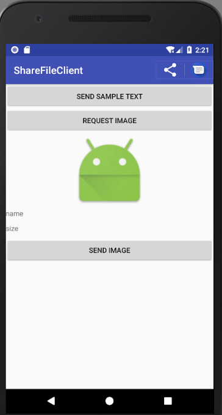
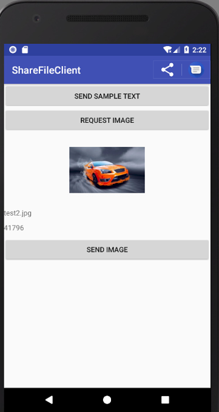

- http://hukai.me/android-training-course-in-chinese/building-content-sharing.html
- [FileProvider 的使用](https://www.jianshu.com/p/55eae30d133c)

## 共享简单数据

#### 发送文本内容

`ACTION_SEND` 操作最直接和最常见的用途是将文本内容从一个活动发送到另一个活动。

```
Intent sendIntent = new Intent();
sendIntent.setAction(Intent.ACTION_SEND);

sendIntent.putExtra(Intent.EXTRA_TEXT, "This is my text to send.");
sendIntent.setType("text/plain");

// 始终显示一个应用选择界面，即使先前选择了默认应用
startActivity(Intent.createChooser(sendIntent, getResources().getText(R.string.send_to)));
```
#### 接收文本内容：

对 `AndroidManifest.xml` 文件做如下配置
```
<activity android:name=".ShareServerActivity">
    <intent-filter>
        <action android:name="android.intent.action.SEND" />
        <category android:name="android.intent.category.DEFAULT" />
        <data android:mimeType="image/*" />
    </intent-filter>
    <intent-filter>
        <action android:name="android.intent.action.SEND" />
        <category android:name="android.intent.category.DEFAULT" />
        <data android:mimeType="text/plain" />
    </intent-filter>
    <intent-filter>
        <action android:name="android.intent.action.SEND_MULTIPLE" />
        <category android:name="android.intent.category.DEFAULT" />
        <data android:mimeType="image/*" />
    </intent-filter>
</activity>
```

处理 intent 传入的内容，需要考虑到这项活动可以从系统的其他部分（例如launcher）启动，在检查意图时就需要考虑到这一点，如下代码的 else 部分，用来处理你可能从其他部分启动的情况。
```
protected void onCreate(Bundle savedInstanceState) {
    ...
    Intent intent = getIntent();
    String action = intent.getAction();
    String type = intent.getType();
    if (Intent.ACTION_SEND.equals(action) && type != null) {
        if ("text/plain".equals(type)) {
            handleSendText(intent); // Handle text being sent
        } else if (type.startsWith("image/")) {
            handleSendImage(intent); // Handle single image being sent
        }
    } else if (Intent.ACTION_SEND_MULTIPLE.equals(action) && type != null) {
        if (type.startsWith("image/")) {
            handleSendMultipleImages(intent); // Handle multiple images being sent
        }
    } else {
        // 处理从其他地方启动，例如从 launcher
    }
}
```

## 分享二进制数据

#### 发送二进制内容

发送二进制数据是通过将 URI 放到 EXTRA_STREAM 中实现数据共享的。 这通常用于共享图像，但可用于共享任何类型的二进制内容：

```
Intent shareIntent = new Intent();
shareIntent.setAction(Intent.ACTION_SEND);
shareIntent.putExtra(Intent.EXTRA_STREAM, uriToImage);
shareIntent.setType("image/jpeg");
startActivity(Intent.createChooser(shareIntent, getResources().getText(R.string.send_to)));
```

上面的代码中我们需要创建一个uirToImage, 这个是比较关键的一步，在Android 7.0 之前我们可以使用如下方法创建这个URI

```
Uri uirToImage = Uri.fromFile(File file);
```

这个方法在 7.0 及以上运行会报错 `FileUriExposedException` ，android7.0 对于系统权限作了一些更改，为了提高私有文件的安全性，当我们在访问文件的时候，安卓禁止你的应用外部公开 `file://uri`

> 处理的应用程序需要访问Uri指向的数据的权限。推荐的方法是：

> ① 将数据存储在您自己的 ContentProvider 中，确保其他应用程序具有访问您的provider的正确权限。提供访问的首选机制是使用 per-URI 权限，这是临时的，只允许访问接收应用程序。像这样创建一个 ContentProvider 的简单方法是使用 FileProvider 类。

> ② 使用系统 MediaStore。 MediaStore 主要针对视频，音频和图像 MIME 类型，但是从Android 3.0（API级别11）开始，它还可以存储非媒体类型（有关更多信息，请参阅MediaStore.Files）。可以使用 scanFile() 将文件插入到 MediaStore 中，一旦添加到系统 MediaStore，设备上的任何应用程序都可以访问该内容。

#### 使用 FileProvider 类

FileProvider 使用大概分为以下几个步骤：

1. manifest 中申明 FileProvider
2. res/xml 中定义对外暴露的文件夹路径
3. 生成 content:// 类型的 Uri
4. 给 Uri 授予临时权限
5. 使用 Intent 传递 Uri


- 在Manifest中指定provider

```
<provider
    android:name="android.support.v4.content.FileProvider"
    android:authorities="google.trainging.com.sharefileclient.fileprovider"
    android:exported="false"
    android:grantUriPermissions="true">
    <meta-data
        android:name="android.support.FILE_PROVIDER_PATHS"
        android:resource="@xml/filepaths" />
</provider>
```
> android:name：provider 你可以使用 v4 包提供的 FileProvider，或者自定义您自己的，只需要在 name 申明就好了，一般使用系统的就足够了。
`android:authorities`：类似 schema，命名空间之类，后面会用到。
`android:exported`：false 表示我们的 provider 不需要对外开放。
`android:grantUriPermissions`：申明为true，你才能获取临时共享权限。
`<provider>`的`<meta-data>`子元素指向一个 XML 文件，该文件指定要共享的目录。

- `res/xml` 中定义对外暴露的文件夹路径：新建 `filepaths.xml`

```
<paths>
    <files-path path="images/" name="myimages" />
</paths>
```
> name：一个引用字符串。
path：文件夹“相对路径”，完整路径取决于当前的标签类型。
path可以为空，表示指定目录下的所有文件、文件夹都可以被共享。

**paths 的类型**

|标签|物理路径|
|-|:-:|
|`<files-path name="name" path="path" />`|	物理路径相当于 `Context.getFilesDir() + /path/`。|
|`<cache-path name="name" path="path" />`|	物理路径相当于 `Context.getCacheDir() + /path/`。
|`<external-path name="name" path="path" />`|	物理路径相当于 `Environment.getExternalStorageDirectory() + /path/`。
|`<external-files-path name="name" path="path" />`|	物理路径相当于 `Context.getExternalFilesDir(String) + /path/`。
|`<external-cache-path name="name" path="path" />`|	物理路径相当于 `Context.getExternalCacheDir() + /path/`。
|`<root-path name="name" path="path" />`|	物理路径相当于/path/。

如果你想使用外置 SD 卡，可以用这个，官方未公布，源码中有。
注意：external-cache-path 在 support-v4:24.0.0 这个版本并未支持，直到 support-v4:25.0.0 才支持。

- 生成 `content://` 类型的 Uri

我们通常通过File生成Uri的代码是这样：
```
File picFile = xxx;
Uri picUri = Uri.fromFile(picFile);
```

这样生成的Uri，路径格式为 `file://xxx`。这种 Uri 是无法在 App 之间共享的，我们需要生成 `content://xxx` 类型的 Uri，方法就是通过 `Context.getUriForFile` 来实现：

```
Uri imageUri = FileProvider.getUriForFile(
ShareClientActivity.this,
"google.trainging.com.sharefileclient.fileprovider",
shareImage);
```
shareImage：使用的路径需要和你在filepaths.xml申明的其中一个符合(或者子文件夹："images/work")。

> getUriForFile：第一个参数是Context；第二个参数，就是我们之前在manifest#provider中定义的android:authorities属性的值；第三个参数是File。

打印出我们的URI的内容为：

`content://google.trainging.com.sharefileclient.fileprovider/myimages/test1.jpg`

- 给Uri授予临时权限

```
intent.addFlags(Intent.FLAG_GRANT_READ_URI_PERMISSION
| Intent.FLAG_GRANT_WRITE_URI_PERMISSION);
```

`FLAG_GRANT_READ_URI_PERMISSION`：表示读取权限；
`FLAG_GRANT_WRITE_URI_PERMISSION`：表示写入权限。

你可以同时或单独使用这两个权限，视你的需求而定。

- 使用Intent传递Uri

分享图片完整代码：

```
private void sendImage(){
    if(shareImage.exists()){
        Intent intent = new Intent();
        intent.setAction(Intent.ACTION_SEND);
        intent.addCategory("android.intent.category.DEFAULT");
        Uri imageUri;
        //imageUri = Uri.fromFile(shareImage);      // 7.0 禁止向外部公开 file://uri
        imageUri = FileProvider.getUriForFile(
                ShareClientActivity.this,
                "google.trainging.com.sharefileclient.fileprovider",
                shareImage);
        intent.putExtra(Intent.EXTRA_STREAM, imageUri);
        intent.setType("image/jpeg");
        // 授予目录临时共享权限
        intent.addFlags(Intent.FLAG_GRANT_READ_URI_PERMISSION
                | Intent.FLAG_GRANT_WRITE_URI_PERMISSION);
        startActivity(Intent.createChooser(intent,"share image"));
    }
}
```

#### 接收二进制数据

上面介绍了如何使用 Fileprovider 生成图片 uri 并使用 intent 发送数据，这里我们在另一个 Activity 里面来接收并显示图片。

```
private  void handleSendImage(Intent intent){
    Uri returnUri = intent.getParcelableExtra(Intent.EXTRA_STREAM);
    /*7.0 以前可以使用这种方法*/
    //FileInputStream fileInputStream=new FileInputStream(uri.getPath());
    ParcelFileDescriptor mInputPFD = null;
    try {
        mInputPFD = getContentResolver().openFileDescriptor(returnUri, "r");
    } catch (FileNotFoundException e) {
        e.printStackTrace();
    }
    // Get a regular file descriptor for the file
    FileDescriptor fd = mInputPFD.getFileDescriptor();
    Bitmap bm = BitmapFactory.decodeFileDescriptor(fd);
    imageView.setImageBitmap(bm);
}
```

> ParcelFileDescriptor 是可以用于进程间 Binder 通信的 FileDescriptor。支持 stream 写入和 stream 读出


#### 发送多个内容片断

要共享多个内容，使用 `ACTION_SEND_MULTIPLE` 操作以及指向内容的 URI 列表。 MIME 类型因您分享内容的组合而异。

例如，如果共享 3 张 JPEG 图像，则类型仍为 `image/ jpeg`。对于图像类型的混合，它应该是 `image/*` 来匹配处理任何类型的图像的活动。如果你分享了各种各样的类型, 你应该使用`*/*`。例：

```
ArrayList<Uri> imageUris = new ArrayList<Uri>();
imageUris.add(imageUri1); // Add your image URIs here
imageUris.add(imageUri2);

Intent shareIntent = new Intent();
shareIntent.setAction(Intent.ACTION_SEND_MULTIPLE);
shareIntent.putParcelableArrayListExtra(Intent.EXTRA_STREAM, imageUris);
shareIntent.setType("image/*");
startActivity(Intent.createChooser(shareIntent, "Share images to.."));
```


## ActionBar添加一个简单的共享操作

通过在 Android 4.0（API Level 14）中引入 ActionProvider，在 ActionBar 中添加共享操作。 一个 ActionProvider 一旦附加到操作栏中的菜单项，将处理该菜单项的外观和行为。 在使用 ShareActionProvider 的情况下，您只需要提供了一个共享意图，剩下的由 ShareActionProvider 处理。

- 更新菜单声明

要开始使用ShareActionProviders，需要在菜单资源文件中为相应的`<item>`定义`android:actionProviderClass`属性：

```
<?xml version="1.0" encoding="utf-8"?>
<menu xmlns:android="http://schemas.android.com/apk/res/android"
    xmlns:app="http://schemas.android.com/apk/res-auto">
    <item
        android:id="@+id/menu_item_share"
        android:title="Share"
        app:showAsAction="ifRoom"
        app:actionProviderClass=
            "android.support.v7.widget.ShareActionProvider" />
</menu>
```

这将该项目的外观和功能的责任委托给 ShareActionProvider。 但是，你需要告诉 ShareActionProvider 您想分享的内容，也就是设置 intent，下面说明怎么使用。

注意：在新建的 menu 目录下的 xml 文件中有 `android:showAsAction=”never”` 报错
需要引入 `xmlns:app=http://schemas.android.com/apk/res-auto`
并且把 `android:showAsAction=”never”` 修改为 `app:showAsAction=”never”`

- 设置一个分享的Intent

为了使 ShareActionProvider 正常运行，需要给其设置 intent。 此共享意图包括 `ACTION_SEND` 动作和 `EXTRA_TEXT` 和 `EXTRA_STREAM` 等其他额外数据。

要分配一个共享意图，首先找到相应的 MenuItem，同时在您的 Activity 或 Fragment 中加载菜单资源。接下来，调用 `MenuItem.getActionProvider()` 来获得 `ShareActionProvider` 的一个实例。 使用 `setShareIntent()` 根据实际的需求更新与该菜单关联的共享意图。 例：

```
 @Override
public boolean onCreateOptionsMenu(Menu menu) {
    getMenuInflater().inflate(R.menu.main, menu);

    // Locate MenuItem with ShareActionProvider
    MenuItem item = menu.findItem(R.id.menu_item_share);

    // 使用 v7 包时要使用下面的这个方法，使用 item.getActionProvider() 会报错
    mShareActionProvider = (ShareActionProvider) MenuItemCompat.getActionProvider(item);
    Intent sendIntent =new Intent();
    sendIntent.setAction(Intent.ACTION_SEND);
    sendIntent.putExtra(Intent.EXTRA_TEXT,"http://www.baidu.com");
    sendIntent.setType("text/plain");
    setShareIntent(sendIntent);
    return true;
}
```

> 注意:在获取 `ShareActionProvider` 时使用的是 `MenuItemCompat.getActionProvider(item)`方法(这是 v7 包中的方法)，`item.getActionProvider()` 是默认的方法


## 请求分享文件

下面我们来实现一个例子(例子在上一级目录，分两部分 ShareClient 和 ShareServer)，实现类似从图库选取一张图片作为图像的操作，我们需要完成两个应用程序，客户端和服务端。客户端去发送请求，向服务端请求获取图片，服务端使用 Fileprovider 来提供客户端可访问的图片资源列表供客户端选择，选择完成后显示在 imageview 中。如下图所示。






- 客户端发送请求，使用 ACTION_PICK ，代码很简单，如下：

```
private void requestImage(){
    Intent mRequestFileIntent = new Intent(Intent.ACTION_PICK);
    mRequestFileIntent.setType("image/jpg");
    startActivityForResult(mRequestFileIntent,0);
}
```

- 服务端创建 `PickActivity` 并在 `AndroidManifest.xml` 中进行注册，这里也注册一个Fileprovider 用法同上。

```
<provider
    android:name="android.support.v4.content.FileProvider"
    android:authorities="google.trainging.com.sharefileserver.fileprovider"
    android:exported="false"
    android:grantUriPermissions="true">
        <meta-data
            android:name="android.support.FILE_PROVIDER_PATHS"
            android:resource="@xml/filepaths" />
</provider>

<activity
    android:name=".PickActivity"
    android:label="@string/pick_iamge_activity_name">
    <intent-filter>
        <action android:name="android.intent.action.PICK" />
        <category android:name="android.intent.category.DEFAULT" />
        <category android:name="android.intent.category.OPENABLE" />
        <data android:mimeType="text/plain" />
        <data android:mimeType="image/*" />
    </intent-filter>
</activity>
```

> `android.intent.category.OPENABLE` 用来指示可以让一个 `ACTION_GET_CONTENT` 的 intent 访问。

- 创建图片内容把 `res/mipmap` 下的图片文件保存到 `files/images` 下面

```
// 从 mipmap 中读取图片文件
protected  void createImages(){
    mPrivateRootDir = getFilesDir();                              // 获取内部存储根路径
    mImagesDir = new File(mPrivateRootDir, "images");       // 如果 images 文件夹不存在则创建
    if (!mImagesDir.exists()) {
        mImagesDir.mkdirs();
    }
    String[] fileNames = new String[]{"test1.jpg","test2.jpg","test3.jpg"};
    int[] imageIds = new int[]{R.mipmap.test1,R.mipmap.test2,R.mipmap.test3};
    for(int i = 0; i < fileNames.length; i++) {
        File test = new File(mImagesDir, fileNames[i]);
        Bitmap testBitmap = BitmapFactory.decodeResource(getResources(), imageIds[i]);
        saveImages(test, testBitmap);
    }
}

// 保存文件到内部目录
protected  void saveImages(File testFile,Bitmap bitmap){
    FileOutputStream fos = null;
    if (bitmap != null) {
        try {
            fos = new FileOutputStream(testFile);
            // save images to internal storage
            bitmap.compress(Bitmap.CompressFormat.JPEG, 100, fos);
        } catch (FileNotFoundException e) {
            e.printStackTrace();
        }
    }
}
```
- 从`files/images` 读取文件并创建适配器，在 ListView 中显示图片。

```
// 从内部存储读取 image 信息
protected void getData(){
    mImageFiles = mImagesDir.listFiles();
    mImageNames = new ArrayList<>();
    mImageBitmaps = new ArrayList<>();
    for(int i = 0; i < mImageFiles.length; i++){
        try {
            File image = mImageFiles[i];
            if(image.isFile()) {
                // 获取文件的名字
                mImageNames.add(image.getName());
                // 获取文件的 bitmap 对象
                FileInputStream fis = new FileInputStream(image);
                Bitmap bitmap = BitmapFactory.decodeStream(fis);
                mImageBitmaps.add(bitmap);
            }
        } catch (FileNotFoundException e) {
            e.printStackTrace();
        }
    }
}

class  ImagesListAdapter extends BaseAdapter {
    // 得到一个 LayoutInflater 对象用来导入布局
    private LayoutInflater mInflater;

    List<String> names;
    List<Bitmap> bitmaps;

    public ImagesListAdapter(Context context ,List<String> names,List<Bitmap> bitmaps) {
        this.mInflater = LayoutInflater.from(context);
        this.names = names;
        this.bitmaps = bitmaps;
    }
    @Override
    public int getCount() {
        return names.size();
    }

    @Override
    public Object getItem(int position) {
        return null;
    }

    @Override
    public long getItemId(int position) {
        return position;
    }

    @Override
    public View getView(int position, View convertView, ViewGroup parent) {
        ViewHolder holder;
        if(convertView == null){
            convertView = mInflater.inflate(R.layout.activity_pick_list_item,null);
            holder = new ViewHolder();

            holder.image_title = (TextView) convertView.findViewById(R.id.image_title);
            holder.image_view = (ImageView) convertView.findViewById(R.id.image_view);
            convertView.setTag(holder);
        }else{
            holder = (ViewHolder)convertView.getTag();
        }
        holder.image_title.setText(names.get(position));
        holder.image_view.setImageBitmap(bitmaps.get(position));
        return convertView;
    }
}

public final class ViewHolder{
    public TextView image_title;
    public ImageView image_view;
}
```

- 点击 item 时，生成该文件的 URI

```
mFileListView.setOnItemClickListener(new AdapterView.OnItemClickListener() {
    // 当一个文件名在 listView 中被点击时，获取它的 content URI 并发送给请求的 app
    @Override
    public void onItemClick(AdapterView<?> parent, View view, int position, long id) {
        Toast.makeText(PickActivity.this,"posion "+ position,Toast.LENGTH_SHORT).show();
        Uri fileUri = null;
        Intent mResultIntent = new Intent("com.example.myapp.ACTION_RETURN_FILE");
        File requestFile = new File(mImagesDir,mImageNames.get(position));

        try {
            fileUri = FileProvider.getUriForFile(
                    PickActivity.this,
                    "google.trainging.com.sharefileserver.fileprovider",
                    requestFile);
        } catch (IllegalArgumentException e) {
            Log.e("File Selector",
                    "The selected file can't be shared");
        }
        if (fileUri != null) {
            mResultIntent.addFlags(
                    Intent.FLAG_GRANT_READ_URI_PERMISSION);
            // Put the Uri and MIME type in the result Intent
            mResultIntent.setDataAndType(
                    fileUri,
                    getContentResolver().getType(fileUri));
            // Set the result
            PickActivity.this.setResult(Activity.RESULT_OK,mResultIntent);

        }else{
            mResultIntent.setDataAndType(null, "");
            PickActivity.this.setResult(RESULT_CANCELED,mResultIntent);
        }
    }
});
```

- 在 ActionBar上添加一个菜单，点击时执行 `finish()` 操作，把 `setResult` 的结果返回给客户端。

```
@Override
public boolean onOptionsItemSelected(MenuItem item) {
    switch (item.getItemId()){
        case R.id.done_select:
        finish();
        break;
    }
    return super.onOptionsItemSelected(item);
}
```

- 客户端在 `onActivityResult`函数中处理返回的URI数据，读取图片数据并显示。

```
@Override
protected void onActivityResult(int requestCode, int resultCode, Intent data) {
    ParcelFileDescriptor mInputPFD = null;
    if(requestCode == PICTURE_PICK) {
        if (resultCode == RESULT_OK) {
            Uri returnUri = data.getData();
            try {
                mInputPFD = getContentResolver().openFileDescriptor(returnUri, "r");
            } catch (FileNotFoundException e) {
                e.printStackTrace();
                Log.e("ShareClientActivity", "File not found.");
                return;
            }
            // Get a regular file descriptor for the file
            FileDescriptor fd = mInputPFD.getFileDescriptor();
            Bitmap bm = BitmapFactory.decodeFileDescriptor(fd);
            showImage.setImageBitmap(bm);

            // 获取文件的名字和 size
            showNameAndSize(returnUri);
        }
    }
}

// 获取文件的名字和 size
protected void showNameAndSize(Uri returnUri){
    Cursor returnCursor =
            getContentResolver().query(returnUri, null, null, null, null);

    int nameIndex = returnCursor.getColumnIndex(OpenableColumns.DISPLAY_NAME);
    int sizeIndex = returnCursor.getColumnIndex(OpenableColumns.SIZE);
    returnCursor.moveToFirst();
    nameTv.setText(returnCursor.getString(nameIndex));
    sizeTv.setText(Long.toString(returnCursor.getLong(sizeIndex)));
}
```

> FileProvider 类具有 `query()` 方法的默认实现，该方法返回与 Cursor 中的内容 URI 关联的文件的名称和大小。默认实现返回两列：
文件的名称，作为一个字符串。 与 `File.getName()` 返回的值相同。
文件的大小（以字节为单位 long 类型）,与 `File.length()` 返回的值相同

例子源码：[ShareFiles](../ShareFiles)