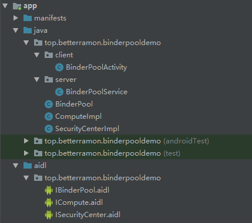

## Binder 连接池

当有多个 `AIDL` 和 `Service` 的时候，我们需要减少 `Service` 的数量，将所有的 `AIDL` 放在同一个 `Service` 中去管理。

整个工作机制是这样的

- 每个业务模块创建自己的 `AIDL` 接口并实现此接口，然后向服务端提供自己的唯一标识和其对应的 `Binder` 对象；
- 对于服务器，只需要一个 `Service` 就可以了，服务端提供一个 `queryBinder` 接口，这个接口能够根据业务模块的特征来返回响应的 `Binder` 对象给它们。


#### 例：提供两个 AIDL 接口（ISecurityCenter 和 ICompute）来模拟多个业务模块都要使用 AIDL 的情况

[Java并发编程：volatile关键字解析](https://www.cnblogs.com/dolphin0520/p/3920373.html)

工程目录结构如下：



- 1.创建 `ISecurityCenter` 和 `ICompute AIDL` 接口,通过这两个接口来分析 `Binder` 连接池的工作原理，大家可以在此基础上继续扩展。

```
// ISecurityCenter.aidl
package top.betterramon.binderpooldemo;

// Declare any non-default types here with import statements
interface ISecurityCenter {
    String encrypt(String content);
    String decrypt(String password);
}

// ICompute.aidl
package top.betterramon.binderpooldemo;

// Declare any non-default types here with import statements

interface ICompute {
    int add(int a, int b);
}
```

- 2. 接下来 `make` 一下工程，然后实现这两个 `AIDL` 接口

```
public class SecurityCenterImpl extends ISecurityCenter.Stub{
    private static final char SECRET_CODE = '^';

    // 加密
    @Override
    public String encrypt(String content) throws RemoteException {
        char[] chars = content.toCharArray();
        for (int i = 0; i < chars.length; i++) {
            chars[i] ^= SECRET_CODE;
        }
        return new String(chars);
    }

    // 解密
    @Override
    public String decrypt(String password) throws RemoteException {
        return encrypt(password);
    }
}

public class ComputeImpl extends ICompute.Stub {
    @Override
    public int add(int a, int b) throws RemoteException {
        return a + b;
    }
}
```

- 3.现在 `AIDL` 接口定义和实现都完成了，但是并没有为每个 `AIDL` 单独创建 `Service`，接下来我们来创建服务端和 `Binder` 连接池。首先，为 `Binder` 连接池创建 `AIDL` 接口 `IBinderPool.aidl`

```
// Binder pool
interface IBinderPool {
    IBinder queryBinder(int binderCode);
}
```

- 4.接下来我们来看 Binder 连接池的实现，首先在它的内部需要去绑定远程服务，绑定成功后，客户端就可以通过它的 queryBinder 方法去获取各个 AIDL 对应的 Binder。Binder 连接池的代码如下：

```
public class BinderPool {
    private static final String TAG = "BinderPool";
    public static final int BINDER_NONE = -1;
    public static final int BINDER_COMPUTE = 0;
    public static final int BINDER_SECURITY_CENTER = 1;

    private Context mContext;
    private IBinderPool mBinderPool;
    private static volatile BinderPool sInsance;
    private CountDownLatch mConnectBinderPoolCountDownLatch;

    // 在构造方法中去绑定 Service 并且这里的 Context 是
    // Application 的，所以 Service 的生命周期同应用
    private BinderPool(Context context) {
        mContext = context.getApplicationContext();
        connectBinderPoolService();
    }

    // 单例模式
    public static BinderPool getsInsance (Context context) {
        if(sInsance == null) {
            synchronized (BinderPool.class) {
                if (sInsance == null) {
                    sInsance = new BinderPool(context);
                }
            }
        }
        return sInsance;
    }

    // 绑定远程服务，拿到 IBinderPool 的实现类返回的代理对象
    private synchronized void connectBinderPoolService() {
        mConnectBinderPoolCountDownLatch = new CountDownLatch(1);
        Intent service = new Intent(mContext, BinderPoolService.class);
        mContext.bindService(service, mBinderPoolConnection, Context.BIND_AUTO_CREATE );
        try {
            mConnectBinderPoolCountDownLatch.await();
        } catch (InterruptedException e) {
            e.printStackTrace();
        }
    }

    public IBinder queryBinder(int binderCode) {
        IBinder binder = null;
        try {
            if (mBinderPool != null) {
                // 通过获取到的代理对象通过 IPC 去调用远程 Binder 线程池中的 queryBinder 方法
                binder = mBinderPool.queryBinder(binderCode);
            }
        } catch (RemoteException e) {
            e.printStackTrace();
        }
        return binder;
    }

    private ServiceConnection mBinderPoolConnection = new ServiceConnection() {
        @Override
        public void onServiceConnected(ComponentName componentName, IBinder iBinder) {
            mBinderPool = IBinderPool.Stub.asInterface(iBinder);
            try {
                mBinderPool.asBinder().linkToDeath(mBinderPoolDeathRecipient, 0);
            } catch (RemoteException e) {
                e.printStackTrace();
            }
            mConnectBinderPoolCountDownLatch.countDown();
        }

        @Override
        public void onServiceDisconnected(ComponentName componentName) {

        }
    };

    private IBinder.DeathRecipient mBinderPoolDeathRecipient = new IBinder.DeathRecipient() {
        @Override
        public void binderDied() {
            Log.d(TAG, "binder died");
            mBinderPool.asBinder().unlinkToDeath(mBinderPoolDeathRecipient, 0);
            mBinderPool = null;
            connectBinderPoolService();
        }
    };
    public static class BinderPoolImpl extends IBinderPool.Stub {
        public BinderPoolImpl() {
            super();
        }
        // 这个方法运行在远程的 Binder 线程池中
        @Override
        public IBinder queryBinder(int binderCode) throws RemoteException {
            IBinder binder = null;
            switch (binderCode) {
                case BINDER_SECURITY_CENTER: {
                    binder = new SecurityCenterImpl();
                    break;
                }
                case BINDER_COMPUTE: {
                    binder = new ComputeImpl();
                    break;
                }
                default:
                    break;
            }
            return binder;
        }
    }
}
```

- 5.实现远程 `Service`，创建 `BinderPoolImpl` 对象并在 `onBind` 方法中返回。这里说明一下为什么要在线程中执行？ 因为我们通过 `CountDownLatch` 将 `binderService` 这个异步操作转换成了 同步操作，它可能是耗时的，同时 `Binder` 方法的调用也有可能是耗时的，所以不建议放到 `UI` 线程。


[什么时候使用 `CountDownLatch`](http://www.importnew.com/15731.html)（例子的抽象类模板挺好）

```
public class BinderPoolService extends Service {

    private static final String TAG = "BinderPoolService";

    private Binder mBinderPool = new BinderPool.BinderPoolImpl();
    public BinderPoolService() {
    }

    @Override
    public void onCreate() {
        super.onCreate();
    }

    @Override
    public IBinder onBind(Intent intent) {
        Log.d(TAG, "onBind");
        return mBinderPool;
    }

    @Override
    public void onDestroy() {
        super.onDestroy();
    }
}
```

- 6.创建客户端测试 `Activity`，在线程中调用 `doWork()` 方法。

```
public class BinderPoolActivity extends AppCompatActivity {
    private static final String TAG = "BinderPoolActivity";
    ISecurityCenter mSecurityCenter;
    ICompute mCompute;
    @Override
    protected void onCreate(Bundle savedInstanceState) {
        super.onCreate(savedInstanceState);
        setContentView(R.layout.activity_binder_pool);
        new Thread(){
            @Override
            public void run() {
                doWork();
            }
        }.start();
    }

    private void doWork() {
        BinderPool binderPool = BinderPool.getsInsance(BinderPoolActivity.this);
        IBinder securityBinder = binderPool.queryBinder(BinderPool.BINDER_SECURITY_CENTER);
        mSecurityCenter = SecurityCenterImpl.asInterface(securityBinder);
        Log.d(TAG, " visit ISecurityCenter");
        String msg = "helloworld - 安卓";
        Log.d(TAG,"content : " + msg);
        try {
            String password = mSecurityCenter.encrypt(msg);
            Log.d(TAG,"encrypt: " + password);
            Log.d(TAG,"decrypt: " + mSecurityCenter.decrypt(password));
        } catch (RemoteException e) {
            e.printStackTrace();
        }
        Log.d(TAG, "visit ICompute");
        IBinder computeBinder = binderPool.queryBinder(BinderPool.BINDER_COMPUTE);
        mCompute = ComputeImpl.asInterface(computeBinder);
        try {
             Log.d(TAG,"3 + 5 = " + mCompute.add(3, 5));
        } catch (RemoteException e) {
            e.printStackTrace();
        }
    }
}
```

运行结果：

```
D/BinderPoolActivity:  visit ISecurityCenter
D/BinderPoolActivity: content : helloworld - 安卓
D/BinderPoolActivity: encrypt: 6;221)1,2:~s~寗匍
D/BinderPoolActivity: decrypt: helloworld - 安卓
D/BinderPoolActivity: visit ICompute
D/BinderPoolActivity: 3 + 5 = 8
```

例子源码：[BinderPoolDemo](./BinderPoolDemo)