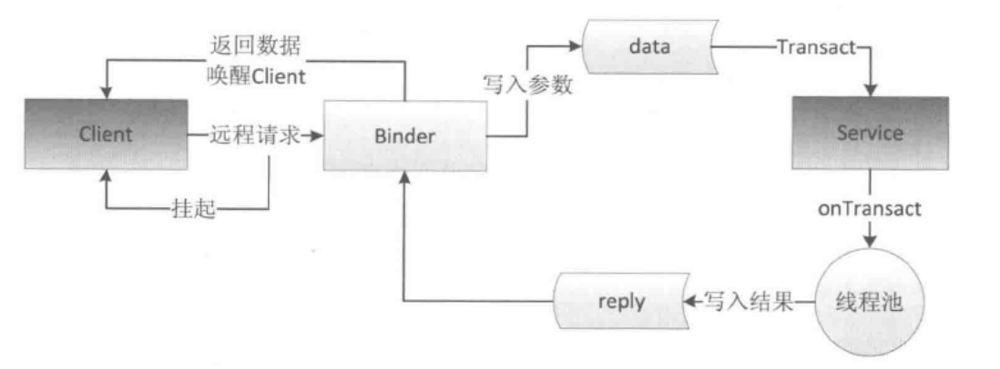

## Binder 机制在 Android 中的具体实现

首先我们来看一下各 java 类职责描述

#### IBinder.java

首先我们来看一下 Binder 的声明

```
public class Binder implements IBinder {...}
```

再来看一下 IBinder

```
public interface IBinder {
    
    int FIRST_CALL_TRANSACTION  = 0x00000001;
    int LAST_CALL_TRANSACTION   = 0x00ffffff;
    int PING_TRANSACTION        = ('_'<<24)|('P'<<16)|('N'<<8)|'G';
    int DUMP_TRANSACTION        = ('_'<<24)|('D'<<16)|('M'<<8)|'P';
    int SHELL_COMMAND_TRANSACTION = ('_'<<24)|('C'<<16)|('M'<<8)|'D';
    int INTERFACE_TRANSACTION   = ('_'<<24)|('N'<<16)|('T'<<8)|'F';
    int TWEET_TRANSACTION       = ('_'<<24)|('T'<<16)|('W'<<8)|'T';
    int LIKE_TRANSACTION        = ('_'<<24)|('L'<<16)|('I'<<8)|'K';
    int SYSPROPS_TRANSACTION    = ('_'<<24)|('S'<<16)|('P'<<8)|'R';
    int FLAG_ONEWAY             = 0x00000001;

    public static final int MAX_IPC_SIZE = 64 * 1024;
    public @Nullable String getInterfaceDescriptor() throws RemoteException;
    public boolean pingBinder();
    public boolean isBinderAlive();
    public @Nullable IInterface queryLocalInterface(@NonNull String descriptor);
    public void dump(@NonNull FileDescriptor fd, @Nullable String[] args) throws RemoteException;
    public void dumpAsync(@NonNull FileDescriptor fd, @Nullable String[] args) throws RemoteException;
    public void shellCommand(@Nullable FileDescriptor in, 
            @Nullable FileDescriptor out, @Nullable FileDescriptor err,
            @NonNull String[] args, @Nullable ShellCallback shellCallback,
            @NonNull ResultReceiver resultReceiver) throws RemoteException;
    public boolean transact(int code, @NonNull Parcel data, @Nullable Parcel reply, int flags) throws RemoteException;
    public interface DeathRecipient {
        public void binderDied();
    }
    public void linkToDeath(@NonNull DeathRecipient recipient, int flags) throws RemoteException;
    public boolean unlinkToDeath(@NonNull DeathRecipient recipient, int flags);
}
```

IBinder： 是一个接口类，代表了一种跨进程通信的能力，只要对象实现了这个接口，就能跨进程传输。

#### Binder.java

Binder 是官方提供的实现了 IBinder 接口的类，它是 IPC 的基础，平常接触到的各种 Manager「ActivityManager，ServiceManager」，以及绑定 Service 时都是使用它进行跨进程操作。

**transact()**

```
public final boolean transact(int code, @NonNull Parcel data, @Nullable Parcel reply, int flags) throws RemoteException {
    if (false) Log.v("Binder", "Transact: " + code + " to " + this);

    if (data != null) {
        data.setDataPosition(0);
    }
    boolean r = onTransact(code, data, reply, flags);
    if (reply != null) {
        reply.setDataPosition(0);
    }
    return r;
}
```
连接 Binder 驱动，发起 IPC 请求。

**onTransact()** 

```
protected boolean onTransact(int code, @NonNull Parcel data, @Nullable Parcel reply, int flags) throws RemoteException {
    if (code == INTERFACE_TRANSACTION) {
        ......
    } else if (code == DUMP_TRANSACTION) {
        ......
    } else if (code == SHELL_COMMAND_TRANSACTION) {
        ......
    }
    return false;
}
```

根据 code 对传入的参数 data 做相应的处理，然后写入 reply，这样就能返回操作后的数据。这个方法运行在服务端的 Binder 线程池中。

**attachInterface()**

```
public void attachInterface(@Nullable IInterface owner, @Nullable String descriptor) {
        mOwner = owner;
        mDescriptor = descriptor;
}
```

这个方法的作用是将一个描述符、特定的 `IInterface` 与 当前 `Binder` 绑定起来，这样后续调用 `queryLocalInterface` 就可以拿到这个 `IInterface`。

#### IInterface.java

```
public interface IInterface{
    public IBinder asBinder();
}
```
IInterface 里只定义了一个 `asBinder()` 方法，这个方法可以返回当前接口关联的 `Binder` 对象。

IInterface 是一个接口类，代表 `Server` 进程对象具备什么样的能力「能提供哪些方法，其实就是对应 AIDL 中定义的接口方法」，我们的接口进程需要继承它，并定义 Server 进程提供的方法。


#### Stub 静态内部类

使用 AIDL 的时候，编译工具会给我们生成一个名为 `Stub` 的静态内部类；这个类继承了 `Binder`, 说明它是一个 `Binder` 本地对象，它实现了 `IInterface` 接口，表明它具有 `Server` 承诺给 `Client` 的能力；`Stub` 是一个抽象类，具体的 `IInterface` 的相关实现需要开发者自己实现。


下图是 Binder 的工作机制图



## 手写实现过程

项目结构如下：


- `RemoteService` 类是 `Server` 端，提供远程服务；
- `ClientActivity` 类是 `Client` 端，请求获取远程服务；
- `Proxy` 类是远程服务的本地代理类；
- `IBookManager` 类是一个接口，继承了 `IInterface` 接口，定义了 `Server` 进程提供的方法。
- `Stub` 类如上述描述一样，是一个 `Binder` 的本地对象。`Book` 类是一个实现了 `Parcelable` 接口的实体类，能够实现序列化和反序列化。

下面分别展示各个类的代码

#### IBookManager

```
/**
 * 这个类用来定义服务端 RemoteService 具备什么样的能力
 */

public interface IBookManager extends IInterface {
    List<Book> getBooks() throws RemoteException;
    void addBook(Book book) throws RemoteException;
}
```

该类继承 IInterface 类，并定义了两个方法，提供给 Client 端使用。

#### Book
```
/**
*  实体类，可以序列化
*/
public class Book implements Parcelable{
    private int price;
    private String name;

    public Book(int price, String name) {
        this.price = price;
        this.name = name;
    }

    @Override
    public int describeContents() {
        return 0;
    }

    @Override
    public void writeToParcel(Parcel dest, int flags) {
        dest.writeInt(this.price);
        dest.writeString(this.name);
    }

    protected Book(Parcel in) {
        this.price = in.readInt();
        this.name = in.readString();
    }

    public static final Creator<Book> CREATOR = new Creator<Book>() {

        @Override
        public Book createFromParcel(Parcel source) {
            return new Book(source);
        }

        @Override
        public Book[] newArray(int size) {
            return new Book[size];
        }
    };

    @Override
    public String toString() {
        return "Book{" +
                "price=" + price +
                ", name='" + name + '\'' +
                '}';
    }
}
```

#### Proxy
```
/**
 * 远程服务代理类，需要实现接口，才能代理服务功能
 */

public class Proxy implements IBookManager{
    //定义字符符描述
    public static final String DESCRIPTOR = "betterramon.top.binderdemo.proxy.BookManager";

    // 是一个 BinderProxy 对象
    private IBinder remote;

    public Proxy(IBinder remote) {
        //构造传入远程服务本地代理对象
        Log.d("proxy","proxy created");
        this.remote = remote;
    }

    @Override
    public List<Book> getBooks() throws RemoteException {
        //client端调用，底层通过binder驱动，会回调到binder实体中对应的 onTransact 对法
        //创建输入输出对象
        Parcel data = Parcel.obtain();
        Parcel reply = Parcel.obtain();
        //定义返回结果对象
        List<Book> result ;

        try {
            //写入ITnterface的描述
            data.writeInterfaceToken(DESCRIPTOR);
            // 发起跨进程请求，当前线程挂起
            //注：若Server进程执行的耗时操作，请不要使用主线程，以防止ANR
            remote.transact(Stub.GET_BOOKS, data, reply, 0);
            //binder 驱动唤醒，线程继续执行，获取返回结果
            reply.readException();
            //反序列化，获取实例
            result = reply.createTypedArrayList(Book.CREATOR);
        } finally {
            reply.recycle();
            data.recycle();
        }
        return result;
    }

    @Override
    public void addBook(Book book) throws RemoteException {
        //client端调用，底层通过binder驱动，会回调到binder实体中对应的 onTransact 对法
        //创建输入输出对象
        Parcel data = Parcel.obtain();
        Parcel reply = Parcel.obtain();

        try {
            //写入ITnterface的描述
            data.writeInterfaceToken(DESCRIPTOR);

            //写入请求参数
            if (book != null) {
                data.writeInt(1);
                book.writeToParcel(data,0);
            } else {
                data.writeInt(0);
            }
            // 发起跨进程请求，当前线程挂起
            //注：若Server进程执行的耗时操作，请不要使用主线程，以防止ANR
            remote.transact(Stub.ADD_BOOK, data, reply, 0);
            //binder 驱动唤醒，线程继续执行，获取返回结果
            reply.readException();
        } finally {
            reply.recycle();
            data.recycle();
        }
    }

    public String getInterfaceDescriptor() {
        return DESCRIPTOR;
    }

    @Override
    public IBinder asBinder() {
        return remote;
    }
}
```

上述 `data` 和 `reply` 对象不是由客户端自己创建的，而是调用 `Parcel.obtain()` 申请的。 data 是输入对象，数据由 `Client` 端进程提供，`reply` 是输出对象，由 `Server` 进程返回结果放入其中。


`writeInterfaceToken()` 方法标注远程服务名称，与 `enforceInterface()` 配对使用，该名称将作为 `Binder` 驱动确保客户端的确想调用指定的服务端功能。

`transact()` 方法需要传入目标函数编码「该编码由 `Client` 进程和 `Server`进程自身约定」和 `Parcel` 类的输入输出对象以及一个标记位「几乎都传 0」

#### Stub
```
/**
 * 抽象类，继承 Binder，拥有跨进程通信能力，具体提供的服务功能由实现类自身处理
 */

public abstract  class Stub extends Binder implements IBookManager{
    //定义字符描述
    public static final String DESCRIPTOR = "betterramon.top.binderdemo.proxy.BookManager";
    //定义函数编码,在跨进程调用的时候，不会传递函数而是传递编号来指明要调用哪个函数
    public static final int GET_BOOKS = IBinder.FIRST_CALL_TRANSACTION;
    public static final int ADD_BOOK = IBinder.FIRST_CALL_TRANSACTION + 1;

    public Stub( ) {
        // 1. 将（descriptor，IBookManager）作为（key,value）对存入到Binder对象中的一个Map<String,IInterface>对象中
        // 2. 之后，Binder对象 可根据descriptor通过queryLocalIInterface（）获得对应IInterface对象（即Stub）的引用，
        // 可依靠该引用完成对请求方法的调用
        this.attachInterface(this, DESCRIPTOR);
    }

    @Override
    protected boolean onTransact(int code, @NonNull Parcel data, @Nullable Parcel reply, int flags) throws RemoteException {
        //跨进程通信时，当client 通过 transact 方法请求时，驱动会通知对数据进行解包，
        // 最后会回调这个方法进行处理，该方法在服务端 binder 线程池中运行
        // 这个方法返回 false 时，客户端请求会失败，可以用来做权限验证，避免随便一个进程都能远程调用我们的服务

        switch (code) {
            case INTERFACE_TRANSACTION:
                reply.writeString(DESCRIPTOR);
                return true;
            case GET_BOOKS:
                //与 Proxy 类中的 data.writeInterfaceToken(DESCRIPTOR);配对使用
                data.enforceInterface(DESCRIPTOR);
                List<Book> result = this.getBooks();
                // 返回结果，驱动会唤醒 Client 端线程来获取执行结果
                reply.writeNoException();
                reply.writeTypedList(result);
                return true;
            case ADD_BOOK:
                //与 Proxy 类中的 data.writeInterfaceToken(DESCRIPTOR);配对使用
                data.enforceInterface(DESCRIPTOR);
                Book book = null;
                if (data.readInt() != 0) {
                    //反序列化，拿到数据
                    book = Book.CREATOR.createFromParcel(data);
                }
                //调用服务方法，具体功能实现在RemoteService中
                this.addBook(book);
                // 返回结果，驱动会唤醒 Client 端线程来获取执行结果
                reply.writeNoException();
                return true;
        }

        return super.onTransact(code, data, reply, flags);
    }


    @Override
    public IBinder asBinder() {
        //返回当前 binder 对象
        return this;
    }

    /**
     * 将  binder 对象 转化为相应的接口对象，区分进程，同一进程，直接返回当前对象，
     * 不同进程，返回代理对象
     */
    public static IBookManager asInterface(IBinder binder) {
        if (binder == null) {
            return null;
        }
        // 之前调用过 attachInterface() ，这里可以拿到引用
        IInterface iin = binder.queryLocalInterface(DESCRIPTOR);
        if (iin != null && iin instanceof IBookManager) {
            //同一进程，直接返回本地binder
            return (IBookManager) iin;
        } else {
            //跨进程，返回代理对象
            return new Proxy(binder);
        }
    }
}
```

这里说一下 `asInterface` 方法，当 `Client` 端在创建和服务端的连接，调用 `bindService` 时需要创建一个 `ServiceConnection` 对象作为入参。在 `ServiceConnection` 的回调方法 `onServiceConnected` 中 会通过这个 `asInterface(IBinder binder)` 拿到 `IBookManager` 对象，**这个 `IBinder` 类型的入参 `binder` 是驱动传给我们的（同进程就是返回 `Binder` 对象，不同进程是返回 `BinderProxy` 对象）**，`asInterface` 方法中会去调用 `binder.queryLocalInterface()` 去查找 `Binder` 本地对象，如果找到了就说明 `Client` 和 `Server` 在同一进程，那么这个 `binder` 本身就是 `Binder` 本地对象，可以直接使用。否则说明是 `binder` 是个远程对象，也就是 `BinderProxy`。因此需要我们创建一个代理对象 `Proxy`，通过这个代理对象实现远程访问。

#### RemoteService

```
/**
 * 远程服务
 */
public class RemoteService extends Service{

    private List<Book> mBookList = new ArrayList<>();

    @Override
    public void onCreate() {
        super.onCreate();
        mBookList.add(new Book(001,"Android 艺术探索"));
    }

    @Nullable
    @Override
    public IBinder onBind(Intent intent) {
        return bookManager;
    }

    private final Stub bookManager = new Stub() {

        @Override
        protected boolean onTransact(int code, @NonNull Parcel data, @Nullable Parcel reply, int flags) throws RemoteException {
            //权限验证
            int check = checkCallingOrSelfPermission("betterramon.top.binderdemo.ACCESS_BOOK_SERVICE");
            if (check == PackageManager.PERMISSION_DENIED) {
                return false;
            }
            //其他验证
            return super.onTransact(code, data, reply, flags);
        }

        // 真正提供的服务功能
        @Override
        public List<Book> getBooks() throws RemoteException {
            // 同步
            synchronized (mBookList) {
                for (Book book : mBookList) {
                    Log.d("server","getBooks: " + book.toString());
                }
                return mBookList;
            }
        }

        @Override
        public void addBook(Book book) throws RemoteException {
            // 同步
            synchronized (mBookList) {
                mBookList.add(book);
                Log.d("server","addBook: " + book.toString());
            }
        }
    };
}
```

#### ClientActivity

```
public class ClientActivity extends AppCompatActivity implements View.OnClickListener{
    private Button mGetBook;
    private Button mAddBook;
    private boolean isServiceConnected;
    private IBookManager mBookManager;

    @Override
    protected void onCreate(Bundle savedInstanceState) {
        super.onCreate(savedInstanceState);
        setContentView(R.layout.activity_client);

        mGetBook = (Button)findViewById(R.id.get_books);
        mAddBook = (Button)findViewById(R.id.add_books);

        mGetBook.setOnClickListener(this);
        mAddBook.setOnClickListener(this);

        // 绑定服务，即获取远程服务
        Intent intent = new Intent("betterramon.top.frameworks.remote.service");
        intent.setClass(this, RemoteService.class);
        bindService(intent, mServiceConnection, Context.BIND_AUTO_CREATE);
    }

    @Override
    public void onClick(View view) {
        switch (view.getId()) {
            case R.id.get_books:
                if (isServiceConnected) {
                    try {
                        List<Book> books = mBookManager.getBooks();
                        Log.d("client", "书的数量： " + books.size());
                    }catch (RemoteException e) {
                        e.printStackTrace();
                    }
                }
                break;
            case R.id.add_books:
                if (isServiceConnected) {
                    try {
                        mBookManager.addBook(new Book(002, "第一行代码"));
                    }catch (RemoteException e) {

                    }
                }
                break;
        }

    }

    private ServiceConnection mServiceConnection = new ServiceConnection() {
        @Override
        public void onServiceConnected(ComponentName componentName, IBinder iBinder) {
            isServiceConnected = true;
            mBookManager = Stub.asInterface(iBinder);
        }

        @Override
        public void onServiceDisconnected(ComponentName componentName) {
            isServiceConnected = false;
        }
    };

    @Override
    protected void onDestroy() {
        super.onDestroy();
        if (isServiceConnected) {
            unbindService(mServiceConnection);
        }
    }
}
```

最后，在 AndroidManifest 中注册 RemoteService

```
<service android:name=".server.RemoteService"
    android:enabled="true"
    android:exported="true"
    android:process=":remote">
    <intent-filter>
        <action android:name="betterramon.top.frameworks.remote.service"/>
        <category android:name="android.intent.category.DEFAULT"/>
    </intent-filter>
</service>
```