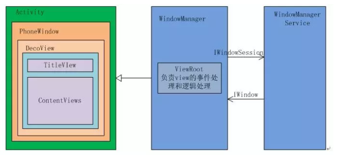
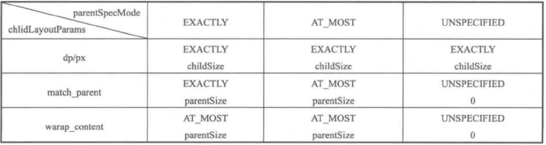

- [图解View测量、布局及绘制原理](https://www.jianshu.com/p/3d2c49315d68)
- [简析Window、Activity、DecorView以及ViewRoot之间的错综关系](https://www.jianshu.com/p/8766babc40e0)
- [ViewRootImpl的独白，我不是一个View(布局篇)](https://blog.csdn.net/stven_king/article/details/78775166)

#### Window Activity DecorView ViewRoot

我们印象中视图就是在 `Activity` 中通过 `setContentView(R.layout.xxx)` 来显示，其实视图的显示并不是由 `Activity` 来完成的，其中还涉及到了 `Window DecorView ViewRoot`,它们四个共同完成视图的显示以及和用户之间的交互。

- **Activity**：`Activity` 不负责视图控制，它只控制生命周期和处理事件。真正控制视图的是 `Window`，一个 `Activity` 包含了一个 `Window`, `Window` 才是真正代表一个窗口。`Activity` 像一个控制器，统筹视图的添加与显示，以及通过其他回调方法来与 `Window` 以及 `View` 进行交互。
- **Window**: `Window` 是视图的承载器，内部持有一个 `DecorView`,这个 `DecorView` 才是 `View` 的根布局。 `Window` 是一个抽象类，实际在 `Activity` 中持有的是其子类 `PhoneWindow`, `PhoneWindow`通过创建 `DecorView` 来加载 `Activity`中设置的布局 `R.layout.xxx`。 `Window` 通过 `WindowManager` 将 `DecorView` 加载其中，并将 `DecorView` 交给 `ViewRoot`,进行视图的绘制以及交互。
- **DecorView**: `DecorView` 是 `FrameLayout` 的子类，它可以被认为是 `Android` 视图树节点的根节点视图， `DecorView` 作为顶级 `View`,一般情况下它内部包含一个竖直方向的 `LinearLayout`,其中有一个布局的 id 为 `"@android:id/content`

```
<LinearLayout xmlns:android="http://schemas.android.com/apk/res/android"
    android:orientation="vertical"
    android:fitsSystemWindows="true">
    <!-- Popout bar for action modes -->
    <ViewStub android:id="@+id/action_mode_bar_stub"
              android:inflatedId="@+id/action_mode_bar"
              android:layout="@layout/action_mode_bar"
              android:layout_width="match_parent"
              android:layout_height="wrap_content"
              android:theme="?attr/actionBarTheme" />

    <FrameLayout android:id="@android:id/title_container" 
        android:layout_width="match_parent" 
        android:layout_height="?android:attr/windowTitleSize"
        android:transitionName="android:title"
        style="?android:attr/windowTitleBackgroundStyle">
    </FrameLayout>
    <FrameLayout android:id="@android:id/content"
        android:layout_width="match_parent" 
        android:layout_height="0dip"
        android:layout_weight="1"
        android:foregroundGravity="fill_horizontal|top"
        android:foreground="?android:attr/windowContentOverlay" />
</LinearLayout>
```
在 `Activity` 中通过 `setContentView` 所设置的布局文件其实就是被加载到内容栏之中(id 为 content 的 FrameLayout)，成为其唯一子 `View`，在代码中可以通过 `content` 来得到对应加载的布局。

```
ViewGroup content = (ViewGroup) findViewById(android.R.id.content);
ViewGroup rootView = (ViewGroup) content.getChildAt(0);
```

- **ViewRoot**: `ViewRoot` 的作用非常大，所有 `View` 的绘制以及事件分发等交互都是通过它来执行或者传递的。 `ViewRoot` 的实现类是 `ViewRootImpl` 类，它是连接 `WindowManagerService` 和 `DecorView` 的纽带，`View` 的三大流程 `measuere layout draw` 均通过 `ViewRoot` 来完成。`ViewRoot` 既非 `View` 的子类，也不是它的父类，但是实现了 `ViewParent` 接口，这让它可以作为 `View` 名义上的父视图。Android 中所有的触屏事件，按键事件，界面刷新都是通过 `ViewRoot` 进行分发的。




#### DecorView 的创建

接下来主要介绍 `DecorView` 是怎么一层层嵌套在 `Activity PhoneWindow` 中的，以及 `DecorView` 如何加载内部布局。


**setContentView**

首先是从 `Activity` 中的 `setContentView()` 开始

```
public void setContentView(@LayoutRes int layoutResID) {
    getWindow().setContentView(layoutResID);
    initWindowDecorActionBar();
}
```

可以看到实际是交给 `Window` 来装载视图的，下面来看看 `Activity` 是怎么样获取 `Window` 对象的。

```
final void attach(Context context, ActivityThread aThread,
            Instrumentation instr, IBinder token, int ident,
            Application application, Intent intent, ActivityInfo info,
            CharSequence title, Activity parent, String id,
            NonConfigurationInstances lastNonConfigurationInstances,
            Configuration config, String referrer, IVoiceInteractor voiceInteractor,
            Window window, ActivityConfigCallback activityConfigCallback) {
        ...

        mWindow = new PhoneWindow(this, window, activityConfigCallback); // 创建一个 Window 对象
        mWindow.setWindowControllerCallback(this);
        // 设置回调，向 Activity 分发点击或者状态改变事件
        mWindow.setCallback(this);
        mWindow.setOnWindowDismissedCallback(this);
        
        ...

        // 给 window 设置 WindowManager 对象
        mWindow.setWindowManager(
                (WindowManager)context.getSystemService(Context.WINDOW_SERVICE),
                mToken, mComponent.flattenToString(),
                (info.flags & ActivityInfo.FLAG_HARDWARE_ACCELERATED) != 0);
        ...
    }
```

在 Activity 的 `attach()` 方法中， 生成了 `PhoneWindow` 实例，通过上面可以知道我们实际是调用了 `PhoneWindow` 的 `setContentView` 方法，接下来来看 `PhoneWindow.java` 的 `setContentView 方法`

```
@Override
public void setContentView(View view, ViewGroup.LayoutParams params) {
    // mContentParent 为空，创建一个 DecorView
    if (mContentParent == null) {
        installDecor();
    } else {
        // mContentParent 不为空，删除其中的 View
        mContentParent.removeAllViews();
    }

    // 为 mContentParent 添加子 View, 即 Activity 中设置的布局文件
    mLayoutInflater.inflate(layoutResID, mContentParent);
    final Callback cb = getCallback();
    if (cb != null && !isDestroyed()) {
        // 回调，内容改变
        cb.onContentChanged();
    }
}
```

上面的 `mContentParent` 指的是什么呢？其实就是前面布局中 `@android:id/content` 对应的 `FrameLayout`

**通过上面的流程我们大致可以知道在 PhoneWindow 中先创建了一个 DecorView， 其中创建的过程可能根据 Theme 不同，加载不同的布局格式，例如没有 Title，或者没有 ActionBar 等，然后再向 mContentParent 中加入子 View, 即 Activity 的布局，这个时候，布局就一层层嵌套加上了**

`DecorView` 是如何创建的呢，我们需要看下上面调用的 `installDecor()` 方法

```
private void installDecor() {
    if (mDecor == null) {
        // 生成 DecorView
        mDecor = generateDecor(-1);
        mDecor.setDescendantFocusability(ViewGroup.FOCUS_AFTER_DESCENDANTS);
        mDecor.setIsRootNamespace(true);
        if (!mInvalidatePanelMenuPosted && mInvalidatePanelMenuFeatures != 0) {
            mDecor.postOnAnimation(mInvalidatePanelMenuRunnable);
        }
    } else {
        mDecor.setWindow(this);
    }

    if (mContentParent == null) {
        // 为 DecorView 设置布局格式，并返回 mContentParent
        mContentParent = generateLayout(mDecor);
        ...
    }
}
```

先来看看 `generateDecor()` 方法, 很简单，就是创建了一个 `DecorView`

```
protected DecorView generateDecor() {
    ...
    return new DecorView(getContext(), -1);
}
```

然后再来看看 `generateLayout(..)` 方法

```
protected ViewGroup generateLayout(DecorView decor) {
    // 从主题文件中获取样式信息
    TypedArray a = getWindowStyle();
    ...
    if (a.getBoolean(R.styleable.Window_windowNoTitle, false)) {
        requestFeature(FEATURE_NO_TITLE);
    } else if (a.getBoolean(R.styleable.Window_windowActionBar, false)) {
        // Don't allow an action bar if there is no title.
        requestFeature(FEATURE_ACTION_BAR);
    }
    ...
    
    // 根据主题样式，加载窗口布局
    int layoutResource;
    int features = getLocalFeatures();
    // System.out.println("Features: 0x" + Integer.toHexString(features));
    if ((features & (1 << FEATURE_SWIPE_TO_DISMISS)) != 0) {
        layoutResource = R.layout.screen_swipe_dismiss;
    } else if(...){
        ...
    }

    // 加载 layoutResource
    View in = mLayoutInflater.inflate(layoutResource, null);    

   // 往DecorView 中添加子 View，即文章开头介绍 DecorView 时提到的布局格式，那只是一个例子，根据主题样式不同，加载不同的布局。
    decor.addView(in, new ViewGroup.LayoutParams(MATCH_PARENT, MATCH_PARENT)); 
    mContentRoot = (ViewGroup) in;

    // 这里获取的就是mContentParent
    ViewGroup contentParent = (ViewGroup)findViewById(ID_ANDROID_CONTENT); 

    if (contentParent == null) {
        throw new RuntimeException("Window couldn't find content container view");
    }

    if ((features & (1 << FEATURE_INDETERMINATE_PROGRESS)) != 0) {
        ProgressBar progress = getCircularProgressBar(false);
        if (progress != null) {
            progress.setIndeterminate(true);
        }
    }

    if ((features & (1 << FEATURE_SWIPE_TO_DISMISS)) != 0) {
        registerSwipeCallbacks();
    }

    // Remaining setup -- of background and title -- that only applies
    // to top-level windows.
    ...

    return contentParent;
}
```

代码比较多，但是逻辑很清晰。首先从主题中获取样式，然后根据样式，加载对应的布局到 `DecorView` 中， 然后从中获取 `mContentParent`, 获取到之后，回到上一层调用代码处，为 `mContentParent` 添加 `View`, 即 `Activity` 中的布局。

#### DecorView 的显示

通过 `setContentView` 设置的界面， 为什么在 `onResume` 之后才对用户可见呢？需要看看 `ActivityThread.java` 文件

```
private void handleLaunchActivity(ActivityClientRecord r, Intent customIntent) {

    // 就是在这里调用了 Activity.attach(), 接着调用了Activity.onCreate() 和 Activity.onStart() 生命周期，
    
    // 但是由于只是初始化了 mDecor，添加了布局文件，还没有把
    // mDecor 添加到负责 UI 显示的 PhoneWindow 中，所以这时候对用户来说，是不可见的
    Activity a = performLaunchActivity(r, customIntent);

    ...

    if (a != null) {
    // 这里面执行了 Activity.onResume()
    handleResumeActivity(r.token, false, r.isForward,
                    !r.activity.mFinished && !r.startsNotResumed);

    if (!r.activity.mFinished && r.startsNotResumed) {
        try {
            r.activity.mCalled = false;
            // 执行Activity.onPause()
            mInstrumentation.callActivityOnPause(r.activity);
            }
        }
    }
}
```

重点看 `handleResumeActivity()` 方法，这里 `DecorView` 将会显示出来，同时一个重要的角色 `ViewRoot` 也会登场。

```
final void handleResumeActivity(IBinder token,
boolean clearHide, boolean isForward, boolean reallyResume) {

//这个时候，Activity.onResume()已经调用了，但是现在界面还是不可见的
ActivityClientRecord r = performResumeActivity(token, clearHide);

if (r != null) {
    final Activity a = r.activity;
      if (r.window == null && !a.mFinished && willBeVisible) {
    r.window = r.activity.getWindow();
    View decor = r.window.getDecorView();
    // decor对用户不可见
    decor.setVisibility(View.INVISIBLE);
    ViewManager wm = a.getWindowManager();
    WindowManager.LayoutParams l = r.window.getAttributes();
    a.mDecor = decor;
  
    l.type = WindowManager.LayoutParams.TYPE_BASE_APPLICATION;

    if (a.mVisibleFromClient) {
        a.mWindowAdded = true;
        // 被添加进 WindowManager 了，但是这个时候，还是不可见的
        wm.addView(decor, l);
    }

    if (!r.activity.mFinished && willBeVisible
        && r.activity.mDecor != null && !r.hideForNow) {
     // 在这里，执行了重要的操作,使得 DecorView 可见
     if (r.activity.mVisibleFromClient) {
            r.activity.makeVisible();
        }
    }
}
```

当我们执行了 `Activity.makeVisible` 方法之后，界面对我们是可见的

```
void makeVisible() {
    if (!mWindowAdded) {
        ViewManager wm = getWindowManager();
        // 将 DecorView 添加到 WindowManager
        wm.addView(mDecor, getWindow().getAttributes());
        mWindowAdded = true;
    }
    mDecor.setVisibility(View.VISIBLE); // DecorView 可见
}
```

到这里 `DecorView` 便可见了，**但是在这其中 `vm.addView(mDecor, getWindow().getAttributes())` 方法非常重要， 它内部创建了一个 ViewRootImpl 对象，负责绘制各个子 `View`**

具体来看 `addView()` 方法， 因为 `WindowManager` 是个接口，具体是交给 `WindowManagerImpl` 实现的

```
public final class WindowManagerImpl implements WindowManager {
    private final WindowManagerGlobal mGlobal = WindowManagerGlobal.getInstance();
    ...
    @Override
    public void addView(@NonNull View view, @NonNull ViewGroup.LayoutParams params) {
        ...
        mGlobal.addView(view, params, mContext.getDisplay(), mParentWindow);
    }
}
```

交给了 `WindowManagerGlobal.java` 的 `addView` 来实现

> WindowManagerImpl 为 WindowManager 的实现类， WindowManagerImpl 内部方法实现都是由代理类 WindowManagerGlobal 实现的，而 WindowManagerGlobal 是一个单例，也就是一个进程中只有一个 WindowManagerGlobal 对象服务于所有的 View。

```
public void addView(View view, ViewGroup.LayoutParams params,
            Display display, Window parentWindow) {
    ...

    final WindowManager.LayoutParams wparams = (WindowManager.LayoutParams) params;
    ...

    ViewRootImpl root;
    View panelParentView = null;

    synchronized (mLock) {
        // 实例化一个 ViewRootImpl 对象
        root = new ViewRootImpl(view.getContext(), display);

        view.setLayoutParams(wparams);

        mViews.add(view);
        mRoots.add(root);
        mParams.add(wparams);

        // do this last because it fires off messages to start doing things
        try {
            // 把将 Window 所对应的 View 设置给 ViewRootImpl
            // 通过 ViewRootImpl 来更新界面并完成 Window 的添加过程
            root.setView(view, wparams, panelParentView);
        } catch (RuntimeException e) {
            ...
        }
    }
}
```

看到其中实例化了 `ViewRootImpl` 对象，然后调用其 `setView` 方法，将 `ViewRootImpl` 和 `Window` 所对应的 `View` 绑定了起来，`ViewRootImpl` 类中会对 `View` 进行测量，布局，绘制等。


```
public final class ViewRootImpl implements ViewParent,
        View.AttachInfo.Callbacks, HardwareRenderer.HardwareDrawCallbacks {
    ...
    /**
     * We have one child
     */
    public void setView(View view, WindowManager.LayoutParams attrs, View panelParentView) {
        synchronized (this) {
            if (mView == null) {
                // ViewRootImpl 成员变量 view 进行复制，以后操作的都是 mView。
                mView = view;
                ...
                // Window 在添加完之前先进行一次布局，确保以后能再接受系统其它事件之后重新布局。
                // 对 View 完成异步刷新，执行 View 的绘制方法。
                requestLayout();
                if ((mWindowAttributes.inputFeatures
                        & WindowManager.LayoutParams.INPUT_FEATURE_NO_INPUT_CHANNEL) == 0) {
                    mInputChannel = new InputChannel();
                }
                try {
                    mOrigWindowType = mWindowAttributes.type;
                    mAttachInfo.mRecomputeGlobalAttributes = true;
                    collectViewAttributes();
                    // 将该 Window 添加到屏幕。
                    // mWindowSession 实现了 IWindowSession 接口，它是 Session 的客户端 Binder 对象.
                    // addToDisplay 是一次 AIDL 的跨进程通信，通知 WindowManagerService 添加 IWindow
                    res = mWindowSession.addToDisplay(mWindow, mSeq, mWindowAttributes,
                            getHostVisibility(), mDisplay.getDisplayId(),
                            mAttachInfo.mContentInsets, mAttachInfo.mStableInsets, mInputChannel);
                } catch (RemoteException e) {
                    mAdded = false;
                    mView = null;
                    mAttachInfo.mRootView = null;
                    mInputChannel = null;
                    mFallbackEventHandler.setView(null);
                    unscheduleTraversals();
                    setAccessibilityFocus(null, null);
                    throw new RuntimeException("Adding window failed", e);
                } finally {
                    if (restore) {
                        attrs.restore();
                    }
                }
                ...
                // 设置当前 View 的 mParent
                view.assignParent(this);
                ...
            }
        }
    }
}
```

上面的方法中我们调用了 `requestLayout()`，对 `View` 的操作（测量/布局/绘制）其过程主要在 `ViewRootImpl` 的 `performTraversals` 方法中

```
public final class ViewRootImpl implements ViewParent,
        View.AttachInfo.Callbacks, HardwareRenderer.HardwareDrawCallbacks {
    ...
    //请求对界面进行布局
    @Override
    public void requestLayout() {
        if (!mHandlingLayoutInLayoutRequest) {
            checkThread();
            mLayoutRequested = true;
            scheduleTraversals();
        }
    }
    // 校验所在线程，mThread 是在 ViewRootImpl 初始化的时候执行 mThread = Thread.currentThread() 进行赋值的，也就是初始化 ViewRootImpl 所在的线程。
    void checkThread() {
        if (mThread != Thread.currentThread()) {
            throw new CalledFromWrongThreadException(
                    "Only the original thread that created a view hierarchy can touch its views.");
        }
    }
    // 安排任务
    void scheduleTraversals() {
        if (!mTraversalScheduled) {
            mTraversalScheduled = true;
            mTraversalBarrier = mHandler.getLooper().postSyncBarrier();
            mChoreographer.postCallback(
                    Choreographer.CALLBACK_TRAVERSAL, mTraversalRunnable, null);
            if (!mUnbufferedInputDispatch) {
                scheduleConsumeBatchedInput();
            }
            notifyRendererOfFramePending();
        }
    }

    final TraversalRunnable mTraversalRunnable = new TraversalRunnable();

    final class TraversalRunnable implements Runnable {
        @Override
        public void run() {
            doTraversal();
        }
    }
    // 做任务
    void doTraversal() {
        if (mTraversalScheduled) {
            mTraversalScheduled = false;
            mHandler.getLooper().removeSyncBarrier(mTraversalBarrier);

            if (mProfile) {
                Debug.startMethodTracing("ViewAncestor");
            }

            Trace.traceBegin(Trace.TRACE_TAG_VIEW, "performTraversals");
            try {
                // 执行任务
                performTraversals();
            } finally {
                Trace.traceEnd(Trace.TRACE_TAG_VIEW);
            }

            if (mProfile) {
                Debug.stopMethodTracing();
                mProfile = false;
            }
        }
    }

    // 执行任务（分别调用 mView 的 measure、layout、draw）
    private void performTraversals() {
        // cache mView since it is used so much below...
        final View host = mView;
        ...
        // 想要展示窗口的宽高
        int desiredWindowWidth;
        int desiredWindowHeight;

        // 开始进行布局准备
        if (mFirst || windowShouldResize || insetsChanged ||
            viewVisibilityChanged || params != null) {
            ...
            if (!mStopped) {
                boolean focusChangedDueToTouchMode = ensureTouchModeLocally(
                        (relayoutResult&WindowManagerGlobal.RELAYOUT_RES_IN_TOUCH_MODE) != 0);
                if (focusChangedDueToTouchMode || mWidth != host.getMeasuredWidth()
                        || mHeight != host.getMeasuredHeight() || contentInsetsChanged) {
                    int childWidthMeasureSpec = getRootMeasureSpec(mWidth, lp.width);
                    int childHeightMeasureSpec = getRootMeasureSpec(mHeight, lp.height);


                     // Ask host how big it wants to be
                    performMeasure(childWidthMeasureSpec, childHeightMeasureSpec);

                    // Implementation of weights from WindowManager.LayoutParams
                    // We just grow the dimensions as needed and re-measure if
                    // needs be
                    int width = host.getMeasuredWidth();
                    int height = host.getMeasuredHeight();
                    boolean measureAgain = false;

                    ...

                    if (measureAgain) {
                        // View 的测量
                        performMeasure(childWidthMeasureSpec, childHeightMeasureSpec);
                    }

                    layoutRequested = true;
                }
            }
        } else {
            ...
        }

        final boolean didLayout = layoutRequested /*&& !mStopped*/ ;
        boolean triggerGlobalLayoutListener = didLayout
                || mAttachInfo.mRecomputeGlobalAttributes;
        if (didLayout) {
            // View 的布局
            performLayout(lp, desiredWindowWidth, desiredWindowHeight);

            ...
        }
        ...

        if (!cancelDraw && !newSurface) {
            if (!skipDraw || mReportNextDraw) {
                ...
                // View 的绘制
                performDraw();
            }
        } else {
            if (viewVisibility == View.VISIBLE) {
                // Try again
                scheduleTraversals();
            } else if (mPendingTransitions != null && mPendingTransitions.size() > 0) {
                for (int i = 0; i < mPendingTransitions.size(); ++i) {
                    mPendingTransitions.get(i).endChangingAnimations();
                }
                mPendingTransitions.clear();
            }
        }

        mIsInTraversal = false;
    }
}
```

#### View 的测量

`ViewRootImpl` 调用 `performMeasure` 执行对 `Window` 对应的 `View` 的测量。测量顺序如下：

- `ViewRootImpl` 的 `performMeasure`
- `DecorView(FrameLayout)` 的 `measure`
- `DecorView(FrameLayout)` 的 `onMeasure`
- `DecorView(FrameLayout)` 所有子 `View` 的 `measure`


```
public final class ViewRootImpl implements ViewParent,
        View.AttachInfo.Callbacks, HardwareRenderer.HardwareDrawCallbacks {
    ...
    // View 的测量
    private void performMeasure(int childWidthMeasureSpec, int childHeightMeasureSpec) {
        Trace.traceBegin(Trace.TRACE_TAG_VIEW, "measure");
        try {
            // mView 在 Activity 中为 DecorView（FrameLayout）
            mView.measure(childWidthMeasureSpec, childHeightMeasureSpec);
        } finally {
            Trace.traceEnd(Trace.TRACE_TAG_VIEW);
        }
    }
}
```

为了更好的理解 `View` 的测量过程，我们需要理解 `MeasureSpec`, 它可以理解为“测量规格”。 `MeasureSpec` 代表一个 32 位 int 值， 高 2 位代表 `SpecMode`(测量模式), 低 30 位代表 `SpecSize`（指某种测量模式下的规格大小），下面是 `MeasureSpec` 内部一些常量的定义

```
public static class MeasureSpec {
        private static final int MODE_SHIFT = 30;
        private static final int MODE_MASK  = 0x3 << MODE_SHIFT;

        /** @hide */
        @IntDef({UNSPECIFIED, EXACTLY, AT_MOST})
        @Retention(RetentionPolicy.SOURCE)
        public @interface MeasureSpecMode {}

        /**
         * Measure specification mode: The parent has not imposed any constraint
         * on the child. It can be whatever size it wants.
         */
        public static final int UNSPECIFIED = 0 << MODE_SHIFT;

        /**
         * Measure specification mode: The parent has determined an exact size
         * for the child. The child is going to be given those bounds regardless
         * of how big it wants to be.
         */
        public static final int EXACTLY     = 1 << MODE_SHIFT;

        /**
         * Measure specification mode: The child can be as large as it wants up
         * to the specified size.
         */
        public static final int AT_MOST     = 2 << MODE_SHIFT;

        /**
         * Creates a measure specification based on the supplied size and mode.
         *
         * The mode must always be one of the following:
         * <ul>
         *  <li>{@link android.view.View.MeasureSpec#UNSPECIFIED}</li>
         *  <li>{@link android.view.View.MeasureSpec#EXACTLY}</li>
         *  <li>{@link android.view.View.MeasureSpec#AT_MOST}</li>
         * </ul>
         *
         */
        public static int makeMeasureSpec(@IntRange(from = 0, to = (1 << MeasureSpec.MODE_SHIFT) - 1) int size,
                                          @MeasureSpecMode int mode) {
            if (sUseBrokenMakeMeasureSpec) {
                return size + mode;
            } else {
                return (size & ~MODE_MASK) | (mode & MODE_MASK);
            }
        }
        /**
         * Extracts the mode from the supplied measure specification.
         *
         * @param measureSpec the measure specification to extract the mode from
         * @return {@link android.view.View.MeasureSpec#UNSPECIFIED},
         *         {@link android.view.View.MeasureSpec#AT_MOST} or
         *         {@link android.view.View.MeasureSpec#EXACTLY}
         */
        @MeasureSpecMode
        public static int getMode(int measureSpec) {
            //noinspection ResourceType
            return (measureSpec & MODE_MASK);
        }

        /**
         * Extracts the size from the supplied measure specification.
         *
         * @param measureSpec the measure specification to extract the size from
         * @return the size in pixels defined in the supplied measure specification
         */
        public static int getSize(int measureSpec) {
            return (measureSpec & ~MODE_MASK);
        }
        ...
}
```

`SpecMode` 有三类，分别如下:

- **UNSPECIFIED**: 父容器不对 `View` 有任何限制，要多大给多大，这种情况一般用于系统内部，表示一种测量状态。
- **EXACTLY**: 父容器已经检测出 `View` 所需要的精确大小，这个时候 `View` 的最终大小就是 `SpecSize` 所指定的值。它对应与 `LayoutParams` 中的 `match_parent` 和具体数值这两种模式。
- **AT_MOST**: 父容器指定了一个可用大小即 `SpecSize`, `View` 的大小不能大于这个值，具体是多少需要看不同 `View` 的实现，它对应于 `LayoutParam` 中的 `wrap_content`


`MeasureSpec` 不是唯一由 `LayoutParams` 决定的， **`LayoutParams` 需要和父容器一起才能决定 `View` 的 `MeasureSpec`**。另外对于顶级 `View`（DecorView）,它的 `MeasureSpec` 和普通 `View` 有所不同，对于 `DecorView`, 其 `MeasureSpec` 由窗口的尺寸和其自身的 `LayoutParams` 来共同确定。对于普通的 `View`, 其 `MeasureSpec` 由父容器的 `MeasureSpec` 和自身的 `LayoutParams`来共同决定。

对于 `DecorView`, 在 `ViewRootImpl` 的 `measureHierarchy` 展示了 `DecorView` 的 `MeasureSpec` 的创建过程，其中 `desiredWindowWidth` 和 `desiredWindowHeight` 是屏幕的尺寸。

```
childWidthMeasureSpec = getRootMeasureSpec(desiredWindowWidth, lp.width);
childHeightMeasureSpec = getRootMeasureSpec(desiredWindowHeight, lp.height);
performMeasure(childWidthMeasureSpec, childHeightMeasureSpec);
```

接下来来看 `getRootMeasureSpec(..)` 方法的实现

```
private static int getRootMeasureSpec(int windowSize, int rootDimension) {
    int measureSpec;
    switch (rootDimension) {

    case ViewGroup.LayoutParams.MATCH_PARENT:
        // Window can't resize. Force root view to be windowSize.
        measureSpec = MeasureSpec.makeMeasureSpec(windowSize, MeasureSpec.EXACTLY);
        break;
    case ViewGroup.LayoutParams.WRAP_CONTENT:
        // Window can resize. Set max size for root view.
        measureSpec = MeasureSpec.makeMeasureSpec(windowSize, MeasureSpec.AT_MOST);
        break;
    default:
        // Window wants to be an exact size. Force root view to be that size.
        measureSpec = MeasureSpec.makeMeasureSpec(rootDimension, MeasureSpec.EXACTLY);
        break;
    }
    return measureSpec;
}
```

通过上面的代码可以看出 `DecorView` 的 `MeasureSpec` 的产生规则，根据 `LayoutParams` 中的参数宽/高来划分

- `LayoutParams.MATCH_PARENT`: 精确模式，大小就是窗口的大小
- `LayoutParams.WRAP_CONTENT`: 最大模式，大小不定，但是不能超过窗口的大小
- 固定大小(比如 100 dp)： 精确模式，大小为 `LayoutParams` 中指定的大小


对于普通 `View`, `View` 的 `measure` 过程由 `ViewGroup` 传递过来，先看一下 `ViewGroup` 的 `measureChildWithMargins` 方法

```
protected void measureChildWithMargins(View child,
        int parentWidthMeasureSpec, int widthUsed,
        int parentHeightMeasureSpec, int heightUsed) {
    // 获取子元素的 LayoutParam
    final MarginLayoutParams lp = (MarginLayoutParams) child.getLayoutParams();

    // 获取子元素的 MeasureSpec
    final int childWidthMeasureSpec = getChildMeasureSpec(parentWidthMeasureSpec,
            mPaddingLeft + mPaddingRight + lp.leftMargin + lp.rightMargin
                    + widthUsed, lp.width);
    final int childHeightMeasureSpec = getChildMeasureSpec(parentHeightMeasureSpec,
            mPaddingTop + mPaddingBottom + lp.topMargin + lp.bottomMargin
                    + heightUsed, lp.height);
    // 执行 child 的 measure 方法
    child.measure(childWidthMeasureSpec, childHeightMeasureSpec);
}
```

上述方法在调用子元素的 `measure` 方法之前会先通过 `getChildMeasureSpec` 方法来得到子元素的 `MeasureSpec`, 从代码上来看，很明显，子元素的 `MeasureSpec` 的创建与父容器的 `MeasureSpec` 和子元素本身的 `LayoutParams` 有关，此外还和 `View` 的 `margin` 和 `padding` 有关，详细代码在 `getChildMeasureSpec` 方法中

```
public static int getChildMeasureSpec(int spec, int padding, int childDimension) {
    // 获取父容器的 mode 和 size
    int specMode = MeasureSpec.getMode(spec);
    int specSize = MeasureSpec.getSize(spec);
    
    // 最大尺寸为父容器尺寸减去父容器 padding 所占尺寸和子 View 的 margin 大小
    int size = Math.max(0, specSize - padding);
    
    // 最终 View 的尺寸和大小
    int resultSize = 0;
    int resultMode = 0;

    switch (specMode) {
    // Parent has imposed an exact size on us
    case MeasureSpec.EXACTLY:
        if (childDimension >= 0) {
            resultSize = childDimension;
            resultMode = MeasureSpec.EXACTLY;
        } else if (childDimension == LayoutParams.MATCH_PARENT) {
            // Child wants to be our size. So be it.
            resultSize = size;
            resultMode = MeasureSpec.EXACTLY;
        } else if (childDimension == LayoutParams.WRAP_CONTENT) {
            // Child wants to determine its own size. It can't be
            // bigger than us.
            // WRAP_CONTENT 默认取值为父容器可提供的大小
            resultSize = size;
            resultMode = MeasureSpec.AT_MOST;
        }
        break;

    // Parent has imposed a maximum size on us
    case MeasureSpec.AT_MOST:
        if (childDimension >= 0) {
            // Child wants a specific size... so be it
            resultSize = childDimension;
            resultMode = MeasureSpec.EXACTLY;
        } else if (childDimension == LayoutParams.MATCH_PARENT) {
            // Child wants to be our size, but our size is not fixed.
            // Constrain child to not be bigger than us.
            resultSize = size;
            resultMode = MeasureSpec.AT_MOST;
        } else if (childDimension == LayoutParams.WRAP_CONTENT) {
            // Child wants to determine its own size. It can't be
            // bigger than us.
            resultSize = size;
            resultMode = MeasureSpec.AT_MOST;
        }
        break;

    // Parent asked to see how big we want to be
    case MeasureSpec.UNSPECIFIED:
        if (childDimension >= 0) {
            // Child wants a specific size... let him have it
            resultSize = childDimension;
            resultMode = MeasureSpec.EXACTLY;
        } else if (childDimension == LayoutParams.MATCH_PARENT) {
            // Child wants to be our size... find out how big it should
            // be
            resultSize = View.sUseZeroUnspecifiedMeasureSpec ? 0 : size;
            resultMode = MeasureSpec.UNSPECIFIED;
        } else if (childDimension == LayoutParams.WRAP_CONTENT) {
            // Child wants to determine its own size.... find out how
            // big it should be
            resultSize = View.sUseZeroUnspecifiedMeasureSpec ? 0 : size;
            resultMode = MeasureSpec.UNSPECIFIED;
        }
        break;
    }
    //noinspection ResourceType
    return MeasureSpec.makeMeasureSpec(resultSize, resultMode);
}
```

`getChildMeasureSpec` 展示了普通 `View` 的 `MeasureSpec` 的创建规则，它的逻辑如下表



> 普通 View 的 MeasureSpec 由父容器的 MeasureSpec 和 自身的 LayoutParam 来共同决定。当 View 的宽高是 wrap_content 时，不管父容器的模式是精准还是最大化，View 的模式总是最大化并且大小不能超过父容器的剩余空间。

#### measure 过程

measure 的过程分两种

- 原始的 `View`,只需要通过 `measure` 方法就完成了其测量过程。
- `ViewGroup`, 除了完成自己的测量之外，还会遍历去调用所有子元素的 `measure` 方法，各个子 `View` 再递归的调用这个流程。


**View 的 measure 过程**

`View` 的 measure 过程由其 `measure` 方法来完成，这个方法是 `final` 类型的，因此不能被重写，`measure` 方法中回去调用 `View` 的 `onMeasure` 方法，因此只需要看 `View` 的 `onMeasure` 方法。

```
protected void onMeasure(int widthMeasureSpec, int heightMeasureSpec) {
    setMeasuredDimension(getDefaultSize(getSuggestedMinimumWidth(), widthMeasureSpec),
            getDefaultSize(getSuggestedMinimumHeight(), heightMeasureSpec));
}
```

`setMeasuredDimension` 设置了 `View` 的宽高测量值，我们来看看其中的 `getDefaultSize` 方法

```
public static int getDefaultSize(int size, int measureSpec) {
    int result = size;
    int specMode = MeasureSpec.getMode(measureSpec);
    int specSize = MeasureSpec.getSize(measureSpec);

    switch (specMode) {
    case MeasureSpec.UNSPECIFIED:
        result = size;
        break;
    case MeasureSpec.AT_MOST:
    case MeasureSpec.EXACTLY:
        result = specSize;
        break;
    }
    return result;
}
```

我们可以认为 `getDefaultSize` 返回的大小就是 `measureSpec` 中的 `specSize`, 而这个 `SpecSize` 就是 `View` **测量后的大小**，`View` **最终的大小**是在 `layout` 阶段确定的，所以这里必须要加以区分，但是几乎所有情况下 `View` 的测量大小和最终大小是相等的。

**UNSPECIFIED** 这种情况一般用于系统内部测量，这种情况下 `View` 的大小是` getDefaultSize` 第一个参数的大小，即 `getSuggestedMinimumWidth` 和 `getSuggestedMinimumHeight`

```
protected int getSuggestedMinimumWidth() {
    return (mBackground == null) ? mMinWidth : max(mMinWidth, mBackground.getMinimumWidth());
}

protected int getSuggestedMinimumHeight() {
    return (mBackground == null) ? mMinHeight : max(mMinHeight, mBackground.getMinimumHeight());
}
```

我们只分析 `getSuggestedMinimumWidth` 方法，如果 `View` 没有设置背景，那么 `View` 的宽度是 `mMinWidth`,它对应于属性 `android:minWidth`, 如果没有指定这个值，值默认为 0， 如果 `View` 设置了背景，则 `View` 的宽度为 `max(mMinWidth, mBackground.getMinimumWidth()`, 看一下 Drawable 的源码

```
public int getMinimumWidth() {
    final int intrinsicWidth = getIntrinsicWidth();
    return intrinsicWidth > 0 ? intrinsicWidth : 0;
}
```

返回这个 `Drawable` 的原始宽高，如果没有原始宽高，则返回 0。 `getSuggestedMinimumWidth` 和 `getSuggestedMinimumHeight` 返回的值就是 `View` 在 `UNSPECIFIED` 模式下的测量宽高

> 从 `getDefaultSize()` 方法来看， `View` 的宽/高由 `specSize` 决定：所以直接继承 View 的自定义控件需要重写 `onMeasure` 方法并设置 `wrap_content` 时的大小，否则在布局中使用 `wrap_content` 和使用 `match_parent` 效果是一样的。从上面的代码可以知道，如果布局中使用的是 `wrap_content`,那么它的 `specMode` 是 `AT_MOST` 模式，这种模式下它的宽高是 `specSize`.也就是父容器中剩余可以使用的大小，和 `match_parent` 效果完全一致，如何解决这个问题呢？


```
protected void onMeasure(int widthMeasureSpec, int heightMeasureSpec) {
    super.onMeasure(widthMeasureSpec, heightMeasureSpec);
    int widthSpecMode = MeasureSpec.getMode(widthMeasureSpec);
    int widthSpecSize = MeasureSpec.getSize(widthMeasureSpec);
    int heightSpecMode = MeasureSpec.getMode(heightMeasureSpec);
    int heightSpecSize = MeasureSpec.getSize(heightMeasureSpec);
    
    if (widthSpecMode == MeasureSpec.AT_MOST && heightSpecMode == MeasureSpec.AT_MOST) {
        // 设置一个默认的宽高
        setMeasuredDimension(mWidth, mHeight);
    } else if (widthSpecMode == MeasureSpec.AT_MOST) {
        setMeasureDimension(mWidth, heightSpecSize);
    } else if (heightSpecMode == MeasureSpec.AT_MOST) {
        setMeasuredDimension(widthSpecSize, mHeight);
    }
}
```

上面的代码中，给 `View` 设置了一个默认的内部宽/高（在 wrap_content 时使用默认宽高）。对于非 wrap_content 还是沿用系统的测量值。

**ViewGroup 的测量过程**

`ViewGroup` 除了完成自己的 `measure` 过程以外，还会去遍历调用所有子元素的 `measure` 方法，各个子元素递归去执行这个过程。和 `View` 不同， `ViewGroup` 是一个抽象类，因此它没有重写 `View` 的 `onMeasure` 方法，但是它提供了一个 `measureChildren` 方法

```
protected void measureChildren(int widthMeasureSpec, int heightMeasureSpec) {
    final int size = mChildrenCount;
    final View[] children = mChildren;
    for (int i = 0; i < size; ++i) {
        final View child = children[i];
        if ((child.mViewFlags & VISIBILITY_MASK) != GONE) {
            measureChild(child, widthMeasureSpec, heightMeasureSpec);
        }
    }
}
```

`ViewGroup` 在 `measure` 时，会对每一个子元素进行 `measure`, `measureChild` 方法如下：

```
 protected void measureChild(View child, int parentWidthMeasureSpec,
            int parentHeightMeasureSpec) {
        final LayoutParams lp = child.getLayoutParams();

        final int childWidthMeasureSpec = getChildMeasureSpec(parentWidthMeasureSpec,
                mPaddingLeft + mPaddingRight, lp.width);
        final int childHeightMeasureSpec = getChildMeasureSpec(parentHeightMeasureSpec,
                mPaddingTop + mPaddingBottom, lp.height);

        child.measure(childWidthMeasureSpec, childHeightMeasureSpec);
    }
```

`measureChild` 方法取出子元素的 `LayoutParams`,然后再通过 `getChildMeasureSpec`（上面有详细讲这个方法） 来创建子元素的 `MeasureSpec`,接着将 `MeasureSpec` 直接传递给 `View` 的 `measure` 方法进行测量。

`ViewGroup` 并没有定义其测量的具体过程，这是因为 `ViewGroup` 是一个抽象类，其测量过程 `onMeasure` 需要各个子类去实现，由于不同的 `ViewGroup` 子类有不同的布局特性，这导致它们在测量细节上各不相同，因此无法像 `View` 一样对其 `onMeasure` 方法做统一的实现。下面通过 `LinearLayout` 的 `onMeasure` 方法来分析 `ViewGroup` 的 `measure` 过程

```
@Override
protected void onMeasure(int widthMeasureSpec, int heightMeasureSpec) {
    if (mOrientation == VERTICAL) {
        measureVertical(widthMeasureSpec, heightMeasureSpec);
    } else {
        measureHorizontal(widthMeasureSpec, heightMeasureSpec);
    }
}
```

上面分别代表竖直和水平方向上的测量，我们选择竖直方向来分析, 即 `measureVertical` 方法（省略掉部分代码）

```
void measureVertical(int widthMeasureSpec, int heightMeasureSpec) {
    ...
    // 记录每个元素多高，同时记录最大宽度
    for (int i = 0; i < count; ++i) {
        final View child = getVirtualChildAt(i);
            ...
            // Determine how big this child would like to be. If this or
            // previous children have given a weight, then we allow it to
            // use all available space (and we will shrink things later
            // if needed).
            final int usedHeight = totalWeight == 0 ? mTotalLength : 0;
            measureChildBeforeLayout(child, i, widthMeasureSpec, 0,
                    heightMeasureSpec, usedHeight);

            final int childHeight = child.getMeasuredHeight();
            ...

            final int totalLength = mTotalLength;
            mTotalLength = Math.max(totalLength, totalLength + childHeight + lp.topMargin +
                   lp.bottomMargin + getNextLocationOffset(child));

            ...
    }
}
```

从代码可以看出，系统会遍历子元素并对每个子元素执行 `measureChildBeforeLayout` 方法，这个方法内部会调用子元素的 `measure` 方法， 这样各个子元素依次进入 `measure` 过程，系统会通过 `mTotalLength` 这个变量来存储 `LinearLayout` 在竖直方向上的高度，每测量一个元素， `mTotalLength` 就会增加，增加的高度主要包括子元素的高度和子元素在竖直方向上的 `margin` 等。当子元素测量完毕后， `LinearLayout` 会测量自己的大小。

```
// Add in our padding
mTotalLength += mPaddingTop + mPaddingBottom;

int heightSize = mTotalLength;

// Check against our minimum height
heightSize = Math.max(heightSize, getSuggestedMinimumHeight());

// Reconcile our calculated size with the heightMeasureSpec
int heightSizeAndState = resolveSizeAndState(heightSize, heightMeasureSpec, 0);
heightSize = heightSizeAndState & MEASURED_SIZE_MASK;

...
setMeasuredDimension(resolveSizeAndState(maxWidth, widthMeasureSpec, childState),
                heightSizeAndState);
```

上述代码中，当子元素测量完毕后， `LinearLayout` 会根据子元素的情况来测量自己的大小，针对竖直的 `LinearLayout` 而言，它在水平方向的测量过程遵循 `View` 的测量过程，在竖直方向的测量过程则和 `View` 不同，具体为：

- 如果 `LinearLayout` 在布局中的高度采用的是 `match_parent` 或者具体数值，那么它的测量过程和 `View` 一致，高度为 `specSize`
- 如果它的布局中高度使用的是 `wrap_content`, 那么它的高度是所有子元素占用高度的总和但是还不能超过它的父容器的可用空间，它的最终高度还需要考虑其在竖直方向的 padding.

```
public static int resolveSizeAndState(int size, int measureSpec, int childMeasuredState) {
        final int specMode = MeasureSpec.getMode(measureSpec);
        final int specSize = MeasureSpec.getSize(measureSpec);
        final int result;
        switch (specMode) {
            case MeasureSpec.AT_MOST:
                if (specSize < size) {
                    result = specSize | MEASURED_STATE_TOO_SMALL;
                } else {
                    result = size;
                }
                break;
            case MeasureSpec.EXACTLY:
                result = specSize;
                break;
            case MeasureSpec.UNSPECIFIED:
            default:
                result = size;
        }
        return result | (childMeasuredState & MEASURED_STATE_MASK);
    }
```

参数 `size`: `View` 期望大小，参数 `measureSpec`：父 `View` 的  `measureSpec` 限制。 `MEASURED_STATE_TOO_SMALL` 标志是否返回的结果比期望的小。

假设有一个需求，我们需要在 `Activity` 启动的时候获取 `View` 的宽高，然而在 `onCreate onStart onResume` 中均无法获取正确的宽高信息，这是因为 `View` 的 `measure` 过程和 `Activity` 的生命周期方法不是同步执行的，因此无法保证 `Activity` 执行了 `onCreate onStart onResume` 时某个 `View` 已经测量完毕了，如果没有测量完毕，那么获取到的宽/高值就是 0，下面介绍 4 中方法来解决这个问题

- `onWindowFocusChanged: Activity` 的窗口得到焦点和失去焦点时均会调用一次，此时 View 已经初始化完毕，宽高已经测量好了。


```
public void onWindowFocusChanged(boolean hasfocus) {
    super.onWindowFocusChanged(hasfocus);
    if (hasFocus) {
        int width = view.getMeasuredWidth();
        int height = view.getMeasuredHeight();
    }
}
```

- `view.post(runnable)`: 通过 post 可以将一个 `runnable` 投递到消息队列的尾部，然后等到 `Looper` 调用此 `runnable` 的时候，View 也测量好了

```
protected void onStart() {
    super.onStart();
    view.post(new Runnable(){
        @Override
        public void run() {
            int width = view.getMeasuredWidth();
            int height = view.getMeasuredHeight();
        }
    })
}
```

- `ViewTreeObserver`: 使用这个接口的众多回调可以处理这个问题，比如 `onGlobalLayoutListener` 这个接口，当 `View` 树的状态发生改变或者 `View` 树内部的 `View` 的可见性发生改变时， `onGlobalLayout` 方法将被回调。需要注意的时，伴随着 `View` 树的状态改变， `onGlobalLayout ` 会调用多次

```
protected void onStart() {
    super.onStart();
    ViewTreeObserver observer = view.getViewTreeObserver();
    observer.addOnGlobalLayoutListener(new OnGlobalLayoutListener(){
        @SuppressWarning("deprecation")
        @Override
        public void onGlobalLayout() {
            // 移除回调监听
            view.getViewTreeObserver().removeGlobalOnLayoutListener(this);
            int width = view.getMeasuredWidth();
            int height = view.getMeasuredHeight();
        }
    })
}
```

- `view.measure(int widthMeasureSpec, int heightMeasureSpec)` : 通过手动对 `View` 进行 `measure` 来得到 `View` 的宽高，这种方法比较复杂，需要根据 `View` 的 `LayoutParams` 来区分。
    - `match_parent` : 直接放弃，无法 measure 出具体的宽高，根据 View 的测量过程，构造此种 `MeasureSpec` 需要知道 `parentSize`,即父容器的剩余空间，这里无法得到。
    - 具体的数值，比如宽高都是 100px
    ```
    int widthMeasureSpec = MeasureSpec.makeMeasureSpec(100, MeasureSpec.EXACTLY);
    int heightMeasureSpec = MeasureSpec.makeMeasureSpec(100, MeasureSpec.EXACTLY);
    
    view.measure(widthMeasureSpec, heightMeasureSpec);
    ```
    - wrap_content
    ```
    int widthMeasureSpec = MeasureSpec.makeMeasureSpec((1 << 30) -1, MeasureSpec.AT_MOST);
    int heightMeasureSpec = MeasureSpec.makeMeasureSpec((1 << 30) - 1, MeasureSpec.AT_MOST);
    
    view.measure(widthMeasureSpec, heightMeasureSpec);
    ```
    `View` 的尺寸使用 30 位二进制表示，也就是说最大是 30 个 1（也就是 (1 << 30) -1），在最大化模式下，我们使用这个理论的最大数值去构造 `MeasureSpec` 是合理的。


#### layout 过程

`Layout ` 的作用是 `ViewGroup` 来确定子元素的位置，当 `ViewGroup` 的位置被确定后，它在 `onLayout` 中会遍历所有子元素并调用其 `layout` 方法，然后 `layout` 方法中， `onLayout` 方法又会被调用。`layout` 方法确定 `View` 本身的位置，而 `onLayout` 方法则会确定所有子元素的位置。

```
public void layout(int l, int t, int r, int b) {
    if ((mPrivateFlags3 & PFLAG3_MEASURE_NEEDED_BEFORE_LAYOUT) != 0) {
        onMeasure(mOldWidthMeasureSpec, mOldHeightMeasureSpec);
        mPrivateFlags3 &= ~PFLAG3_MEASURE_NEEDED_BEFORE_LAYOUT;
    }

    int oldL = mLeft;
    int oldT = mTop;
    int oldB = mBottom;
    int oldR = mRight;

    boolean changed = isLayoutModeOptical(mParent) ?
            setOpticalFrame(l, t, r, b) : setFrame(l, t, r, b);

    if (changed || (mPrivateFlags & PFLAG_LAYOUT_REQUIRED) == PFLAG_LAYOUT_REQUIRED) {
        onLayout(changed, l, t, r, b);

        if (shouldDrawRoundScrollbar()) {
            if(mRoundScrollbarRenderer == null) {
                mRoundScrollbarRenderer = new RoundScrollbarRenderer(this);
            }
        } else {
            mRoundScrollbarRenderer = null;
        }

        mPrivateFlags &= ~PFLAG_LAYOUT_REQUIRED;

        ListenerInfo li = mListenerInfo;
        if (li != null && li.mOnLayoutChangeListeners != null) {
            ArrayList<OnLayoutChangeListener> listenersCopy =
                    (ArrayList<OnLayoutChangeListener>)li.mOnLayoutChangeListeners.clone();
            int numListeners = listenersCopy.size();
            for (int i = 0; i < numListeners; ++i) {
                listenersCopy.get(i).onLayoutChange(this, l, t, r, b, oldL, oldT, oldR, oldB);
            }
        }
    }

    mPrivateFlags &= ~PFLAG_FORCE_LAYOUT;
    mPrivateFlags3 |= PFLAG3_IS_LAID_OUT;

    if ((mPrivateFlags3 & PFLAG3_NOTIFY_AUTOFILL_ENTER_ON_LAYOUT) != 0) {
        mPrivateFlags3 &= ~PFLAG3_NOTIFY_AUTOFILL_ENTER_ON_LAYOUT;
        notifyEnterOrExitForAutoFillIfNeeded(true);
    }
}
```

`layout` 方法的大致流程为： 首先会通过 `setFrame` 来设定 View 的四个顶点的位置，View 的四个顶点确定之后，View 在父容器的位置也就确定了，接着会调用 `onLayout` 方法，这个方法的用途是父容器确定子元素的位置，和 `onMeasure` 方法类似，它的实现同样和具体的布局有关，这里我们来看一下 `LinearLayout` 的 `onLayout` 方法。

```
protected void onLayout(boolean changed, int l, int t, int r, int b) {
    if (mOrientation == VERTICAL) {
        layoutVertical(l, t, r, b);
    } else {
        layoutHorizontal(l, t, r, b);
    }
}
```

接下来我们来看 `layoutVertical` 方法

```
 void layoutVertical(int left, int top, int right, int bottom) {
   ...

    for (int i = 0; i < count; i++) {
        final View child = getVirtualChildAt(i);
        if (child == null) {
            childTop += measureNullChild(i);
        } else if (child.getVisibility() != GONE) {
            final int childWidth = child.getMeasuredWidth();
            final int childHeight = child.getMeasuredHeight();

            final LinearLayout.LayoutParams lp =
                    (LinearLayout.LayoutParams) child.getLayoutParams();

            ...
            if (hasDividerBeforeChildAt(i)) {
                childTop += mDividerHeight;
            }

            childTop += lp.topMargin;
            setChildFrame(child, childLeft, childTop + getLocationOffset(child),
                    childWidth, childHeight);
            childTop += childHeight + lp.bottomMargin + getNextLocationOffset(child);

            i += getChildrenSkipCount(child, i);
        }
    }
}
```

此方法会遍历所有子元素并调用 `setChildFrame` 方法来为子元素指定对应的位置，其中 `childTop` 会逐渐增大，这意味着后面的子元素会给放在位置靠下的地方，这刚好符合 `LinearLayout` 的特性。 `setChildFrame` 这个方法仅仅是调用子元素的 `layout` 方法而已，这样父元素在 `layout` 方法中完成自己的定位以后，通过 `onLayout` 方法去调用子元素的 `layout` 方法，子元素又会通过自己的 `layout` 方法确定自己的位置。

```
private void setChildFrame(View child, int left, int top, int width, int height) {
    child.layout(left, top, left + width, top + height);
}
```

`setChildFrame` 中的 `width` 和 `height` 实际就是子元素的测量宽高，可以从下面的代码看出来

```
final int childWidth = child.getMeasuredWidth();
final int childHeight = child.getMeasuredHeight();

...
setChildFrame(child, childLeft + getLocationOffset(child), childTop,
                childWidth, childHeight);
```

而 `layout` 方法中的 `setFrame` 实际就是去设置四个顶点的位置

```
mLeft = left;
mTop = top;
mRight = right;
mBottom = bottom;
```

**问题**：View 的测量宽高和最终宽高有什么区别，问题可以具体为 `getMeasuredWidth` 和 `getWidth` 这两个方法有什么区别？ 看一下 `getWidth` 的源码

```
public final int getWidth() {
    return mRight - mLeft;
}
```

可以看到，在默认实现中，`getWidth` 的返回值就是 `View` 的测量宽高，而不同的是测量宽高形成于 `view` 的 `measure` 过程，而最终宽高形成于 `View` 的 `layout` 过程，两者的赋值时机不同。日常开发中，我们可以认为 `View` 的测量宽高就等于最终宽高，但是的确存在某些特殊情况使得两者不一致。如：重写 View 的 `layout` 方法

```
public void layout(int l, int t, int r, int b) {
    super.layout(l, t, r + 100, b + 100) ;
}
```

上面会导致任何情况下 View 的最终宽高总是比测量宽高大 100 px，虽然这样没有意义，但证明了确实存在不相等的情况。


#### draw 过程

view 的绘制过程遵循如下几步：

- 绘制背景 `background.draw(canvas)`
- 绘制自己 `onDraw`
- 绘制 `children(dispatchDarw)`
- 绘制装饰 `onDrawScrollBars`

通过 `draw` 方法的源码可以看出上述步骤

```
public void draw(Canvas canvas) {
        final int privateFlags = mPrivateFlags;
        final boolean dirtyOpaque = (privateFlags & PFLAG_DIRTY_MASK) == PFLAG_DIRTY_OPAQUE &&
                (mAttachInfo == null || !mAttachInfo.mIgnoreDirtyState);
        mPrivateFlags = (privateFlags & ~PFLAG_DIRTY_MASK) | PFLAG_DRAWN;

        /*
         * Draw traversal performs several drawing steps which must be executed
         * in the appropriate order:
         *
         *      1. Draw the background
         *      2. If necessary, save the canvas' layers to prepare for fading
         *      3. Draw view's content
         *      4. Draw children
         *      5. If necessary, draw the fading edges and restore layers
         *      6. Draw decorations (scrollbars for instance)
         */

        // Step 1, draw the background, if needed
        int saveCount;

        if (!dirtyOpaque) {
            drawBackground(canvas);
        }

        // skip step 2 & 5 if possible (common case)
        final int viewFlags = mViewFlags;
        boolean horizontalEdges = (viewFlags & FADING_EDGE_HORIZONTAL) != 0;
        boolean verticalEdges = (viewFlags & FADING_EDGE_VERTICAL) != 0;
        if (!verticalEdges && !horizontalEdges) {
            // Step 3, draw the content
            if (!dirtyOpaque) onDraw(canvas);

            // Step 4, draw the children
            dispatchDraw(canvas);

            drawAutofilledHighlight(canvas);

            // Overlay is part of the content and draws beneath Foreground
            if (mOverlay != null && !mOverlay.isEmpty()) {
                mOverlay.getOverlayView().dispatchDraw(canvas);
            }

            // Step 6, draw decorations (foreground, scrollbars)
            onDrawForeground(canvas);

            // Step 7, draw the default focus highlight
            drawDefaultFocusHighlight(canvas);

            if (debugDraw()) {
                debugDrawFocus(canvas);
            }

            // we're done...
            return;
        }
        ...
    }
```

`View` 的绘制传递是通过 `dispatchDraw` 来实现的，该方法会遍历调用所有子元素的 `draw` 方法，如此 `draw` 事件就一层一层的传递了下去。

View 有个特殊的方法 `setWillNotDraw`,注释很清楚，当自定义 `ViewGroup` 需要通过 `onDraw` 来绘制时，需要显式的关闭这个标记

```
 /**
     * If this view doesn't do any drawing on its own, set this flag to
     * allow further optimizations. By default, this flag is not set on
     * View, but could be set on some View subclasses such as ViewGroup.
     *
     * Typically, if you override {@link #onDraw(android.graphics.Canvas)}
     * you should clear this flag.
     *
     * @param willNotDraw whether or not this View draw on its own
     */
    public void setWillNotDraw(boolean willNotDraw) {
        setFlags(willNotDraw ? WILL_NOT_DRAW : 0, DRAW_MASK);
    }
```