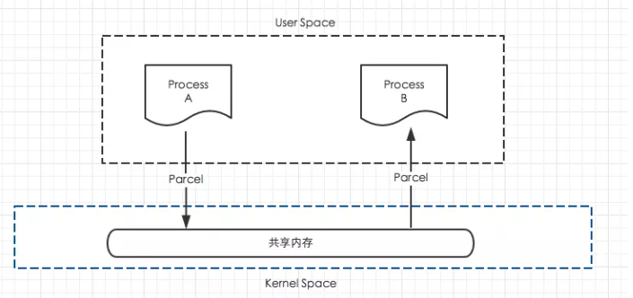
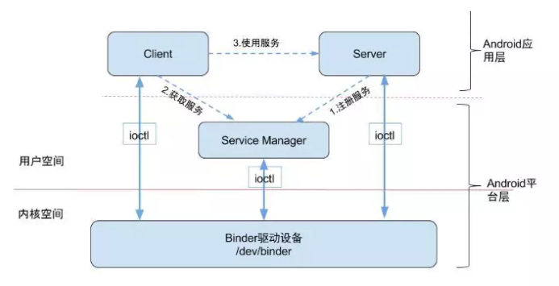

- [Binder机制及AIDL](https://fandazeng.github.io/2019/02/13/android/ipc/Binder%E6%9C%BA%E5%88%B6%E5%8F%8AAIDL/#more)
- [Android：从源码角度来赏析Binder机制的优美](https://www.jianshu.com/p/c1daf5653a47)
- [Android进程间的通信 - IPC(机制)Binder的原理和源码阅读](https://www.jianshu.com/p/810ecb80a96f)
- https://github.com/LRH1993/android_interview/blob/master/android/advance/binder.md
- Android 艺术探索 - 第二章

# 知识储备

## Android IPC 简介

IPC (Inter-Process Communication) 含义为进程间通信，是指两个进程间进行进行数据交换的过程。Android 中最有特色的进程间通信方式就是 Binder。

> *线程与进程*，线程是 CPU 调度的最小单元，线程是一种有限的系统资源。进程指一个执行单元，Android 中一般指一个 APP，一个进程可以包含多个线程。

## 多进程使用场景

- 1.可能是有些模块由于特殊原因需要运行在单独的进程中，或者为了让一个应用获取多份内存空间。（具体应用分配多少内存和屏幕密度、尺寸有关，可查看[高效加载大图](https://github.com/BetterRamon/RamonLearningCode/blob/master/Android/Basic/DispalyBitmaps.md)）
- 2.两个应用之间需要进行数据交换，这种就要使用跨进程的方式通信。例如 `ContentProvider`

## Android 中的多进程模式

在 Android 中使用多进程就是给四大组件指定 `android:process` 属性。例如：

```
<activity android:name=".multiprocess.MainActivity" >
    <intent-filter>
        <action android:name="android.intent.action.MAIN"/>
        <category android:name="android.intent.category.LAUNCHER"/>
    </intent-filter>
</activity>
<activity android:name=".multiprocess.SecondActivity"
    android:process=":remote"/>
<activity android:name=".multiprocess.ThirdActivity"
    android:process="betterramon.top.frameworks.remote"/>
```

上面我们创建了三个 Activity，通过 `MainActivity` 启动 `SecondActivity` 然后再启动 `ThirdActivity`。我们使用下面的命令来查看当前的进程信息

`adb shell ps | grep xxx.xxx.包名`

```
adb shell ps | grep betterramon.top.frameworks
u0_a534      13087  1032 2311424  76392 SyS_epoll_wait      0 S betterramon.top.frameworks
u0_a534      14219  1032 2312348  77328 SyS_epoll_wait      0 S betterramon.top.frameworks:remote
u0_a534      14303  1032 2315428  69496 SyS_epoll_wait      0 S betterramon.top.frameworks.remote
```

没有指定 `process` 属性的组件运行在默认进程中，进程名为当前应用的包名；

『:』开头的命名方式是一种简写方式，前面会附加包名信息，属于当前应用的私有进程，其他应用的组件不可以和它跑在同一个进程中。

进程名不以『:』开头的属于全局进程，其他应用通过 [ShareUID](http://www.cnblogs.com/mythou/p/3258715.html) 方式可以和它跑在同一个进程中。

> 两个应用通过 ShareUID 跑在同一个进程是有要求的，需要这两个应用具有相同的 ShareUID 并且签名相同才可以。

## 多进程模式造成的问题

1. 静态成员和单例模式完全失效
2. 线程同步机制完全失效（因为不同进程锁的不是同一个对象）
3. `SharePreference` 可靠性下降（并发写会出问题）
4. `Application` 会创建多次


> 解析： Android 为每一个应用分配了一个独立的虚拟机，不同的虚拟机在内存上有不同的地址空间，这就导致了在不用的虚拟机访问同一个对象会产生多份副本，所以会产生上述 1、2问题；SharedPreference 底层是通过读写 XML 文件实现的，多进程意味着并发操作，所以会造成问题 3；组件在新的进程上运行，系统会创建新的 Application 和分配独立的虚拟机，这样会造成 4 问题。为了解决这些问题，我们需要可靠、稳定的跨进程通信方式，这就是 Binder 通信机制。

# 序列化

## 什么是序列化？

**把对象从内存中变成可存储或传输的过程称为序列化**，序列化之后的内容可以存储在磁盘上或者通过网络传输；反过来，**把对象内容从序列化的对象重新读取到内存里称之为反序列化**。

## Serializable 接口序列化

`Serializable` 是 `Java` 所提供的一个序列化接口，它是一个空接口，用于标识类可以被序列化。只需要实现这个接口并在类中声明一个指定的字段

```
private static final long serialVersionUID = 232234334221121L;
```
serialVersionUID 也不是必须的，**我们不声明这个 serialVersionUID 同样也可以实现序列化，但是会对反序列化产生影响**，具体影响后面介绍，先来介绍一下怎么使用 Serializable 进行序列化。

下面的 User 类是一个实现了 Serializable 接口的类。
```
public class Users implements Serializable{
    private static final long serialVersionUID = 1L;

    private int userId;
    private String userName;
    private boolean isMale;

    public Users(int userId, String userName, boolean isMale) {
        this.userId = userId;
        this.userName = userName;
        this.isMale = isMale;
    }

   // 省略 get set 方法
}
```
序列化和反序列化非常简单（实现工作几乎都被系统实现了），我们只需要调用 ObjectOutputStream 和 ObjectInputStream 实现
```
// 序列化过程
Users users = new Users(3112, "Ramon", true);
try {
    ObjectOutputStream objectOutputStream = new ObjectOutputStream(new FileOutputStream(getCacheDir() + "/cache.txt"));
    objectOutputStream.writeObject(users);
    objectOutputStream.close();
} catch (IOException e) {
    Log.i("meng", "ioException" + e.getMessage());
    e.printStackTrace();
}

// 反序列化过程
try {
    ObjectInputStream objectInputStream = new ObjectInputStream(new FileInputStream(getCacheDir()+"/cache.txt"));
    Users newUser = (Users)objectInputStream.readObject();
    objectInputStream.close();
    messageTv.setText(newUser.toString());
} catch (IOException e){
    Log.i("meng", "ioException2" + e.getMessage());
    e.printStackTrace();
} catch (ClassNotFoundException e){
    Log.i("meng", "ClassNotFoundException" + e.getMessage());
    e.printStackTrace();
}
```

### serialVersionUID 字段

不指定 serialVersionUID 也可以实现序列化，但是反序列化会有问题，下面详细解释，serialVersionUID 是用来辅助序列化和反序列化过程的，工作过程如下：

序列化的时候系统会把当前类的 serialVersionUID 写入序列化的文件中，当反序列化的时候系统会检测文件中的 serialVersionUID，看它是否和当前类的 serialVersionUID 一致，如果一致就说明序列化的类的版本和当前类的版本是相同的，可以成功反序列化；否则说明当前类和序列化的类相比发生了某些变化，比如成员变量的数量、类型可能发生了变化，这个时候是无法反序列化的，会报如下错误：

```
java.io.InvalidClassException: Main,local class incompatible: stream classdesc serialVersionUID = 23232434323223,local class serialVersionUID = 232432324243332232
```

一般来说，我们应该手动指定 serialVersionUID 的值，比如 1L，这样序列化和反序列化的时候 serialVersionUID 是相同的，因此可以正常进行反序列化。如果不手动指定 serialVersionUID 的值，反序列化的时候当前类有所改变，比如增加或者删除了某些成员变量，那么系统会重新计算当前类的 hash 值并把它赋值给 serialVersionUID，这个时候当前类的 serialVersionUID 和序列化中的 serialVersionUID 就会不一致，反序列化就会失败。

> 有两点需要注意：静态成员变量属于类不属于对象，所以不会参与序列化过程；<br/>
第二个用 transient 关键字标记的成员变量不参与序列化过程。

通过实现如下两个方法可以重写系统默认的序列化和反序列化的过程

```
private void writeObject(java.io.ObjectOutputStream out) throws IOException {
    ...
}

private void readObject(java.io.ObjectInputStream in) throws IOException, ClassNotFoundException {
    ...
}
```

是不是很好奇，上面的两个方法是 private 的，它们是怎么被调用到的呢？

[关于Java中使用Serializable中writeObject和readObject调用的问题](https://www.cnblogs.com/sharkli/p/5607895.html)

## Parcelable 接口序列化

Parcelable 也是一个接口，只要实现了这个接口，一个类的对象就可以实现序列化并可以通过 Intent 和 Binder 传递。

**使用Parcelable步骤:**

- 1.实现Parcelable接口 
- 2.实现接口中的两个方法

```
public int describeContents();
public void writeToParcel(Parcel dest, int flags);
```

第一个方法是内容接口描述，默认返回0就可以了 
第二个方法是将我们的对象序列化一个Parcel对象，也就是将我们的对象存入Parcel中 

- 3.实例化静态内部对象 CREATOR 实现接口 Parcelable.Creator，实例化 CREATOR 时要实现其中的两个方法，其中 createFromParcel 的功能就是从 Parcel 中读取我们的对象。

> 也就是说我们先利用writeToParcel方法写入对象，再利用 createFromParcel 方法读取对象，因此这两个方法中的读写顺序必须一致，否则会出现数据紊乱


方法 | 功能 | 标记位
---|---|---
createFromParcel(Parcel in) | 从序列化后的对象中创建原始对象|
newArray(int size) | 创建指定长度的原始对象数组|
User2(Parcel in) | 从序列化后的对象中创建原始对象 |
writeToParcel(Parcel out,int flags)| 将当前对象写入序列化结中，其中 flags 标识有两种值： 0 或者 1（右侧标记）为 1 时标识当前对象需要作为返回值返回，不能立即释放资源，几乎所有情况都是0|PARCELABLE_WRITE_RETURN_VALUE
describeContents|返回当前对象的内容描述，如果含有文件描述符，返回1（参见右边标志位），否则返回 0，几乎所有情况都返回 0 | CONTENTS_FILE_DESCRIPTOR

```
public class User2 implements Parcelable{
    private int userId;
    private String userName;
    private boolean isMale;

    public Book book;

    @Override
    public int describeContents() {
        // 返回当前对象的内容描述，如果含有文件描述符，则返回1，否则返回 0
        return 0;
    }

    // 完成序列化过程
    @Override
    public void writeToParcel(Parcel parcel, int i) {
        parcel.writeInt(userId);
        parcel.writeString(userName);
        parcel.writeInt(isMale ? 1 : 0);
        parcel.writeParcelable(book, 0);
    }

    // 完成反序列化过程，内部两个方法分别表示创建序列化对象和数组
    public static final Parcelable.Creator<User2> CREATOR = new
                Parcelable.Creator<User2>() {
        @Override
        public User2 createFromParcel(Parcel parcel) {
            return new User2(parcel);
        }

        @Override
        public User2[] newArray(int i) {
            return new User2[i];
        }
    };

    // 通过各种 readXXX 方法完成反序列化过程
    // 注意这里读的顺序需要和写的顺序一致才行
    private User2(Parcel in) {
        userId = in.readInt();
        userName = in.readString();
        isMale = in.readInt() == 1;
        // 由于 book 是另一个可序列化的对象，
        // 所以它的反序列化需要传递当前线程的上下文类加载器，否则会报无法找到类的错误
        book = in.readParcelable(Thread.currentThread().getContextClassLoader());
    }
}
```

**接下来我们分解一下上面的代码，首先我们需要知道什么 Parcel**

以下来自：[Android序列化完全解析(二)-Parcelable](https://www.jianshu.com/p/82e3090e00e0)

Parcel 提供了一套机制，可以将序列化之后的数据写入一个共享内存中，其他进程通过 Parcel 可以从这块内存中读出字节流并反序列化为对象，它的模型如下：



Parcel 在 Java 层和 C++ 层都有定义，Parcel 中对于不同类型的数据处理是不一样的，它有两个成员变量

```
uint8_t* mData; //用来存储序列化流数据，可以把它理解成共享内存
size_t* mObjects;  //用来存储IBinder和FileDescriptor
```
> 为什么要区别对待呢？我们可以暂时这么理解，对于IBinder来说，它存在的意义就是要现实跨进程调用，所以我就是需要在Parcel中传递一个真实的引用，这个引用能够操作到发起进程的对象。而对于文件描述符来说，本来就是kernel层的东西，所以在不同的进程中它们可以表示同一个对象，所以也无需严格的序列化。

### Parcelable 和 Serializable 的区别

Serializable： 使用简单，开销大，一般用于存储到磁盘上。

Parcelable： Android 提供的序列化方式，主要用于在内存序列化上。


# Binder

## Linux 进程相关知识

1. 进程空间 = 用户空间 + 内核空间

2. 进程间用户数据不可共享，内核空间可共享。

3. 为了保证安全性和独立性，一个进程不能直接操作或访问另一个进程。（进程隔离）

4. 进程内，用户空间和内核空间不能直接交互，需要通过系统调用。


主要通过函数：

`copy_from_user()`,将用户空间数据拷贝到内核空间。

`copy_to_user()`,将内核空间数据拷贝到用户空间。


## Linux 跨进程通信原理


工作流程：

1. 发送进程通过系统调用，将需要发送的数据拷贝到 Linux 进程的内核空间的缓存区中。

2. 内核服务程序唤醒接收进程的接收线程，通过系统调用将数据发送到接收进程的用户空间中，最终完成数据发送。


即： 发送进程的用户空间 -- 系统调用 `copy_from_user()` -- 内核空间内存缓存区 -- 系统调用 `copy_to_user()` -- 接收进程的用户空间 『上图的 2 次 代表第二次拷贝数据，全过程需要拷贝两次数据』

缺点： 效率低，有 2 次数据拷贝，接收数据的缓存要由接收方提供，但接收方不知道到底需要多大的缓存。「一般的做法是：开辟尽量大的空间或先调用 API 接收消息头获取消息体大小，再开辟适当的空间接收消息体，但前者浪费空间，后者浪费时间」


## Binder 跨进程通信原理

### 动态内核可加载模块和内存映射

Linux 的动态内核可加载模块机制，使得 Android 系统可以通过动态添加一个内核模块运行在内核空间，用户进程之间通过这个内核模块作为桥梁来实现通信。在 Android 系统中，这个运行在内核空间，负责各个用户进程通过 Binder 实现通信的内核模块就叫 Binder 驱动（Binder Dirver）。

Binder IPC 机制中涉及到的内存映射是通过 `mmap()` 来实现的，`mmap()` 是操作系统中的一种内存映射的方法。内存映射简单的讲就是将用户空间的一块内存区域映射到内核空间。映射关系建立后，用户对这块内存区域的修改可以直接反应到内核空间；反之内核空间对这段区域的修改也能直接反应到用户空间。

内存映射能减少数据拷贝次数，实现用户空间和内核空间的高效互动。两个空间各自的修改能直接反映在映射的内存区域，从而被对方空间及时感知。正因如此，内存映射能够提供对进程间通信的支持。


### Binder IPC 实现原理

一次完整的 Binder IPC 通信过程如下：

1. 首先 Binder 驱动在内核空间创建一个数据接收缓存区；

2. 接着在内核空间开辟一块内核缓存区，建立内核缓存区和内核中的数据缓存区的映射关系，以及内核中数据接收缓存区和接收进程用户空间地址的映射关系。

3. 发送方进程通过系统调用 `copy_from_user()`将数据 copy 到内核中的内核缓存区，由于内核缓存区和接收进程的用户空间存在内存映射，因此也就相当于把数据发送到了接收进程的用户空间，这样便完成了一次进程间通信。


### Binder 通信模型

我们来看下图 Binder 进程间通信的四个重要角色：



- Client： 用户端进程
- Server：服务端进程
- ServiceManager：运行在用户空间，它负责管理 Service 注册与查询等操作。
- Binder驱动：进程间通信的核心。是一种虚拟设备驱动，负责进程之间 Binder 通信的建立， Binder 在进程之间的传递，Binder 引用计数管理，数据包在进程之间的传递和交互等一系列底层支持。

下面是详细的 Binder 机制运行过程

1. ServiceManager 初始化
2. Server 向 ServiceManager 注册自己
3. Client 获取远程服务
    - Client 向 Server 发起 IPC 请求
    - Binder 驱动将该请求转发给 ServiceManager 进程
    - ServiceManager 查找到对应 Server 的 Binder 引用后通过 Binder 驱动 反馈给 Client「并不是实际真实的远程 Binder 对象，而是 Binder 驱动里的一个映射 BinderProxy」
    - Client 收到 Server 对应的 BinderProxy 引用后，会创建一个 Server 对应的远程服务代理。
4. Client 通过代理调用 Server
    - Client 会先将请求数据从用户空间拷贝到内核空间，然后调用 transact 去连接 Binder 驱动。
    - 接着 Binder 驱动会去连接远程进程，并通知远程进程执行 onTransact() 函数
5. Server 返回结果
    - 执行完成后将结果写入内核空间
    - Binder 驱动再唤醒客户端线程获取数据

> 注意：Binder 执行过程中客户端当前线程会被挂起！因此，如果远程进程是执行长时间的运算，请不要使用主线程去调用远程函数，防止 ANR

#### Binder 的完整定义

- 从 IPC 的角度来说，Binder 是 Android 中的一种跨进程通信的方式。

- Binder 还可以理解为一种虚拟的物理设备，它的设备驱动是 /dev/binder,该通信方式 Linux 中没有。

- 从 Android Framework 角度来说，Binder 是 ServiceManager 连接各种 
Manager（ActivityManager、WindowManager...）和相应 ManagerService 的桥梁。

- 从 Server 进程的角度看，Binder 指的是 Server 中的 Binder 实体对象。

- 从 Client 进程的角度看，Binder 指的是对 Binder 代理对象，是 Binder 实体对象的一个远程代理；

- 从传输过程的角度看，Binder 是一个可以跨进程传输的对象；Binder 驱动会对这个跨越进程边界的对象做特殊处理，自动完成代理对象和本地对象之间的转换；