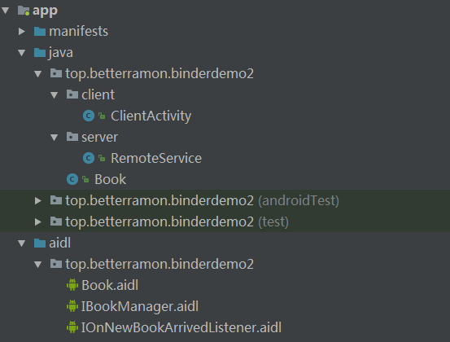

- https://www.cnblogs.com/everhad/p/6246551.html

## 使用 AIDL 的方式实现 Binder

我们使用 AIDL 来扩展第二话中的手写 Binder

项目结构如下：



首先，声明后缀为 AIDL 的文件，在里面声明 Server 提供的功能

```
// IBookManager.aidl
package top.betterramon.binderdemo2;

import top.betterramon.binderdemo2.Book;
import top.betterramon.binderdemo2.IOnNewBookArrivedListener;
// Declare any non-default types here with import statements

interface IBookManager {
    List<Book> getBookList();
    void addBook(in Book book);
    void registerListener(IOnNewBookArrivedListener listener);
    void unregisterListener(IOnNewBookArrivedListener listener);
}
```

在 AIDL 文件中，并不是所有的数据类型都可以使用的，只支持以下数据类型：

- 基本数据类型「int、long、char、boolean、double」
- String 和 CharSequence
- List：只支持 ArrayList，里面每个元素都必须能够被 AIDL 支持；
- Map：只支持 HashMap，里面每个元素都必须能够被 AIDL 支持，包括 KEY 和 VALUE；
- Parcelable：所有实现了 Parcelable 接口的对象；
- AIDL：所有 AIDL 接口本身也可以在 AIDL 文件中使用；

**注意：**

1. **自定义的 Parcelable 对象「如上面的 Book 类」和 AIDL 对象「如上面的 IOnNewBookArrivedListener」必须显式 import 进来，不管是否位于同一个包内。**

2. **如果 AIDL 文件中用到了自定义的 Parcelable 对象，那么必须新建一个和它同名的 AIDL 文件，并在里面声明它为 Parcelable 类型**。「上面的 Book 类就需要做声明」

```
// Book.aidl
package top.betterramon.binderdemo2;

parcelable Book;
```

3. **AIDL 文件只支持定义方法，不支持声明静态变量，这点区别于传统接口**；

4. AIDL 文件中只能使用 AIDL 接口，不能使用传统接口。

#### AIDL 中的定向 tag

上述 AIDL 文件的方法参数前带了一个 in，这其实是 AIDL 中的其中一个定向 tag，除了 in，还有 out 和 inout，不同的 tag 对底层的开销不一样。

不同的 tag 表示了在跨进程通信中数据的流向， 其中 in 表示数据只能由客户端流向服务端，out 表示数据只能由服务端流向客户端，inout 表示数据可以双向流动。

假如当前的方法为客户端请求服务端，in 为定向 tag 的话表现为服务端将会收到一个参数对象的完整数据，但是客户端的对象不会因为服务器对参数的修改而发生变动。out 为定向 tag 的话服务端将会收到参数为空的对象，但是在服务端对接收的空对象有任何修改的话客户端将会同步变动。inout 为定向 tag 的情况下，服务端将会收到客户端传来对象的完整信息，并且客户端将会同步服务端对该对象的任何变动。

#### AIDL 自动生成的 JAVA 类

AIDL 工具会解析 AIDL 文件帮我们自动生成一些 Java 类，下面就是我们生成的类。

```
/*
 * This file is auto-generated.  DO NOT MODIFY.
 * Original file: E:\\RamonLearningCode\\Android\\Frameworks\\BinderDemo2\\app\\src\\main\\aidl\\top\\betterramon\\binderdemo2\\IBookManager.aidl
 */
package top.betterramon.binderdemo2;

// 这个类用来定义服务端 RemoteService 具备什么样的能力
public interface IBookManager extends android.os.IInterface {
    // 定义方法
    public java.util.List<top.betterramon.binderdemo2.Book> getBookList() throws android.os.RemoteException;
    public void addBook(top.betterramon.binderdemo2.Book book) throws android.os.RemoteException;
    public void registerListener(top.betterramon.binderdemo2.IOnNewBookArrivedListener listener) throws android.os.RemoteException;
    public void unregisterListener(top.betterramon.binderdemo2.IOnNewBookArrivedListener listener) throws android.os.RemoteException;
    /**
     *  抽象类，继承 Binder， 拥有跨进程通信的能力，具体提供的服务功能由实现类自身实现
     */
    public static abstract class Stub extends android.os.Binder implements top.betterramon.binderdemo2.IBookManager {
        // 定义字符描述
        private static final java.lang.String DESCRIPTOR = "top.betterramon.binderdemo2.IBookManager";

        /**
         * 1. 将（descriptor，IBookManager）作为（key，value）对存到 Binder 对象中的 Map<String,IInterface>对象中
         * 2. 之后 Binder 对象可根据 descriptor 通过 queryLocalIInterface() 获得对应的 IInterface 对象
         */
        public Stub() {
            this.attachInterface(this, DESCRIPTOR);
        }

        /**
         * 将 binder 对象转化为相应的接口对象，区分进程，同一进程，直接返回当前对象
         * 不同进程，返回代理对象。
         */
        public static top.betterramon.binderdemo2.IBookManager asInterface(android.os.IBinder obj) {
            if ((obj == null)) {
                return null;
            }
            android.os.IInterface iin = obj.queryLocalInterface(DESCRIPTOR);
            if (((iin != null) && (iin instanceof top.betterramon.binderdemo2.IBookManager))) {
                return ((top.betterramon.binderdemo2.IBookManager) iin);
            }
            return new top.betterramon.binderdemo2.IBookManager.Stub.Proxy(obj);
        }

        @Override
        public android.os.IBinder asBinder() {
            return this;
        }

        @Override
        public boolean onTransact(int code, android.os.Parcel data, android.os.Parcel reply, int flags) throws android.os.RemoteException {
            switch (code) {
                case INTERFACE_TRANSACTION: {
                    reply.writeString(DESCRIPTOR);
                    return true;
                }
                case TRANSACTION_getBookList: {
                    data.enforceInterface(DESCRIPTOR);
                    java.util.List<top.betterramon.binderdemo2.Book> _result = this.getBookList();
                    reply.writeNoException();
                    reply.writeTypedList(_result);
                    return true;
                }
                case TRANSACTION_addBook: {
                    data.enforceInterface(DESCRIPTOR);
                    top.betterramon.binderdemo2.Book _arg0;
                    if ((0 != data.readInt())) {
                        _arg0 = top.betterramon.binderdemo2.Book.CREATOR.createFromParcel(data);
                    } else {
                        _arg0 = null;
                    }
                    this.addBook(_arg0);
                    reply.writeNoException();
                    return true;
                }
                case TRANSACTION_registerListener: {
                    data.enforceInterface(DESCRIPTOR);
                    top.betterramon.binderdemo2.IOnNewBookArrivedListener _arg0;
                    _arg0 = top.betterramon.binderdemo2.IOnNewBookArrivedListener.Stub.asInterface(data.readStrongBinder());
                    this.registerListener(_arg0);
                    reply.writeNoException();
                    return true;
                }
                case TRANSACTION_unregisterListener: {
                    data.enforceInterface(DESCRIPTOR);
                    top.betterramon.binderdemo2.IOnNewBookArrivedListener _arg0;
                    _arg0 = top.betterramon.binderdemo2.IOnNewBookArrivedListener.Stub.asInterface(data.readStrongBinder());
                    this.unregisterListener(_arg0);
                    reply.writeNoException();
                    return true;
                }
            }
            return super.onTransact(code, data, reply, flags);
        }

        // 远程服务代理类，需要实现接口，才能代理服务功能
        private static class Proxy implements top.betterramon.binderdemo2.IBookManager {
            private android.os.IBinder mRemote;

            Proxy(android.os.IBinder remote) {
                mRemote = remote;
            }

            @Override
            public android.os.IBinder asBinder() {
                return mRemote;
            }

            public java.lang.String getInterfaceDescriptor() {
                return DESCRIPTOR;
            }

            @Override
            public java.util.List<top.betterramon.binderdemo2.Book> getBookList() throws android.os.RemoteException {
                android.os.Parcel _data = android.os.Parcel.obtain();
                android.os.Parcel _reply = android.os.Parcel.obtain();
                java.util.List<top.betterramon.binderdemo2.Book> _result;
                try {
                    _data.writeInterfaceToken(DESCRIPTOR);
                    mRemote.transact(Stub.TRANSACTION_getBookList, _data, _reply, 0);
                    _reply.readException();
                    _result = _reply.createTypedArrayList(top.betterramon.binderdemo2.Book.CREATOR);
                } finally {
                    _reply.recycle();
                    _data.recycle();
                }
                return _result;
            }

            @Override
            public void addBook(top.betterramon.binderdemo2.Book book) throws android.os.RemoteException {
                android.os.Parcel _data = android.os.Parcel.obtain();
                android.os.Parcel _reply = android.os.Parcel.obtain();
                try {
                    _data.writeInterfaceToken(DESCRIPTOR);
                    if ((book != null)) {
                        _data.writeInt(1);
                        book.writeToParcel(_data, 0);
                    } else {
                        _data.writeInt(0);
                    }
                    mRemote.transact(Stub.TRANSACTION_addBook, _data, _reply, 0);
                    _reply.readException();
                } finally {
                    _reply.recycle();
                    _data.recycle();
                }
            }

            @Override
            public void registerListener(top.betterramon.binderdemo2.IOnNewBookArrivedListener listener) throws android.os.RemoteException {
                android.os.Parcel _data = android.os.Parcel.obtain();
                android.os.Parcel _reply = android.os.Parcel.obtain();
                try {
                    _data.writeInterfaceToken(DESCRIPTOR);
                    _data.writeStrongBinder((((listener != null)) ? (listener.asBinder()) : (null)));
                    mRemote.transact(Stub.TRANSACTION_registerListener, _data, _reply, 0);
                    _reply.readException();
                } finally {
                    _reply.recycle();
                    _data.recycle();
                }
            }

            @Override
            public void unregisterListener(top.betterramon.binderdemo2.IOnNewBookArrivedListener listener) throws android.os.RemoteException {
                android.os.Parcel _data = android.os.Parcel.obtain();
                android.os.Parcel _reply = android.os.Parcel.obtain();
                try {
                    _data.writeInterfaceToken(DESCRIPTOR);
                    _data.writeStrongBinder((((listener != null)) ? (listener.asBinder()) : (null)));
                    mRemote.transact(Stub.TRANSACTION_unregisterListener, _data, _reply, 0);
                    _reply.readException();
                } finally {
                    _reply.recycle();
                    _data.recycle();
                }
            }
        }
        // 定义方法的编码
        static final int TRANSACTION_getBookList = (android.os.IBinder.FIRST_CALL_TRANSACTION + 0);
        static final int TRANSACTION_addBook = (android.os.IBinder.FIRST_CALL_TRANSACTION + 1);
        static final int TRANSACTION_registerListener = (android.os.IBinder.FIRST_CALL_TRANSACTION + 2);
        static final int TRANSACTION_unregisterListener = (android.os.IBinder.FIRST_CALL_TRANSACTION + 3);
    }
}
```
系统帮我们生成的类其实和我们之前手写的格式是一样的，不过 Stub 类放在了 IBookManager 的内部，然后 Proxy 类放在了 Stub 类内部，成为 Stub 类的静态内部类。这样做的好处是避免类名重复的问题，因为每个 AIDL 文件都会生成对应的 Stub 类和 Proxy 类。

#### Stub

- DESCRIPTOR
```
private static final java.lang.String DESCRIPTOR = "top.betterramon.binderdemo2.IBookManager";
```
用一个常量存储 AIDL 的类名，作用后面介绍

- Stub() 构造方法
```
public Stub() {
    this.attachInterface(this, DESCRIPTOR);
}
```
构造方法里调用了一个方法，而这个 attachInterface 自己没有，所以调用的是父类 Binder 的。
```
private IInterface mOwner;
private String mDescriptor;

public void attachInterface(@Nullable IInterface owner, @Nullable String descriptor) {
    mOwner = owner;
    mDescriptor = descriptor;
}
```
这个方法做了什么呢？它把自己和 DESCRIPTOR 保存在了当前类里，做了一个关联，有什么用？继续向后看

- asInterface()
```
public static com.wf.testaidl.PersonAidl asInterface(android.os.IBinder obj) {
    if ((obj == null)) {
         return null;
    }
    android.os.IInterface iin = obj.queryLocalInterface(DESCRIPTOR);
    if (((iin != null) && (iin instanceof com.wf.testaidl.PersonAidl))) {
        return ((com.wf.testaidl.PersonAidl) iin);
    }
    return new com.wf.testaidl.PersonAidl.Stub.Proxy(obj);
}
```
这个方法做了一件事，就是当发起 IPC 请求的时候把我们从 Binder 驱动拿到的这个 IBinder 描述转换成一个具体的 AIDL 接口对象，后面才能调用相应的接口方法。这里先调用了一个 queryLocalInterface(),下面来看看为什么调用这个方法？

```
public @Nullable IInterface queryLocalInterface(@NonNull String descriptor) {
    if (mDescriptor.equals(descriptor)) {
        return mOwner;
    }
    return null;
}
```
这里可以看出它是拿这个 descriptor 去判断是不是调用的自己，是就直接返回自己「这就是上面的 attachInterface 的作用」。为什么需要这样呢？我们考虑一个问题：是不是我们需要访问的服务一定是在不同的进程呢？答案是不是的，我们也有可能访问自己的服务，所以这里会有一个 queryLocalInterface。所以上图中有个本地服务。

如果我们访问的不是自己就需要拿这个 IBinder 描述去创建一个远程的 AIDL 接口对象。

- onTransact()
```
@Override
public boolean onTransact(int code, android.os.Parcel data, android.os.Parcel reply, int flags) throws android.os.RemoteException {
    switch (code) {
        case INTERFACE_TRANSACTION: {
            reply.writeString(DESCRIPTOR);
            return true;
        }
        case TRANSACTION_addPerson: {
            data.enforceInterface(DESCRIPTOR);
            com.wf.testaidl.bean.Person _arg0;
            if ((0 != data.readInt())) {
                _arg0 = com.wf.testaidl.bean.Person.CREATOR.createFromParcel(data);
            } else {
                _arg0 = null;
            }
            this.addPerson(_arg0);
            reply.writeNoException();
            return true;
        }
        case TRANSACTION_getPersonList: {
            data.enforceInterface(DESCRIPTOR);
            java.util.List<com.wf.testaidl.bean.Person> _result = this.getPersonList();
            reply.writeNoException();
            reply.writeTypedList(_result);
            return true;
        }
    }
    return super.onTransact(code, data, reply, flags);
 }
```
这个方法就是用来处理 IPC 请求的，根据不同的 code 值最终会调用它的实现类的对应接口方法，然后将处理后的结果写入 reply 返回给客户端。

- **服务要注册到 ServiceManager，那它到底在哪里注册呢？** 其实它在我们上面的 Stub 的构造函数里就已经完成了注册，无参构造函数初始化会先调用父类的无参构造函数，我们来看看它的父类 Binder 的无参构造函数。
```
public Binder() {
    init();
    ...
}
private native final void init();
```

从上面我们可以看出它调用了一个 native 方法，就是在这里注册的，native 方法会隐式的把 this 传过去，我们之前定义的 DESCRIPTOR 就注册过去了。


#### Proxy

Stub 其实是作为一个服务端注册到 ServiceManager 来响应我们的请求的，那我们是怎么发起请求的呢？来看 Proxy 类

```
// 远程服务代理类，需要实现接口，才能代理服务功能
private static class Proxy implements top.betterramon.binderdemo2.IBookManager {
    private android.os.IBinder mRemote;

    Proxy(android.os.IBinder remote) {
        mRemote = remote;
    }

    @Override
    public android.os.IBinder asBinder() {
        return mRemote;
    }

    public java.lang.String getInterfaceDescriptor() {
        return DESCRIPTOR;
    }

    @Override
    public java.util.List<top.betterramon.binderdemo2.Book> getBookList() throws android.os.RemoteException {
        ...
    }

    @Override
    public void addBook(top.betterramon.binderdemo2.Book book) throws android.os.RemoteException {
        ...
    }

    @Override
    public void registerListener(top.betterramon.binderdemo2.IOnNewBookArrivedListener listener) throws android.os.RemoteException {
        ...
    }

    @Override
    public void unregisterListener(top.betterramon.binderdemo2.IOnNewBookArrivedListener listener) throws android.os.RemoteException {
       ...
    }
}
```
Proxy 作为一个 Stub 的静态内部类主要用来发起跨进程的请求，为什么一个进程既有 Stub 又有 Proxy？因为一个进程既可以是客户端也可以是服务端。

- 1.构造方法
```
Proxy(android.os.IBinder remote) {
    mRemote = remote;
}
```
初始化的时候传入我们发起 IPC 请求的时候从 ServiceManager 里面查询到的 IBinder，这样我们才知道要去访问那个进程。

- 2.实现接口方法 getBookList 和其他几个方法
```
@Override
public java.util.List<top.betterramon.binderdemo2.Book> getBookList() throws android.os.RemoteException {
    android.os.Parcel _data = android.os.Parcel.obtain();
    android.os.Parcel _reply = android.os.Parcel.obtain();
    java.util.List<top.betterramon.binderdemo2.Book> _result;
    try {
        _data.writeInterfaceToken(DESCRIPTOR);
        mRemote.transact(Stub.TRANSACTION_getBookList, _data, _reply, 0);
        _reply.readException();
        _result = _reply.createTypedArrayList(top.betterramon.binderdemo2.Book.CREATOR);
    } finally {
        _reply.recycle();
        _data.recycle();
    }
    return _result;
}
```
首先初始化两个 Parcel 对象，都是通过 Parcel.obtain() 去 Parcel 池（队列）里面拿的。然后将我们要传递的进程（DESCRIPTOR）和传递的参数写入 Parcel。接下来就调用 IBinder 引用的 transact（）去连接 Binder 驱动。

```
mRemote.transact(Stub.TRANSACTION_getBookList, _data, _reply, 0);
```
这里它把要访问的方法定义成了一个 int 类型的常量 TRANSACTION_getBookList，这样 IBinder 引用拿到数据就知道去调用哪个方法了。
接下来我们来看看 transact() 方法做了些什么事

```
public final boolean transact(int code, @NonNull Parcel data, @Nullable Parcel reply,
            int flags) throws RemoteException {
    if (false) Log.v("Binder", "Transact: " + code + " to " + this);

    if (data != null) {
        data.setDataPosition(0);
    }
    boolean r = onTransact(code, data, reply, flags);
    if (reply != null) {
        reply.setDataPosition(0);
    }
    return r;
}
```

当 Binder 驱动拿到我们的请求和数据后，它就会去连接我们要访问的服务器端进程，然后通知它回调 onTransact() 方法。这样整个请求就完了。


#### 远程服务 RemoteService

```
package top.betterramon.binderdemo2.server;

/**
 * 远程服务 RemoteService
 */
public class RemoteService extends Service {
    // 支持并发读写，自动线程同步
    private CopyOnWriteArrayList<Book> mBookList = new CopyOnWriteArrayList<>();

    // 用于注册或反注册跨进程 listener，内部自动实现线程同步工作，当客户端进程终止时，会自动解除注册
    private RemoteCallbackList<IOnNewBookArrivedListener> mBookArrivedListeners = new RemoteCallbackList<>();

    // 线程安全的
    private AtomicBoolean mIsDestroy = new AtomicBoolean(false);

    @Override
    public void onCreate() {
        super.onCreate();
        mBookList.add(new Book(001,"艺术探索"));
        // 新建线程
        new Thread(new ServiceWorker()).start();
    }

    /*
        定时 5 秒新增一本书
     */
    private class ServiceWorker implements Runnable {
        @Override
        public void run() {
            // 服务还活着
            while (!mIsDestroy.get()) {
                try {
                    Thread.sleep(5000);
                } catch (InterruptedException e) {
                    e.printStackTrace();
                }
                int price = mBookList.size() + 1;
                Book book = new Book(price, " new Book: " + price);
                try{
                    onNewBookArrived(book);
                } catch (RemoteException e) {
                    e.printStackTrace();
                }
            }
        }
    }

    /*
        通知 client 端有新书
     */
    private void onNewBookArrived(Book book) throws RemoteException {
        mBookList.add(book);

        // beginBroadcast 将创建一个回调列表的副本，你可以从使用 getBroadcastItem 检索条目
        final int N = mBookArrivedListeners.beginBroadcast();

        for (int i = 0; i < N; i++) {
            IOnNewBookArrivedListener listener = mBookArrivedListeners.getBroadcastItem(i);
            if(listener != null) {
                listener.onNewBookArrived(book);
            }
        }
        // 和 beginBroadcast 结合使用
        mBookArrivedListeners.finishBroadcast();
    }

    @Nullable
    @Override
    public IBinder onBind(Intent intent) {
        if(checkPermission()) {
            return bookManager;
        } else {
            return null;
        }
    }

    /*
        权限验证，有权限才能连接到此服务
     */
    private boolean checkPermission() {
        int check = checkCallingOrSelfPermission("top.betterramon.binderdemo2.ACCESS_BOOK_SERVICE");
        if (check == PackageManager.PERMISSION_DENIED) {
            return false;
        }
        return true;
    }

    private final IBookManager.Stub bookManager = new IBookManager.Stub() {
        @Override
        public boolean onTransact(int code, Parcel data, Parcel reply, int flags) throws RemoteException {
            // 包名验证
            String packageName = null;
            String[] packages = getPackageManager().getPackagesForUid(getCallingUid());
            if(packages != null && packages.length > 0) {
                packageName = packages[0];
            }
            if( !packageName.startsWith("top.betterramon")) {
                return false;
            }
            // 权限验证
            boolean checkPermission = checkPermission();
            return checkPermission && super.onTransact(code, data, reply, flags);
        }

        // 真正提供的服务功能
        @Override
        public List<Book> getBookList() throws RemoteException {
            // 模拟耗时工作，如果 Client 端是在主线程操作，会导致 client 端出现 ANR
            SystemClock.sleep(5000);
            // 同步
            for (Book book : mBookList) {
                Log.d("server", "getBooks: " + book.toString());
            }
            return mBookList;
        }

        @Override
        public void addBook(Book book) throws RemoteException {
            mBookList.add(book);
            Log.d("server", "addBook: " + book.toString());
        }

        @Override
        public void registerListener(IOnNewBookArrivedListener listener) throws RemoteException {
            // 订阅
            mBookArrivedListeners.register(listener);

            final int N = mBookArrivedListeners.beginBroadcast();
            Log.d("server", "订阅成功，数量为: " + N);
            mBookArrivedListeners.finishBroadcast();
        }

        @Override
        public void unregisterListener(IOnNewBookArrivedListener listener) throws RemoteException {
            // 取消订阅
            mBookArrivedListeners.unregister(listener);

            // 配对使用
            final int N = mBookArrivedListeners.beginBroadcast();
            Log.d("server", "取消订阅成功，数量为： " + N);
            mBookArrivedListeners.finishBroadcast();
        }
    };

    @Override
    public void onDestroy() {
        super.onDestroy();
        mIsDestroy.set(true);
    }
}
```

1. CopyOnWriteArrayList ，这个类支持并发读写，应为 AIDL 方法是在 Binder 线程池中执行的，当多个客户端同时连接的时候，会存在多个线程同时访问的情况，我们需要处理线程同步。同理，要用 ConcurrentHashMap 代替 HashMap。

2. RemoteCallbackList 类，用于注册或反注册进程 listener，内部自动实现线程同步工作。服务每隔 5 秒生成一本新书，并向已经订阅的用户进行回调。注意：RemoteCallbackList 类的 beginBroadcast() 和 finishBroadcast() 方法要配对使用。跨进程传输的时候客户端的 Listener 在服务端会生成不同的对象，但是这个对象和客户端的对象有一个共同点，就是它们底层的 Binder 对象是同一个，利用这个特性就可以实现解注册。

3. 上述代码还实现了权限验证和包名验证。有两个地方可以做这个验证，其中之一，在 Service 的 onBind() 方法中进行验证，验证不通过直接返回 null；第二种是在 onTransact() 方法进行，如果返回 false，就不会执行 AIDL 中的方法。要验证权限，我们需要先定义权限，然后申请权限。

```
<!-- 定义服务权限 -->
<permission
    android:name="top.betterramon.binderdemo2.ACCESS_BOOK_SERVICE"
    android:protectionLevel="normal" />
<!-- 申请服务权限 -->
<uses-permission android:name="top.betterramon.binderdemo2.ACCESS_BOOK_SERVICE"/>
```

**注意：**

**1. 服务端的方法本身就运行在服务端的 Binder 线程池中，所以服务端方法本身就可以执行大量耗时操作，不需要另外开线程。**

**2. 服务端调用客户端的 listener 方法时，被调用的方法也运行在 Binder 线程池中，只不过是客户端的线程池。所以我们也要确保服务端不要在 UI 线程中调用客户端的耗时方法，否则将导致服务端无法响应。**

怎么理解上面这一点呢？从上面的介绍我们可以知道 Binder 采用的是 C/S 架构的模式来进行进程间通信的，核心就是内核空间的 Binder 驱动。下面给出一幅图，一个进程是既可以做客户端也可以做服务端的。


简单说一下上图的几个元素

- 1.AIDL，接口定义语言。
- 2.Stub：接收底层 C/C++ Binder 引用的回调。
    - function：我们定义的一些接口方法。
    - Proxy：用来访问底层的 Binder 驱动。
- 3.本地服务，我们当前进程的服务。
- 4.Binder驱动。


#### 客户端 ClientActivity

```
package top.betterramon.binderdemo2.client;

public class ClientActivity extends AppCompatActivity implements View.OnClickListener {

    private Button mGetBooks;
    private Button mAddBook;
    private Button mRegister;
    private Button mUnRegister;
    private boolean isServiceConnected;
    private IBookManager mBookManager;

    private static final int MESSAGE_NEW_BOOK_ARRIVED = 167;

    @Override
    protected void onCreate(Bundle savedInstanceState) {
        super.onCreate(savedInstanceState);
        setContentView(R.layout.activity_client);

        mGetBooks = findViewById(R.id.get_books_btn);
        mAddBook = findViewById(R.id.add_book_btn);
        mRegister = findViewById(R.id.register_btn);
        mUnRegister = findViewById(R.id.unregister_btn);

        mGetBooks.setOnClickListener(this);
        mAddBook.setOnClickListener(this);
        mRegister.setOnClickListener(this);
        mUnRegister.setOnClickListener(this);

        // 绑定服务，获取远程服务
        bindService(new Intent(this, RemoteService.class), mServiceConnection, Context.BIND_AUTO_CREATE);
    }

    @Override
    public void onClick(View view) {
        switch (view.getId()) {
            case R.id.get_books_btn:
                if(isServiceConnected) {
                    // 新建线程处理，防止 ANR
                    new Thread(new Runnable() {
                        @Override
                        public void run() {
                            List<Book> books = null;
                            try {
                                books = mBookManager.getBookList();
                            } catch (RemoteException e) {
                                e.printStackTrace();
                            }
                            Log.d("client", "书的数量 " + books.size());
                        }
                    }).start();
                }
                break;
            case R.id.add_book_btn:
                if (isServiceConnected) {
                    try {
                        mBookManager.addBook(new Book(002, "第二行代码"));
                    } catch (RemoteException e) {

                    }
                }
                break;
            case R.id.register_btn:
                if (isServiceConnected) {
                    try {
                        mBookManager.registerListener(mIOnNewBookArrivedListener);
                    } catch (RemoteException e) {
                        e.printStackTrace();
                    }
                }
                break;
            case R.id.unregister_btn:
                if(isServiceConnected) {
                    try {
                        mBookManager.unregisterListener(mIOnNewBookArrivedListener);
                    } catch (RemoteException e) {
                        e.printStackTrace();
                        Log.d("client", "client 取消订阅失败");
                    }
                }
                break;
            default:
                break;
        }
    }

    private ServiceConnection mServiceConnection = new ServiceConnection() {
        @Override
        public void onServiceConnected(ComponentName componentName, IBinder iBinder) {
            isServiceConnected = true;
            mBookManager = IBookManager.Stub.asInterface(iBinder);
            try{
                iBinder.linkToDeath(mDeathRecipient, 0);
            } catch (RemoteException e) {
                e.printStackTrace();
            }
        }

        @Override
        public void onServiceDisconnected(ComponentName componentName) {
            isServiceConnected = false;
            // 远程服务进程异常，重新连接服务
            bindService(new Intent(ClientActivity.this, RemoteService.class), mServiceConnection, Context.BIND_AUTO_CREATE);
            Log.d("client","onServiceDisconnected 当前进程名称 " + Thread.currentThread().getName());
        }
    };

    /*
        创建 binder 实体类
     */
    private IOnNewBookArrivedListener mIOnNewBookArrivedListener = new IOnNewBookArrivedListener.Stub() {
        @Override
        public void onNewBookArrived(Book book) throws RemoteException {
            // 该方法在 client 端线程池中运行，切换到主线程处理
            mHandler.obtainMessage(MESSAGE_NEW_BOOK_ARRIVED, book).sendToTarget();
        }
    };

    /*
        定义 Binder 死亡代理
     */
    private IBinder.DeathRecipient mDeathRecipient = new IBinder.DeathRecipient() {
        @Override
        public void binderDied() {// 该方法在 client 端线程池中运行
            if(mBookManager == null) {
                return;
            }
            mBookManager.asBinder().unlinkToDeath(mDeathRecipient, 0);
            mBookManager = null;
            // 远程服务进程异常，重新连接服务
            bindService(new Intent(ClientActivity.this, RemoteService.class), mServiceConnection, Context.BIND_AUTO_CREATE);
            Log.d("client", "onServiceDisconnected 当前进程名： " + Thread.currentThread().getName());
            Log.d("client", "DeathRecipient 当前进程名称： " + Thread.currentThread().getName());
        }
    };

    private Handler mHandler = new Handler() {
        @Override
        public void handleMessage(Message msg) {
            super.handleMessage(msg);
            switch (msg.what) {
                case MESSAGE_NEW_BOOK_ARRIVED:
                    Log.d("client", "receive new book: " + msg.obj );
                    break;
            }
        }
    };

    @Override
    protected void onDestroy() {
        super.onDestroy();
        if (isServiceConnected) {
            unbindService(mServiceConnection);
        }
    }
}
```

- 客户端的 IOnNewBookArrivedListener 中的 onNewBookArrived 方法运行在客户端线程池中，所以我们通过 Handle 切换到主线程处理，具体看代码实现。

- 由于服务端进程的意外停止，Binder 也可能会意外死亡，所以我们在 Binder 意外死亡时，重新连接了服务。实现方式有两种，一种方法是在 onServiceDisconnected 中重连服务，这个方法运行在 UI 线程。另一个方式是给 Binder 设置 DeathRecipient 监听，当 Binder 死亡时，会回调 DeathRecipient 的 binderDied 方法，可以在这个方法重连服务，这个方法运行在客户端线程池中。

#### linkToDeath 和 unlinkToDeath

Binder 运行在服务端进程，如果服务端进程由于某种原因异常终止，这个时候我们到服务端的连接断裂，会导致远程调用失败，如果我们不知道 Binder 连接已经断裂，那么客户端的功能就会收到影响。

通过 linkToDeath 我们可以给 Binder 设置一个死亡代理，当 Binder 死亡时，我们就会收到通知，这个时候我们就可以重新发起请求从而恢复连接。

- 第一步：声明一个 DeathRecipient 对象，它是一个接口，内部只有一个 binderDied 方法，我们需要实现这个方法，当 Binder 死亡的时候，系统就会回调 binderDied 方法，然后我们就可以移除之前绑定的 binder 代理重新绑定远程服务

```
private IBinder.DeathRecipient mDeathRecipient = new IBinder.DeathRecipient() {
    @Override
    public void binderDied() {
        if(mBookManager == null) {
            return;
        }
        
        mBookManager.asBinder().unlinkToDeath(mDeathRecipient, 0);
        mBookManager = null;
        // TODO：重新绑定远程 Service
    }
}
```

- 第二步：在客户端绑定远程服务成功后，给 binder 设置死亡代理

```
mService = IMessageBoxManager.Stub.asInterface(binder);
// linkToDeath 第二个参数是个标志位，直接设置为 0 就可以
binder.linkToDeath(mDeathRecipient, 0);
```

通过上面两步就给我们的 Binder 设置了死亡代理，当 Binder 死亡的时候我们就可以收到通知了

> 通过 Binder 的方法 isBinderAlive 也可以判断 Binder 是否死亡

## 从头开始再次分析一次流程

1. ServiceManager的注册和获取，Service Manager在用户空间的源代码位于`frameworks/base/cmds/servicemanager`目录下，主要是由`binder.h`、`binder.c`和 `service_manager.c` 三个文件组成。Service Manager的入口位于service_manager.c文件中的 main 函数。系统启动的时候会去执行\system\core\rootdir\init.rc，在这里面就启动了ServiceManager，启动之后会去执行service_manager.c

```
int main(int argc, char **argv)
{
    struct binder_state *bs;
    void *svcmgr = BINDER_SERVICE_MANAGER;

    bs = binder_open(128*1024);

    if (binder_become_context_manager(bs)) {
        ALOGE("cannot become context manager (%s)\n", strerror(errno));
        return -1;
    }

    svcmgr_handle = svcmgr;
    binder_loop(bs, svcmgr_handler);
    return 0;
}
```
打开 bind 驱动，并且分配 128 KB 内存，紧接着把自己注册为 Service 大管家，然后就开启 loop 来读取 Binder 驱动的消息处理各种服务请求。


2. 客户端发起 IPC 请求

```
//绑定服务
Intent intent = new Intent(this, AidlService.class);
bindService(intent, new ServiceConnection() {
    @Override
    public void onServiceConnected(ComponentName name, IBinder service) {
        mPersonAidl = PersonAidl.Stub.asInterface(service);
    }

    @Override
    public void onServiceDisconnected(ComponentName name) {
        mPersonAidl = null;
    }
}, BIND_AUTO_CREATE);
```
上面通过显式意图来绑定服务，接下来来看 bindService 做了什么

```
@Override
public boolean bindService(Intent service, ServiceConnection conn, int flags) {
    return mBase.bindService(service, conn, flags);
}
```
继续看 mBase.bindService 做了什么?
```
public abstract boolean bindService(@RequiresPermission Intent service,
            @NonNull ServiceConnection conn, @BindServiceFlags int flags);
```
可看到它是一个抽象方法，那么我们去找它的实现类，最终找到了 ContextImpl.java 里面
```
@Override
public boolean bindService(Intent service, ServiceConnection conn,
        int flags) {
    warnIfCallingFromSystemProcess();
    return bindServiceCommon(service, conn, flags, mMainThread.getHandler(),
            Process.myUserHandle());
}

private boolean bindServiceCommon(Intent service, ServiceConnection conn, int flags, Handler
        handler, UserHandle user) {
    IServiceConnection sd;
    if (conn == null) {
        throw new IllegalArgumentException("connection is null");
    }
    if (mPackageInfo != null) {
        sd = mPackageInfo.getServiceDispatcher(conn, getOuterContext(), handler, flags);
    } else {
        throw new RuntimeException("Not supported in system context");
    }
    try {
        // 调用ActivityManagerNative.getDefault().bindService方法 
        int res = ActivityManagerNative.getDefault().bindService(
            mMainThread.getApplicationThread(), getActivityToken(), service,
            service.resolveTypeIfNeeded(getContentResolver()),
            sd, flags, getOpPackageName(), user.getIdentifier());
        return res != 0;
    } catch (RemoteException e) {
        throw e.rethrowFromSystemServer();
    }
}

private static final Singleton<IActivityManager> gDefault = new Singleton<IActivityManager>() {
    protected IActivityManager create() {
        // binderService获取的也是一个远程服务的Binder对象，也是跨进程，而ServiceManager就是上面
        // 流程图里用来管理这些服务和Binder驱动
        IBinder b = ServiceManager.getService("activity");
        if (false) {
            Log.v("ActivityManager", "default service binder = " + b);
        }
        // 获取到ActivityManager的管理类，最终调用ActivityManagerService是一个典型的跨进程通讯，
        // 别问为什么千万别纠结
        IActivityManager am = asInterface(b);
        if (false) {
            Log.v("ActivityManager", "default service = " + am);
        }
        return am;
    }
};

// 省略掉一些有关Activity的启动流程，我们再后面再说

private final void realStartServiceLocked(ServiceRecord r,
        ProcessRecord app, boolean execInFg) throws RemoteException {
    if (app.thread == null) {
        throw new RemoteException();
    }
    
    requestServiceBindingsLocked(r, execInFg);
}


private final boolean requestServiceBindingLocked(ServiceRecord r, IntentBindRecord i,
        boolean execInFg, boolean rebind) throws TransactionTooLargeException {
    if (r.app == null || r.app.thread == null) {
        // If service is not currently running, can't yet bind.
        return false;
    }
    if ((!i.requested || rebind) && i.apps.size() > 0) {
            bumpServiceExecutingLocked(r, execInFg, "bind");
            r.app.forceProcessStateUpTo(ActivityManager.PROCESS_STATE_SERVICE);
            // IApplicationThread 
            r.app.thread.scheduleBindService(r, i.intent.getIntent(), rebind,
                    r.app.repProcState);
    }
    return true;
}

// 找了半天才找到这个方法，在ActivityThread的一个内部类
public final void scheduleBindService(IBinder token, Intent intent,
            boolean rebind, int processState) {
        updateProcessState(processState, false);
        BindServiceData s = new BindServiceData();
        s.token = token;
        s.intent = intent;
        s.rebind = rebind;

        if (DEBUG_SERVICE)
            Slog.v(TAG, "scheduleBindService token=" + token + " intent=" + intent + " uid="
                    + Binder.getCallingUid() + " pid=" + Binder.getCallingPid());
        // 请求绑定
        sendMessage(H.BIND_SERVICE, s);
}

public void handleMessage(Message msg) {
        if (DEBUG_MESSAGES) Slog.v(TAG, ">>> handling: " + codeToString(msg.what));
        switch (msg.what) {
         case BIND_SERVICE:
                Trace.traceBegin(Trace.TRACE_TAG_ACTIVITY_MANAGER, "serviceBind");
                handleBindService((BindServiceData)msg.obj);
                Trace.traceEnd(Trace.TRACE_TAG_ACTIVITY_MANAGER);
                break;
        }
}

private void handleBindService(BindServiceData data) {
    Service s = mServices.get(data.token);
    if (DEBUG_SERVICE)
        Slog.v(TAG, "handleBindService s=" + s + " rebind=" + data.rebind);
    if (s != null) {
        try {
            data.intent.setExtrasClassLoader(s.getClassLoader());
            data.intent.prepareToEnterProcess();
            try {
                if (!data.rebind) {
                    // 果真调用了service的onBind方法
                    IBinder binder = s.onBind(data.intent);
                    // 然后把返回的binder实例公开回调出去
                    ActivityManagerNative.getDefault().publishService(
                            data.token, data.intent, binder);
                } else {
                    // 调用 onRebind 方法
                    s.onRebind(data.intent);
                    ActivityManagerNative.getDefault().serviceDoneExecuting(
                            data.token, SERVICE_DONE_EXECUTING_ANON, 0, 0);
                }
                ensureJitEnabled();
            } catch (RemoteException ex) {
                throw ex.rethrowFromSystemServer();
            }
        } catch (Exception e) {
            if (!mInstrumentation.onException(s, e)) {
                throw new RuntimeException(
                        "Unable to bind to service " + s
                        + " with " + data.intent + ": " + e.toString(), e);
            }
        }
    }
}
```

例子源码：[BinderDemo2](./BinderDemo2)

