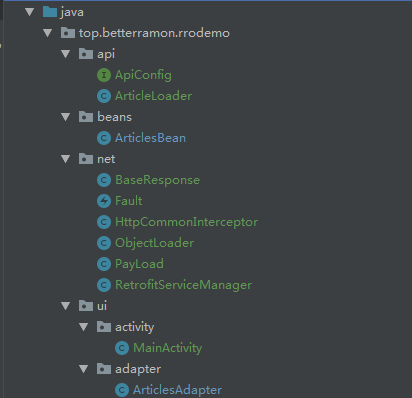

- [Retrofit + RxJava ＋ OkHttp 让网络请求变的简单-基础篇](https://www.jianshu.com/p/5bc866b9cbb9)
- [Retrofit + RxJava ＋ OkHttp 让网络请求变的简单-封装篇](https://www.jianshu.com/p/811ba49d0748)
- [RxJava2开发小记：用CompositeDisposable来“安排”Retrofit网络请求](https://blog.csdn.net/ysy950803/article/details/84930656)

## RRO 基本使用

#### 使用 Retrofit 实现

使用 [wanandroid] 的开发 api，获取首页热门文章 https://www.wanandroid.com/article/list/2/json (ps:作者原文里的豆瓣 api 不好用了)

> 方法：GET<br/>
参数：页码，拼接在链接中，从0开始。

- 首先在 build.gradle 文件中添加我们的依赖

```
implementation 'com.squareup.retrofit2:retrofit:2.4.0'// retrofit
implementation 'com.google.code.gson:gson:2.8.5'    // Gson 库
implementation 'io.reactivex:rxjava:1.1.5'      // Rxjava
implementation 'io.reactivex:rxandroid:1.1.0'   // Rxandroid
implementation 'com.squareup.retrofit2:converter-gson:2.4.0'    // 转换器，请求结果转换成Model
implementation 'com.squareup.retrofit2:adapter-rxjava:2.1.0'    // 配合Rxjava 使用
```

- 创建 Retrofit 实例

```
public static final String BASE_URL = "https://www.wanandroid.com";
Retrofit retrofit = new Retrofit.Builder()
                .baseUrl(BASE_URL)
                .addConverterFactory(GsonConverterFactory.create())
                .build();
```

- 创建一个接口

```
public interface HotArticles {
    @GET("/article/list/{page}/json")
    Call<ArticlesBean> getHotArticles(@Path("page") int page);
}
```

- 用 Retrofit 创建 HotArticles 实例，然后调用请求的方法

```
HotArticles service = retrofit.create(HotArticles.class);
Call<ArticlesSubject> articlesCall = service.getHotArticles(0);
articlesCall.enqueue(new Callback<ArticlesSubject>() {
    @Override
    public void onResponse(Call<ArticlesSubject> call, Response<ArticlesBean> response) {
        ArticlesAdapter articlesAdapter = new ArticlesAdapter(MainActivity.this, response.body());
        articlesRecycler.setAdapter(articlesAdapter);
    }

    @Override
    public void onFailure(Call<ArticlesSubject> call, Throwable t) {
        t.printStackTrace();
    }
});
```

效果如下，很简陋...


#### 配合 Rxjava 使用

- 更改定义的接口，把返回值 Call 类型修改为 Observable 类型

```
public interface HotArticles {
    @GET("/article/list/{page}/json")
    Observable<ArticlesBean> getHotArticles(@Path("page") int page);
}
```

- Retrofit 初始化时添加 RxJava 支持

```
Retrofit retrofit = new Retrofit.Builder()
    .baseUrl(BASE_URL)
    .addCallAdapterFactory(RxJavaCallAdapterFactory.create())   // RxJava 支持
    .addConverterFactory(GsonConverterFactory.create())         // json 转对象
    .build();
```

- 在 Activity 或者 Fragment 中传入 Subscriber 建立订阅关系

```
HotArticles service = retrofit.create(HotArticles.class);
// 建立订阅关系
Subscription subscription = service.getHotArticles(0)
        .subscribeOn(Schedulers.io())
        .observeOn(AndroidSchedulers.mainThread())
        .subscribe(new Subscriber<ArticlesBean>() {
            @Override
            public void onCompleted() {

            }

            @Override
            public void onError(Throwable e) {

            }

            @Override
            public void onNext(ArticlesBean articlesBean) {
                ArticlesAdapter articlesAdapter = new ArticlesAdapter(MainActivity.this, articlesBean);
                articlesRecycler.setAdapter(articlesAdapter);
            }
        });
```

#### 加入 Okhttp 配置

OkHttpClient 可以配置超时时间、缓存、拦截器等，下面我们来配置一下。

我们这里用到了  [BasicParamsInterceptor](https://github.com/jkyeo/okhttp-basicparamsinterceptor), 它的使用需要引入依赖，详情请查阅 Github

```
// 创建 Okhttpclient
OkHttpClient.Builder builder = new OkHttpClient.Builder();
builder.connectTimeout(DEFAULT_TIME_OUT, TimeUnit.SECONDS); // 连接超时时间
builder.writeTimeout(DEFAULT_TIME_OUT, TimeUnit.SECONDS);   // 连接超时时间
builder.readTimeout(DEFAULT_TIME_OUT, TimeUnit.SECONDS);    // 读操作超时时间

// 添加公共参数拦截器
BasicParamsInterceptor basicParamsInterceptor = new BasicParamsInterceptor.Builder()
        .addHeaderParam("userName", "")     // 添加公共参数
        .addHeaderParam("device", "")
        .build();

builder.addInterceptor(basicParamsInterceptor);

Retrofit retrofit = new Retrofit.Builder()
        .client(builder.build())    // 使用我们配置的 OkHttpClient
        .baseUrl(BASE_URL)
        .addCallAdapterFactory(RxJavaCallAdapterFactory.create())   // RxJava 支持
        .addConverterFactory(GsonConverterFactory.create())         // json 转对象
        .build();
```

> 上面这种是最简单的使用，实际使用中是不能这么写的，不符合软件工程！！我们需要进行一下封装，然后再使用

## RRO 封装

- 创建一个统一的接口实例管理类 `RetrofitServiceManager.java` , 每一个请求都需要定义一个接口，而获取接口实例的方式都是相同的，我们把这一步抽离出来。


```
/**
 * Created by Ramon Lee on 2019/8/12.
 * 统一生成接口实例的管理类
 */
public class RetrofitServiceManager {
    private static final int DEFAULT_TIME_OUT = 5;      // 默认超时时间
    private static final int DEFAULT_READ_TIME_OUT = 10;    // 默认读取超时时间
    private Retrofit mRetrofit;

    private RetrofitServiceManager() {
        // 创建 OkhttpClient
        OkHttpClient.Builder builder = new OkHttpClient.Builder();
        builder.connectTimeout(DEFAULT_TIME_OUT, TimeUnit.SECONDS);     // 连接超时时间
        builder.readTimeout(DEFAULT_READ_TIME_OUT, TimeUnit.SECONDS);        // 读操作超时时间

        // 添加公共参数拦截器
        HttpCommonInterceptor basicParamsInterceptor = new HttpCommonInterceptor.Builder()
                .addHeaderParams("paltform","android")
                .addHeaderParams("userToken","1234343434dfdfd3434")
                .addHeaderParams("userId","123445")
                .build();

        builder.addInterceptor(basicParamsInterceptor);


        // 创建 Retrofit
        mRetrofit = new Retrofit.Builder()
                .client(builder.build())
                .addCallAdapterFactory(RxJavaCallAdapterFactory.create())
                .addConverterFactory(GsonConverterFactory.create())
                .baseUrl(ApiConfig.BASE_URL)
                .build();
    }

    private static class SingletonHolder {
        private static final RetrofitServiceManager INSTANCE = new RetrofitServiceManager();
    }

    /**
     * 获取 RetrofitServiceManager 实例
     */

    public static RetrofitServiceManager getInstance() {
        return SingletonHolder.INSTANCE;
    }

    public <T> T create(Class<T> service) {
        return mRetrofit.create(service);
    }
}
```

> 使用单例模式实现了 RetrofitServiceManager , 提供了一个 create 方法，它的参数是泛型的，所以可以使用它来创建任何 api 接口的实例


- 创建接口

创建一个 api 接口，通过上面的 create 方法我们就可以获取实例

```
public interface ArticleService {
    // 获取 wanandroid 首页文章列表
    @GET("/article/list/{page}/json")
    Observable<ArticlesBean> getHotArticles(@Path("page") int page);
}
```

- 创建一个业务 Loader，获取 Observable 并处理相关业务，如果每一个 api 都写一个接口，这样非常麻烦，因此把请求逻辑封装在一个业务 Loader 里面，一个 Loader 里面可以处理多个 api 接口,例如我们这里创建一个 `ArticleLoader.java`

```
public class ArticleLoader extends ObjectLoader {
    private ArticleService mArticleService;

    public ArticleLoader() {
        mArticleService = RetrofitServiceManager.getInstance().create(ArticleService.class);
    }

    public Observable<List<ArticlesBean.Datas>> getArticles(int page) {
        return observe(mArticleService.getHotArticles(page))
                .map(new Func1<ArticlesBean, List<ArticlesBean.Datas>>() {
                    @Override
                    public List<ArticlesBean.Datas> call(ArticlesBean articlesBean) {
                        return articlesBean.getData().getDatas();
                    }
                });
    }


    public interface ArticleService {
        // 获取 wanandroid 首页文章列表
        @GET("/article/list/{page}/json")
        Observable<ArticlesBean> getHotArticles(@Path("page") int page);
    }
}
```

ArticleLoader 继承自 ObjectLoader ，这个类抽出了一些公共逻辑

```
/**
 * Created by Ramon Lee on 2019/8/12.
 * 将重复的代码抽取出来，放到父类
 */
public class ObjectLoader {
    protected <T> Observable<T> observe(Observable<T> observable) {
        return observable
                .subscribeOn(Schedulers.io())
                .unsubscribeOn(Schedulers.io())         // 可以让用户取消订阅
                .observeOn(AndroidSchedulers.mainThread());
    }
}
```

- Activity 或者 Fragment 中调用

```
mArticleLoader = new ArticleLoader();
mArticleLoader.getArticles(0).subscribe(new Action1<List<ArticlesBean.Datas>>() {
            @Override
            public void call(List<ArticlesBean.Datas> datas) {
                ArticlesAdapter articlesAdapter = new ArticlesAdapter(MainActivity.this, datas);
                articlesRecycler.setAdapter(articlesAdapter);
            }
        },
        new Action1<Throwable>() {
            @Override
            public void call(Throwable throwable) {
                Log.e(TAG,"error message:"+throwable.getMessage());
            }
        }
);
```

- 到上面为止，我们就完成了请求的封装，但在实际使用中，我们还需要考虑统一处理结果和错误。


统一处理请求结果，实际项目中，所有的返回结果都是统一格式的，例如我们这里返回的格式如下：

```
{
	"data": {
		"curPage": 5,
		"datas": [{
			"apkLink": "",
			"author": "xiaoyang",
			"chapterId": 440,
			"chapterName": "官方",
			"collect": false,
			"courseId": 13,
			"desc": "<p>1. 首先至少要知道<span style=\"font-size: 16px;\">同步屏障机制是什么？</span></p><br><p>2. 思考下，为什么要有这个机制？</p><br><p>本周1/3，家有喜事，最近熬夜已懵逼。</p>",
			"envelopePic": "",
			"fresh": false,
			"id": 8710,
			"link": "https://www.wanandroid.com/wenda/show/8710",
			"niceDate": "2019-07-23",
			"origin": "",
			"prefix": "",
			"projectLink": "",
			"publishTime": 1563874193000,
			"superChapterId": 440,
			"superChapterName": "问答",
			"tags": [{
				"name": "问答",
				"url": "/article/list/0?cid=440"
			}],
			"title": "每日问答 Handler应该是大家再熟悉不过的类了，那么其中有个同步屏障机制，你了解多少呢？",
			"type": 0,
			"userId": 2,
			"visible": 1,
			"zan": 19
		}],
		"offset": 80,
		"over": false,
		"pageCount": 347,
		"size": 20,
		"total": 6922
	},
	"errorCode": 0,
	"errorMsg": ""
}
```

请求 api 的时候，如果请求成功我们只关心 data，不关心其他字段，请求失败的时候，我们根据 errorCode 进行错误处理，根据服务器返回的 json 格式创建一个 `BaseResponse.java` 类

```
public class BaseResponse<T> {
    public int errorCode;   // 0 代表请求成功
    public String errorMsg;
    public T data;

    public boolean isSuccess() {
        return errorCode == 0;
    }
}
```

有了统一的数据格式，我们需要剥离出 data 给上层使用，创建一个 `PayLoad.java` 类

```
public class PayLoad<T> implements Func1<BaseResponse<T>, T> {
    @Override
    public T call(BaseResponse<T> tBaseResponse) { //获取数据失败时，包装一个Fault 抛给上层处理错误
        if (!tBaseResponse.isSuccess()) {
            throw new Fault(tBaseResponse.errorCode,tBaseResponse.errorMsg);
        }
        return tBaseResponse.data;
    }
}
```

PayLoad 继承自 `Func1`,接收一个 `BaseResponse<T>` , 就是接口返回的 JSON 数据结构，返回的是T,就是data,判断是否请求成功，请求成功返回 Data,请求失败包装成一个 Fault 返回给上层统一处理错误。

```
/**
 * Created by Ramon Lee on 2019/8/12.
 * 异常处理类，将异常包装成一个 Fault ,抛给上层统一处理
 */
public class Fault extends RuntimeException {
    private int errorCode;

    public Fault(int errorCode,String message){
        super(message);
        errorCode = errorCode;
    }

    public int getErrorCode() {
        return errorCode;
    }
}
```

在 Loader 类里面获取结果后，通过map 操作符剥离数据

```
public class ArticleLoader extends ObjectLoader {
    private ArticleService mArticleService;

    public ArticleLoader() {
        mArticleService = RetrofitServiceManager.getInstance().create(ArticleService.class);
    }

    public Observable<ArticlesBean> getArticles(int page) {
        return observe(mArticleService.getHotArticles(page))
                .map(new PayLoad<ArticlesBean>());  // 这里我使用 map 剥离出 data
    }


    public interface ArticleService {
        // 获取 wanandroid 首页文章列表
        @GET("/article/list/{page}/json")
        Observable<BaseResponse<ArticlesBean>> getHotArticles(@Path("page") int page);  // 注意这里返回类型我们做了修改
    }
}
```

统一错误处理，在 PayLoad 类里，在请求失败时抛出了一个异常给上层，我们在 Activity 中拿到这个异常进行错误处理

```
new Action1<Throwable>() {
    @Override
    public void call(Throwable throwable) {
        Log.e(TAG,"error message:"+throwable.getMessage());
        Fault fault = (Fault) throwable;
        if(fault.getErrorCode() == 1) {
            // 进行不同类型的错误处理
        } else if (fault.getErrorCode() == 2) {
            
        }
    }
}
```

- 添加公共参数，实际项目中，每个请求接口都有一些公共请求参数，userId、userToken、userName,deviceId，我们没有必要对每个接口都去写这些请求参数，我们可以写一个拦截器，在拦截器里拦截请求，为每个请求都添加上公共的请求参数。

```
public class HttpCommonInterceptor implements Interceptor {
    private Map<String,String> mHeaderParamsMap = new HashMap<>();
    public HttpCommonInterceptor() {
    }

    @Override
    public Response intercept(Chain chain) throws IOException {
        Request oldRequest = chain.request();
        // 新的请求   
        Request.Builder requestBuilder =  oldRequest.newBuilder();
        requestBuilder.method(oldRequest.method(),
                oldRequest.body());

        //添加公共参数,添加到header中        
        if(mHeaderParamsMap.size() > 0){
            for(Map.Entry<String,String> params:mHeaderParamsMap.entrySet()){
                requestBuilder.header(params.getKey(),params.getValue());
            }
        }
        Request newRequest = requestBuilder.build();
        return chain.proceed(newRequest);
    }

    public static class Builder{
        HttpCommonInterceptor mHttpCommonInterceptor;
        public Builder(){
            mHttpCommonInterceptor = new HttpCommonInterceptor();
        }
        public Builder addHeaderParams(String key, String value){
            mHttpCommonInterceptor.mHeaderParamsMap.put(key,value);
            return this;
        }
        public Builder  addHeaderParams(String key, int value){
            return addHeaderParams(key, String.valueOf(value));
        }
        public Builder  addHeaderParams(String key, float value){
            return addHeaderParams(key, String.valueOf(value));
        }
        public Builder  addHeaderParams(String key, long value){
            return addHeaderParams(key, String.valueOf(value));
        }
        public Builder  addHeaderParams(String key, double value){
            return addHeaderParams(key, String.valueOf(value));
        }
        public HttpCommonInterceptor build(){
            return mHttpCommonInterceptor;
        }
    }
}
```

在 `RetrofitServiceManager` 中给 OkhttpClient 添加配置

```
// 添加公共参数拦截器
HttpCommonInterceptor basicParamsInterceptor = new HttpCommonInterceptor.Builder()
        .addHeaderParams("paltform","android")
        .addHeaderParams("userToken","1234343434dfdfd3434")
        .addHeaderParams("userId","123445")
        .build();

builder.addInterceptor(basicParamsInterceptor);
```


工程目录如下：




#### 遇到的问题

- **RecyclerView item 不充满一行**

修改

```
view = View.inflate(mContext, R.layout.item,null); 
return new ViewHolder(view);
```
为

```
view = LayoutInflater.from(mContext).inflate(R.layout.item,parent,false);
```