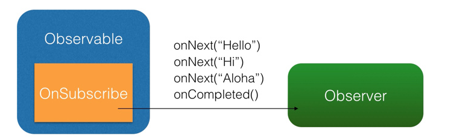
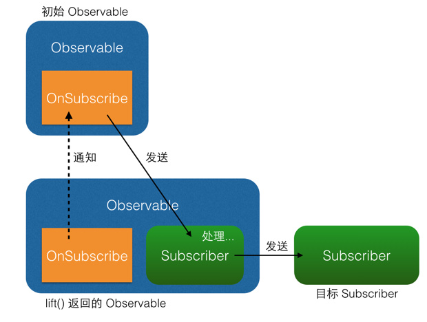
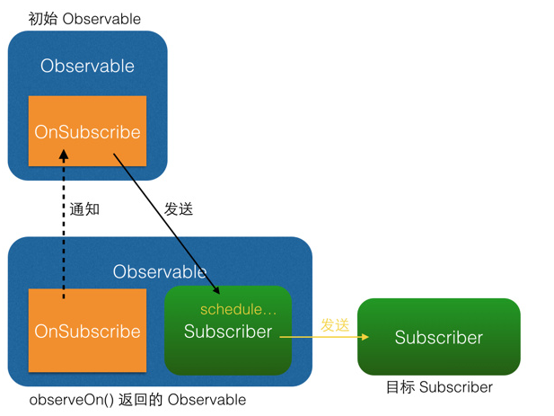
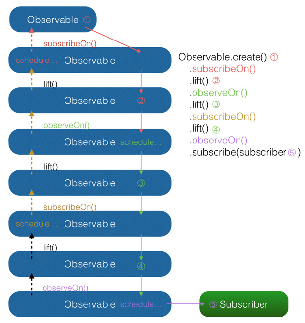

- [给 Android 开发者的 RxJava 详解-扔物线](https://gank.io/post/560e15be2dca930e00da1083)（本文转载自此文）
- [关于RxJava最友好的文章](https://juejin.im/post/580103f20e3dd90057fc3e6d)
- [关于RxJava最友好的文章（进阶）](https://juejin.im/post/5818777f67f356005871ef2c)
- [RxJava2 只看这一篇文章就够了](https://juejin.im/post/5b17560e6fb9a01e2862246f)


## 简介
RxJava (Reactive Extensions for the JVM)。RxJava 在 GitHub 主页上的自我介绍是 

```
"a library for composing asynchronous and event-based programs using observable sequences for the Java VM"（一个在 Java VM 上使用可观测的序列来组成异步的、基于事件的程序的库）
```

总结的说它是一个处理 **异步** 的库。


引入依赖

```
implementation 'io.reactivex:rxjava:1.1.5'
implementation 'io.reactivex:rxandroid:1.1.0'
```

> [RxJava](https://github.com/ReactiveX/RxJava) & [RxAndroid](https://github.com/ReactiveX/RxAndroid)

**为什么使用 RxJava 处理异步**

Rxjava 保证了异步操作的**简洁性**，我们在处理异步的时候一般都需要定义回调接口，随着逻辑越来越复杂，代码回调嵌套会使得人越来越难看懂代码。

#### 对比举例

界面上有一个自定义的视图 `imageCollectorView` ，它的作用是显示多张图片，并能使用 `addImage(Bitmap)` 方法来任意增加显示的图片。现在需要程序将一个给出的目录数组 `File[] folders` 中每个目录下的 png 图片都加载出来并显示在 `imageCollectorView` 中。

> 注意：由于读取图片的这一过程较为耗时，需要放在后台执行，而图片的显示则必须在 UI 线程执行。

```
new Thread() {
    @Override
    public void run() {
        super.run();
        for (File folder : folders) {
            File[] files = folder.listFiles();
            for (File file : files) {
                if (file.getName().endsWith(".png")) {
                    final Bitmap bitmap = getBitmapFromFile(file);
                    getActivity().runOnUiThread(new Runnable() {
                        @Override
                        public void run() {
                            imageCollectorView.addImage(bitmap);
                        }
                    });
                }
            }
        }
    }
}.start();
```

而如果使用 RxJava ，实现方式是这样的：
```
Observable.from(folders)
    .flatMap(new Func1<File, Observable<File>>() {
        @Override
        public Observable<File> call(File file) {
            return Observable.from(file.listFiles());
        }
    })
    .filter(new Func1<File, Boolean>() {
        @Override
        public Boolean call(File file) {
            return file.getName().endsWith(".png");
        }
    })
    .map(new Func1<File, Bitmap>() {
        @Override
        public Bitmap call(File file) {
            return getBitmapFromFile(file);
        }
    })
    .subscribeOn(Schedulers.io())
    .observeOn(AndroidSchedulers.mainThread())
    .subscribe(new Action1<Bitmap>() {
        @Override
        public void call(Bitmap bitmap) {
            imageCollectorView.addImage(bitmap);
        }
    });
```

> RxJava 的实现，是一条从上到下的链式调用，没有任何嵌套，这在**逻辑简洁**上是具有优势的。当需求复杂时，这种优势更加明显。我们还可以使用 [Retrolambda](https://github.com/evant/gradle-retrolambda) 对上面的代码进行简写


## API 介绍和原理解析

#### 概念：扩展的观察者模式
**RxJava 的异步实现，是通过一种扩展的观察者模式来实现的。**

观察者模式面向的需求是：**A 对象（观察者）对 B 对象（被观察者）的某种变化高度敏感，A 需要在 B 变化的一瞬间做出反应**。
 

Android 开发中一个比较典型的例子是点击监听器 OnClickListener 。对设置 **OnClickListener** 来说， **View 是被观察者**， **OnClickListener 是观察者**，二者通过 `setOnClickListener()` 方法达成订阅关系。订阅之后用户点击按钮的瞬间，Android Framework 就会将点击事件发送给已经注册的 `OnClickListener` 。


如图所示，通过 `setOnClickListener()` 方法，Button 持有 `OnClickListener` 的引用。当用户点击时，Button 自动调用 OnClickListener 的 `onClick()` 方法。另外，如果把这张图中的概念抽象出来


（Button -> **被观察者**、OnClickListener -> **观察者**、setOnClickListener() -> **订阅**，onClick() -> **事件**），就由专用的观察者模式（例如只用于监听控件点击）转变成了通用的观察者模式。如下图：


**RxJava 的观察者模式**，RxJava 有四个基本概念：

- **Observable (可观察者，即被观察者)**
- **Observer (观察者)**
- **subscribe (订阅)**
- **事件**。

Observable 和 Observer 通过 `subscribe()` 方法实现订阅关系，从而 Observable 可以在需要的时候发出事件来通知 Observer。

与传统观察者模式不同， RxJava 的事件回调方法除了普通事件 `onNext()` （相当于 `onClick()`）之外，还定义了两个特殊的事件：`onCompleted()` 和 `onError()`。

- **onCompleted()**: 事件队列完结。RxJava 不仅把每个事件单独处理，还会把它们看做一个队列。RxJava 规定，当不会再有新的 onNext() 发出时，需要触发 onCompleted() 方法作为标志。
- **onError()**: 事件队列异常。在事件处理过程中出异常时，onError() 会被触发，同时队列自动终止，不允许再有事件发出。


> 在一个正确运行的事件序列中, onCompleted() 和 onError() 的调用只有一个，并且是事件序列中的最后一个。

RxJava 观察者模式大致如下：


#### 基本实现

基于以上概念，RxJava 的基本实现主要有三点

**1）创建 Observer**

Observer 即观察者，它决定事件触发的时候将有怎样的行为。 RxJava 中的 Observer 接口的实现方式：
```
Observer<String> observer = new Observer<String>() {
    @Override
    public void onNext(String s) {
        Log.d(tag, "Item: " + s);
    }

    @Override
    public void onCompleted() {
        Log.d(tag, "Completed!");
    }

    @Override
    public void onError(Throwable e) {
        Log.d(tag, "Error!");
    }
};
```

除了 Observer 接口之外，RxJava 还内置了一个实现了 Observer 的抽象类：Subscriber。 **Subscriber 对 Observer 接口进行了一些扩展**，但他们的基本使用方式是完全一样的：


```
Subscriber<String> subscriber = new Subscriber<String>() {
    @Override
    public void onNext(String s) {
        Log.d(tag, "Item: " + s);
    }

    @Override
    public void onCompleted() {
        Log.d(tag, "Completed!");
    }

    @Override
    public void onError(Throwable e) {
        Log.d(tag, "Error!");
    }
};
```

不仅基本使用方式一样，实质上，**在 RxJava 的 subscribe 过程中，Observer 也总是会先被转换成一个 Subscriber 再使用**。所以如果你只想使用基本功能，选择 Observer 和 Subscriber 是完全一样的。它们的区别对于使用者来说主要有两点：

- **onStart()**: 这是 Subscriber 增加的方法。它会在 Subscribe 刚开始，而事件还未发送之前被调用，可以用于做一些准备工作，例如数据的清零或重置。这是一个可选方法，默认情况下它的实现为空。需要注意的是，如果对准备工作的线程有要求（例如弹出一个显示进度的对话框，这必须在主线程执行）， onStart() 就不适用了，因为它总是在 subscribe 所发生的线程被调用，而不能指定线程。要在指定的线程来做准备工作，可以使用 doOnSubscribe() 方法，具体可以在后面的文中看到。


- **unsubscribe()**: 这是 Subscriber 所实现的另一个接口 `Subscription` 的方法，用于取消订阅。在这个方法被调用后，Subscriber 将不再接收事件。一般在这个方法调用前，可以使用 `isUnsubscribed()` 先判断一下状态。 `unsubscribe()` 这个方法很重要，因为在 `subscribe()` 之后， Observable 会持有 Subscriber 的引用，这个引用如果不能及时被释放，将有内存泄露的风险。所以最好保持一个原则：**要在不再使用的时候尽快在合适的地方（例如 onPause() onStop() 等方法中）调用 unsubscribe() 来解除引用关系，以避免内存泄露的发生**。

**2）创建 Obervable**

Observable 即被观察者，它决定什么时候触发事件以及触发怎样的事件。 RxJava 使用 `create()` 方法来创建一个 Observable ，并为它定义事件触发规则：

```
Observable observable = Observable.create(new Observable.OnSubscribe<String>() {
    @Override
    public void call(Subscriber<? super String> subscriber) {
        subscriber.onNext("Hello");
        subscriber.onNext("Hi");
        subscriber.onNext("Aloha");
        subscriber.onCompleted();
    }
});
```

可以看到，这里传入了一个 OnSubscribe 对象作为参数。OnSubscribe 会被存储在返回的 Observable 对象中，**它的作用相当于一个计划表，当 Observable 被订阅的时候，OnSubscribe 的 `call()` 方法会自动被调用，事件序列就会依照设定依次触发**（对于上面的代码，就是观察者 Subscriber 将会被调用三次 `onNext()` 和一次 `onCompleted()`）。这样，由被观察者调用了观察者的回调方法，就实现了由被观察者向观察者的事件传递，即观察者模式。

> 这个例子很简单：事件的内容是字符串，而不是一些复杂的对象；事件的内容是已经定好了的，而不像有的观察者模式一样是待确定的（例如网络请求的结果在请求返回之前是未知的）；所有事件在一瞬间被全部发送出去，而不是夹杂一些确定或不确定的时间间隔或者经过某种触发器来触发的。(这个例子只是为了说明原理)


`create()` 方法是 RxJava 最基本的创造事件序列的方法。基于这个方法， RxJava 还提供了一些方法用来快捷创建事件队列，例如：

- `just(T...)`: 将传入的参数依次发送出来。

```
Observable observable = Observable.just("Hello", "Hi", "Aloha");
// 将会依次调用：
// onNext("Hello");
// onNext("Hi");
// onNext("Aloha");
// onCompleted();
```
- `from(T[]) / from(Iterable<? extends T>)` : 将传入的数组或 Iterable 拆分成具体对象后，依次发送出来。

```
String[] words = {"Hello", "Hi", "Aloha"};
Observable observable = Observable.from(words);
// 将会依次调用：
// onNext("Hello");
// onNext("Hi");
// onNext("Aloha");
// onCompleted();
```

> 上面 `just(T...)` 的例子和 `from(T[])` 的例子，都和之前的 `create(OnSubscribe)` 的例子是等价的。

**3）Subcribe(订阅)**

创建了 Observable 和 Observer 之后，再用 `subscribe()` 方法将它们联结起来，整条链子就可以工作了。代码形式很简单：

```
observable.subscribe(observer);
// 或者：
observable.subscribe(subscriber);
```
> 有人可能会注意到， `subscribe()` 这个方法有点怪：它看起来是『observalbe 订阅了 observer / subscriber』而不是『observer / subscriber 订阅了 observalbe』，这看起来就像『杂志订阅了读者』一样颠倒了对象关系。这让人读起来有点别扭，不过如果把 API 设计成 observer.subscribe(observable) / subscriber.subscribe(observable) ，虽然更加符合思维逻辑，但对**流式 API** 的设计就造成影响了，比较起来明显是得不偿失的。

`Observable.subscribe(Subscriber)` 的内部实现是这样的（仅核心代码）：

```
// 去掉了性能、兼容性、扩展性有关的代码后的核心代码
public Subscription subscribe(Subscriber subscriber) {
    subscriber.onStart();
    onSubscribe.call(subscriber);
    return subscriber;
}
```

可以看到，`subscribe()` 做了 3 件事：

- 调用 `Subscriber.onStart()`这个方法在前面已经介绍过，是一个可选的准备方法。
- 调用 Observable 中的 `onSubscribe.call(Subscriber)`(前面提到的事件计划表) 。在这里，事件发送的逻辑开始运行。从这也可以看出，在 RxJava 中， Observable 并不是在创建的时候就立即开始发送事件，而是在它被订阅的时候，即当 `subscribe()` 方法执行的时候。
- 将传入的 Subscriber 作为 Subscription(Subscriber 实现的另一个接口) 返回。这是为了方便 `unsubscribe()`.

整个过程中对象间的关系如下图：



除了 `subscribe(Observer)` 和 `subscribe(Subscriber)` ，`subscribe()` 还支持不完整定义的回调，RxJava 会自动根据定义创建出 Subscriber 。形式如下：


```
Action1<String> onNextAction = new Action1<String>() {
    // onNext()
    @Override
    public void call(String s) {
        Log.d(tag, s);
    }
};
Action1<Throwable> onErrorAction = new Action1<Throwable>() {
    // onError()
    @Override
    public void call(Throwable throwable) {
        // Error handling
    }
};
Action0 onCompletedAction = new Action0() {
    // onCompleted()
    @Override
    public void call() {
        Log.d(tag, "completed");
    }
};


// 自动创建 Subscriber ，并使用 onNextAction 来定义 onNext()
observable.subscribe(onNextAction);


// 自动创建 Subscriber ，并使用 onNextAction 和 onErrorAction 来定义 onNext() 和 onError()
observable.subscribe(onNextAction, onErrorAction);


// 自动创建 Subscriber ，并使用 onNextAction、 onErrorAction 和 onCompletedAction 来定义 onNext()、 onError() 和 onCompleted()
observable.subscribe(onNextAction, onErrorAction, onCompletedAction);
```

- Action0 是 RxJava 的一个接口，它只有一个方法 `call()`，这个方法是无参无返回值的；由于 onCompleted() 方法也是无参无返回值的，因此 Action0 可以被当成一个包装对象，将 `onCompleted()` 的内容打包起来将自己作为一个参数传入 `subscribe()` 以实现不完整定义的回调。这样其实也可以看做将 `onCompleted()` 方法作为参数传进了 `subscribe()`，相当于其他某些语言中的**闭包**。


- Action1 也是一个接口，它同样只有一个方法 `call(T param)`，这个方法也无返回值，但有一个参数；与 Action0 同理，由于 `onNext(T obj)` 和 `onError(Throwable error)` 也是单参数无返回值的，因此 Action1 可以将 `onNext(obj)` 和 `onError(error)` 打包起来传入 `subscribe()` 以实现不完整定义的回调。

>  Action0 和 Action1 在 API 中使用最广泛，RxJava 同时提供了多个 ActionX 形式的接口 (例如 Action2, Action3) 的，它们可以被用以包装不同的无返回值的方法。其实包装就是在方法里面进行了转化，可以看[这篇文章](https://www.cnblogs.com/huolongluo/p/6585809.html)


**4）场景示例**

例1：**打印字符串数组**： 将字符串数组 names 中的所有字符串依次打印出来。


```
// 例1：打印数组
String[] names = {"路飞", "索隆", "乔巴"};
// from 是快捷创建事件序列
Observable.from(names)
        .subscribe(new Action1<String>() {      // Action1 是不完整定义回调
            @Override
            public void call(String s) {
                Log.i("RamonLee", s);
            }
        });
```

运行结果：

```
RamonLee: 路飞
RamonLee: 索隆
RamonLee: 乔巴
```

例2：**由 id 取得图片并显示**

```
final int drawableRes = R.drawable.ic_launcher_background;
Observable.create(new Observable.OnSubscribe<Drawable>() {
    @Override
    public void call(Subscriber<? super Drawable> subscriber) {     // 这个方法会在 subscribe（）调用后调用
        Drawable drawable = getTheme().getDrawable(drawableRes);
        subscriber.onNext(drawable);
        subscriber.onCompleted();
    }
}).subscribe(new Observer<Drawable>() {
    @Override
    public void onCompleted() {

    }

    @Override
    public void onError(Throwable e) {

    }

    @Override
    public void onNext(Drawable drawable) {
        showImage.setImageDrawable(drawable);
    }
});
```

> 在 RxJava 的默认规则中，事件的发出和消费都是在同一个线程的。也就是说，如果只用上面的方法，实现出来的只是一个同步的观察者模式。观察者模式本身的目的就是『后台处理，前台回调』的异步机制，因此异步对于 RxJava 是至关重要的。而要实现异步，则需要用到 RxJava 的另一个概念： **Scheduler** 。

#### 线程控制 Scheduler

在不指定线程的情况下， RxJava 遵循的是线程不变的原则，即：**在哪个线程调用 subscribe()，就在哪个线程生产事件；在哪个线程生产事件，就在哪个线程消费事件**。如果需要切换线程，就需要用到 Scheduler （调度器）。

Scheduler 线程控制器，RxJava 通过它来指定每一段代码应该运行在什么样的线程。RxJava 已经内置了几个 Scheduler
- **Schedulers.immediate()**: 直接在当前线程运行，相当于不指定线程。这是默认的 Scheduler。


- **Schedulers.newThread()**: 总是启用新线程，并在新线程执行操作。


- **Schedulers.io()**: I/O 操作（读写文件、读写数据库、网络信息交互等）所使用的 Scheduler。行为模式和 `newThread()` 差不多，区别在于 io() 的内部实现是是用一个无数量上限的线程池，可以重用空闲的线程，因此多数情况下 `io()` 比 `newThread()` 更有效率。不要把计算工作放在 io() 中，可以避免创建不必要的线程。


- **Schedulers.computation()**: 计算所使用的 Scheduler。这个计算指的是 CPU 密集型计算，即不会被 I/O 等操作限制性能的操作，例如图形的计算。这个 Scheduler 使用的固定的线程池，大小为 CPU 核数。不要把 I/O 操作放在 `computation()` 中，否则 I/O 操作的等待时间会浪费 CPU。


- **AndroidSchedulers.mainThread()**，它指定的操作将在 Android 主线程运行。


有了这几个 Scheduler ，就可以使用 `subscribeOn()` 和 `observeOn()` 两个方法来对线程进行控制了。 

- **subscribeOn()**: 指定 `subscribe()` 所发生的线程，即 `Observable.OnSubscribe` 被激活时所处的线程。或者叫做**事件产生的线程**。 


- **observeOn()**: 指定 Subscriber 所运行在的线程。或者叫做事件消费的线程,也就是回调执行的线程。


```
Observable.just(1, 2, 3, 4)
    .subscribeOn(Schedulers.io())   // 指定 subscribe() 发生在 IO 线程，也就是产生事件的操作
    .observeOn(AndroidSchedulers.mainThread()) // 指定 Subscriber 的回调发生在主线程
    .subscribe(new Action1<Integer>() {
        @Override
        public void call(Integer number) {
            Log.d("RamonLee", "number:" + number);
        }
    });
```

> 上面这段代码中，由于 `subscribeOn(Schedulers.io())` 的指定，被创建的事件的内容 1、2、3、4 将会在 IO 线程发出；而由于 `observeOn(AndroidScheculers.mainThread())` 的指定，因此 subscriber 数字的打印将发生在主线程 。事实上，这种在 `subscribe()` 之前写上两句 `subscribeOn(Scheduler.io())`和`observeOn(AndroidSchedulers.mainThread())` 的使用方式非常常见，它适用于多数的**后台线程取数据，主线程显示**的程序策略。

例：修改前面根据 id 取图片的例子

```
final int drawableRes = R.drawable.ic_launcher_background;
Observable.create(new Observable.OnSubscribe<Drawable>() {
    @Override
    public void call(Subscriber<? super Drawable> subscriber) {     // 这个方法会在 subscribe（）调用后调用
        Drawable drawable = getTheme().getDrawable(drawableRes);
        subscriber.onNext(drawable);
        subscriber.onCompleted();
    }
}).subscribeOn(Schedulers.io())     // 在 io 线程读取图片
  .observeOn(AndroidSchedulers.mainThread())  // 在主线程显示
  .subscribe(new Action1<Drawable>() {
      @Override
      public void call(Drawable drawable) {
          showImage.setImageDrawable(drawable);
      }
});
```

#### 变换

后面讲的 Scheduler 的原理是基于变换的，我们先来看看变换。

**变换**：RxJava 提供了对事件序列进行变换的支持，这是它的核心功能之一。**所谓变换，就是将事件序列中的对象或整个序列进行加工处理，转换成不同的事件或事件序列**。

首先看一个 `map()` 的例子：

```
Observable.just("images/logo.png") // 输入类型 String
    .map(new Func1<String, Bitmap>() {
        @Override
        public Bitmap call(String filePath) { // 参数类型 String
            return getBitmapFromPath(filePath); // 返回类型 Bitmap
        }
    })
    .subscribe(new Action1<Bitmap>() {
        @Override
        public void call(Bitmap bitmap) { // 参数类型 Bitmap
            showBitmap(bitmap);
        }
    });
```

> Fun1 是 Rxjava 的一个接口，用于包装含有一个参数的方法。 Func1 和 Action 的区别在于， Func1 包装的是有返回值的方法

可以看到，`map()` 方法将参数中的 String 对象转换成一个 Bitmap 对象后返回，而在经过 `map()` 方法后，事件的参数类型也由 String 转为了 Bitmap。这种直接变换对象并返回的，是最常见的也最容易理解的变换。不过 RxJava 的变换远不止这样，它不仅可以针对事件对象，还可以针对整个事件队列，这使得 RxJava 变得非常灵活。列举几个常用的变换：

- **map()**: 事件对象的直接变换，具体功能上面已经介绍过(String 转换为了Bitmap)。它是 RxJava 最常用的变换。 map() 的示意图：


- **flatMap()**: 这是一个很有用但**非常难理解**的变换。 首先假设这么一种需求：**假设有一个『学生』对象，现在需要打印出一组学生的名字**。实现方式很简单：


```
Student[] students = ...;
Subscriber<String> subscriber = new Subscriber<String>() {
    @Override
    public void onNext(String name) {
        Log.d(tag, name);
    }
    ...
};
Observable.from(students)
    .map(new Func1<Student, String>() {
        @Override
        public String call(Student student) {
            return student.getName();
        }
    })
    .subscribe(subscriber);
```

很简单，那么再假设：**如果要打印出每个学生所需要修的所有课程的名称，区别在于，每个学生只有一个名字，但却有多个课程** 首先可以这样实现：


```
Student[] students = ...;
Subscriber<Student> subscriber = new Subscriber<Student>() {
    @Override
    public void onNext(Student student) {
        List<Course> courses = student.getCourses();
        for (int i = 0; i < courses.size(); i++) {
            Course course = courses.get(i);
            Log.d(tag, course.getName());
        }
    }
    ...
};
Observable.from(students)
    .subscribe(subscriber);
```


依然很简单。那么如果我不想在 Subscriber 中使用 for 循环，而是希望 Subscriber 中直接传入单个的 Course 对象呢？用 `map()` 显然是不行的，因为 `map()` 是一对一的转化，而我现在的要求是一对多的转化。那怎么才能把一个 Student 转化成多个 Course 呢？这个时候，就需要用 `flatMap()` 了：


```
Student[] students = ...;
Subscriber<Course> subscriber = new Subscriber<Course>() {
    @Override
    public void onNext(Course course) {
        Log.d(tag, course.getName());
    }
    ...
};
Observable.from(students)
    .flatMap(new Func1<Student, Observable<Course>>() {
        @Override
        public Observable<Course> call(Student student) {
            return Observable.from(student.getCourses());
        }
    })
    .subscribe(subscriber);
```

> 从上面的代码可以看出， `flatMap()` 和 `map()` 有一个相同点：**它也是把传入的参数转化之后返回另一个对象。但需要注意，和 `map()` 不同的是， `flatMap()` 中返回的是个 Observable 对象，并且这个 Observable 对象并不是被直接发送到了 Subscriber 的回调方法中(这句话很重要)**。 


flatMap() 的原理是这样的：
- 1.使用传入的事件对象创建一个 Observable 对象；
- 2.并不发送这个 Observable, 而是将它激活，于是它开始发送事件；
- 3.每一个创建出来的 Observable 发送的事件，都被汇入同一个 Observable ，而这个 Observable 负责将这些事件统一交给 Subscriber 的回调方法。

> 这三个步骤，把事件拆成了两级，通过一组新创建的 Observable 将初始的对象『铺平』之后通过统一路径分发了下去。而这个『铺平』就是 `flatMap()` 所谓的 flat。

**flatMap()示意图**


**扩展**：由于可以在嵌套的 Observable 中添加异步代码， `flatMap()` 也常用于嵌套的异步操作，例如嵌套的网络请求。示例代码（Retrofit + RxJava）：


```
networkClient.token() // 返回 Observable<String>，在订阅时请求 token，并在响应后发送 token
    .flatMap(new Func1<String, Observable<Messages>>() {
        @Override
        public Observable<Messages> call(String token) {
            // 返回 Observable<Messages>，在订阅时请求消息列表，并在响应后发送请求到的消息列表
            return networkClient.messages();
        }
    })
    .subscribe(new Action1<Messages>() {
        @Override
        public void call(Messages messages) {
            // 处理显示消息列表
            showMessages(messages);
        }
    });
```
传统的嵌套请求需要使用嵌套的 Callback 来实现。而通过 flatMap() ，可以把嵌套的请求写在一条链中，从而保持程序逻辑的清晰。

- **throttleFirst()**: 在每次事件触发后的一定时间间隔内丢弃新的事件。常用作去抖动过滤(放置打开重复页面)，例如按钮的点击监听

```
RxView.clickEvents(button) // RxBinding 代码，后面的文章有解释
    .throttleFirst(500, TimeUnit.MILLISECONDS) // 设置防抖间隔为 500ms
    .subscribe(subscriber); 
```

> 还有一些其他的事件序列的变换可以查看 [官方文档](https://github.com/ReactiveX/RxJava)

#### 变换的原理 lift()

> 注意： ( 旧版本原理，新版已不使用)，可以学习理解下

新版本操作符原理，可以看[这篇文章](https://juejin.im/post/5818777f67f356005871ef2c)

上面这些变换的实质都是针对事件序列的处理和再发送，在 Rxjava 内部，它们是基于同一个变换方法 `lift(Operator)` 实现的

```
public <R> Observable<R> lift(Operator<? extends R, ? super T> operator) {
    return Observable.create(new OnSubscribe<R>() {
        @Override
        public void call(Subscriber subscriber) {
            Subscriber newSubscriber = operator.call(subscriber);   // 生成一个新的订阅者
            newSubscriber.onStart();
            onSubscribe.call(newSubscriber);    // 原始 onSubscribe 和新订阅者关联
        }
    });
}
```

在理解这段代码之前，我们先来回顾下 `subscribe()` 的源码

```
// 去掉了性能、兼容性、扩展性有关的代码后的核心代码
public Subscription subscribe(Subscriber subscriber) {
    subscriber.onStart();
    onSubscribe.call(subscriber);   // call 里产生了事件序列 onNext/onComplete
    return subscriber;
}
```

再来看看上面的代码

- `subscribe()` 中这句话的 `onSubscribe` 指的是 `Observable` 中的 `onSubscribe` 对象，这个没有问题，但是 `lift()` 之后的情况就复杂了点。


- 当含有 `lift()` 时
    - `lift()` 创建了一个 Observable，加上之前的 Observable， 我们已经有两个 Observable 了。
    - 同样的，新 Observable 中的 OnSubscribe 加上之前的 OnSubscribe，已经有了两个 OnSubscribe。
    - 当用户调用经过 `lift()` 后的 Observable 的 `subscribe()` 的时候，使用的是 `lift()` 所返回的新的 Observable，于是它所触发的 `onSubscribe.call(subscriber)`，也是用的新 Observable 中的新 OnSubscribe，即在 `lift()` 中生成的那个 OnSubscribe
    - 这个新 OnSubscribe 的 `call()` 方法中的 onSubscribe ，就是指的原始 Observable 中的原始 OnSubscribe ，在这个 `call()` 方法里，新 OnSubscribe 利用 `operator.call(subscriber)` 生成了一个新的 Subscriber（Operator 就是在这里，通过自己的 call() 方法将新 Subscriber 和原始 Subscriber 进行关联，并插入自己的『变换』代码以实现变换），然后利用这个新 Subscriber 向原始 Observable 进行订阅。


> `lift()` 过程，有点像一种代理机制，通过事件拦截和处理实现事件序列的变换。



例： 一个将事件中的 Integer 对象转换成 String(这就是自定义实现了 `operator.call(subscriber)` 不建议自己实现)

```
observable.lift(new Observable.Operator<String, Integer>() {
    @Override
    public Subscriber<? super Integer> call(final Subscriber<? super String> subscriber) {
        // 将事件序列中的 Integer 对象转换为 String 对象
        return new Subscriber<Integer>() {
            @Override
            public void onNext(Integer integer) {
                subscriber.onNext("" + integer);
            }

            @Override
            public void onCompleted() {
                subscriber.onCompleted();
            }

            @Override
            public void onError(Throwable e) {
                subscriber.onError(e);
            }
        };
    }
});
```


#### Compose 对 Observable 的整体变换

除了 `lift()` 之外， `Observable` 还有一个变换方法叫做 `compose(Transformer)`。它和 `lift()` 的区别在于， `lift()` 是针对事件项和事件序列的，而 `compose()` 是针对 Observable 自身进行变换。举个例子，假设在程序中有多个 Observable ，并且他们都需要应用一组相同的 `lift()` 变换。你可以这么写：

```
observable1
    .lift1()
    .lift2()
    .lift3()
    .lift4()
    .subscribe(subscriber1);
observable2
    .lift1()
    .lift2()
    .lift3()
    .lift4()
    .subscribe(subscriber2);
observable3
    .lift1()
    .lift2()
    .lift3()
    .lift4()
    .subscribe(subscriber3);
observable4
    .lift1()
    .lift2()
    .lift3()
    .lift4()
    .subscribe(subscriber1);
```

你觉得这样太 low，所以你进行了函数封装

```
private Observable liftAll(Observable observable) {
    return observable
        .lift1()
        .lift2()
        .lift3()
        .lift4();
}
...
liftAll(observable1).subscribe(subscriber1);
liftAll(observable2).subscribe(subscriber2);
liftAll(observable3).subscribe(subscriber3);
liftAll(observable4).subscribe(subscriber4);
```

可读性、可维护性都提高了。可是 Observable 被一个方法包起来，这种方式对于 Observale 的灵活性似乎还是增添了那么点限制。怎么办？这个时候，就应该用 `compose()` 来解决了：

```
public class LiftAllTransformer implements Observable.Transformer<Integer, String> {
    @Override
    public Observable<String> call(Observable<Integer> observable) {
        return observable
            .lift1()
            .lift2()
            .lift3()
            .lift4();
    }
}
...
Transformer liftAll = new LiftAllTransformer();
observable1.compose(liftAll).subscribe(subscriber1);
observable2.compose(liftAll).subscribe(subscriber2);
observable3.compose(liftAll).subscribe(subscriber3);
observable4.compose(liftAll).subscribe(subscriber4);
```

这样 Observalble 对象就不必被包在方法里了


#### 线程控制

`observeOn()` 指定的是 Subscriber 的线程，而这个 Subscriber 不一定是 `subscribe()` 参数中的 Subscriber ，而是 `observeOn()` 执行时的当前 Observable 所对应的 Subscriber ,因此如果有需要我们可以多次切换线程的需求，那么可以多次调用 `oberveOn()`

```
Observable.just(1, 2, 3, 4) // IO 线程，由 subscribeOn() 指定
    .subscribeOn(Schedulers.io())
    .observeOn(Schedulers.newThread())
    .map(mapOperator) // 新线程，由 observeOn() 指定
    .observeOn(Schedulers.io())
    .map(mapOperator2) // IO 线程，由 observeOn() 指定
    .observeOn(AndroidSchedulers.mainThread) 
    .subscribe(subscriber);  // Android 主线程，由 observeOn() 指定
```

> 不同于 `observeOn()` ， `subscribeOn()` 的位置放在哪里都可以，但它是只能调用一次的。为什么？下面讲


#### Scheduler 的原理

其实， `subscribeOn()` 和 `observeOn()` 的内部实现，也是用的 `lift()`。具体看图（不同颜色的箭头表示不同的线程）：

`subscribeOn()` 原理图：


`observeOn()` 原理图：



`subscribeOn()` 的线程切换发生在 OnSubscribe 中，即在它通知上一级 OnSubscribe 时，这时事件还没有开始发送，因此 `subscribeOn()` 的线程控制可以从事件发出的开端就造成影响；而 `observeOn()` 的线程切换则发生在它内建的 Subscriber 中，即发生在它即将给下一级 Subscriber 发送事件时，因此 `observeOn()` 控制的是它后面的线程。

当多个 `subscribeOn()` 和 `observeOn()` 混合使用时，线程调度是怎么发生的




图中共有 5 处含有对事件的操作。由图中可以看出，①和②两处受第一个 subscribeOn() 影响，运行在红色线程；③和④处受第一个 `observeOn()` 的影响，运行在绿色线程；⑤处受第二个 `onserveOn()` 影响，运行在紫色线程；而第二个 `subscribeOn()` ，由于在通知过程中线程就被第一个 `subscribeOn()` 截断，因此对整个流程并没有任何影响。这里也就回答了前面的问题：当使用了多个 `subscribeOn()` 的时候，只有第一个 `subscribeOn()` 起作用。


#### 延伸：doOnSubscribe()

虽然超过一个的 `subscribeOn()` 对事件处理的流程没有影响，但在流程之前却是可以利用的。

在前面讲 Subscriber 的时候，提到过 Subscriber 的 `onStart()` 可以用作流程开始前的初始化。然而 `onStart()` 由于在 `subscribe()` 发生时就被调用了，因此不能指定线程，而是只能执行在 `subscribe()` 被调用时的线程。这就导致如果 `onStart()` 中含有对线程有要求的代码（例如在界面上显示一个 ProgressBar，这必须在主线程执行），将会有线程非法的风险，因为有时你无法预测 `subscribe()` 将会在什么线程执行。

而与 `Subscriber.onStart()` 相对应的，有一个方法 `Observable.doOnSubscribe()` 。它和 `Subscriber.onStart()` 同样是在 `subscribe()` 调用后而且在事件发送前执行，但区别在于它可以指定线程。默认情况下， `doOnSubscribe()` 执行在 `subscribe()` 发生的线程；而如果在 `doOnSubscribe()` 之后有 `subscribeOn()` 的话，它将执行在离它最近的 `subscribeOn()` 所指定的线程。

例： 在主线程显示一个 PregressBar

```
Observable.create(onSubscribe)
    .subscribeOn(Schedulers.io())
    .doOnSubscribe(new Action0() {
        @Override
        public void call() {
            progressBar.setVisibility(View.VISIBLE); // 需要在主线程执行
        }
    })
    .subscribeOn(AndroidSchedulers.mainThread()) // 指定主线程
    .observeOn(AndroidSchedulers.mainThread())
    .subscribe(subscriber);
```

> 上面还需要多看几遍

## RxJava 适用场景和使用方法

#### 与 Retrofit 结合

Retrofit 除了提供传统的 Callback 形式的 api，还提供了 Rxjava 形式的 Observable 形式的api，下面来介绍这两种方式的不同。

以获取一个 User 对象为例，使用 Retrofit Callback API, 这样来定义一个请求

```
@GET("/user")
public void getUser(@Query("userId") String userId, Callback<User> callback);
```

使用这个请求

```
getUser(userId, new Callback<User>() {
    @Override
    public void success(User user) {
        userView.setUser(user);
    }

    @Override
    public void failure(RetrofitError error) {
        // Error handling
        ...
    }
};
```

使用 Rxjava 形式

```
@GET("/user")
public Observable<User> getUser(@Query("userId") String userId);
```

使用的时候是这样的

```
getUser(userId)
    .observeOn(AndroidSchedulers.mainThread())
    .subscribe(new Observer<User>() {
        @Override
        public void onNext(User user) {
            userView.setUser(user);
        }

        @Override
        public void onCompleted() {
        }

        @Override
        public void onError(Throwable error) {
            // Error handling
            ...
        }
    });
```

当 RxJava 形式的时候，Retrofit 把请求封装进 Observable ，在请求结束后调用 `onNext()` 或在请求失败后调用 `onError()`。就看上面的代码 Rxjava 形式好像没有什么优势，那是因为情况还不够复杂

例如：程序取到的 User 并不应该直接显示，而是需要先与数据库中的数据进行比对和修正后再显示。使用 Callback 方式大概可以这么写：

```
getUser(userId, new Callback<User>() {
    @Override
    public void success(User user) {
        processUser(user); // 尝试修正 User 数据
        userView.setUser(user);
    }

    @Override
    public void failure(RetrofitError error) {
        // Error handling
        ...
    }
};
```

看起来很简便，但是千万不要这么做，因为读取数据库是个耗时操作，这么做会影响性能，我们一般要在子线程中处理，所以上面的代码需要改写。

```
getUser(userId, new Callback<User>() {
    @Override
    public void success(User user) {
        new Thread() {
            @Override
            public void run() {
                processUser(user); // 尝试修正 User 数据
                runOnUiThread(new Runnable() { // 切回 UI 线程
                    @Override
                    public void run() {
                        userView.setUser(user);
                    }
                });
            }).start();
    }

    @Override
    public void failure(RetrofitError error) {
        // Error handling
        ...
    }
};
```

性能问题解决了，但是代码太乱了，很难看懂，尤其随着逻辑继续复杂，这时候看看 Rxjava 是怎么做的

```
getUser(userId)
    .doOnNext(new Action1<User>() {
        @Override
        public void call(User user) {
            processUser(user);
        })
    .observeOn(AndroidSchedulers.mainThread())
    .subscribe(new Observer<User>() {
        @Override
        public void onNext(User user) {
            userView.setUser(user);
        }

        @Override
        public void onCompleted() {
        }

        @Override
        public void onError(Throwable error) {
            // Error handling
            ...
        }
    });
```

前台后台代码在一条链中，逻辑清晰了好多。

例： 假设 /user 接口并不能直接访问，而需要填入一个在线获取的 token ，代码应该怎么写？

Callback 方式，可以使用嵌套的 Callback：

```
@GET("/token")
public void getToken(Callback<String> callback);

@GET("/user")
public void getUser(@Query("token") String token, @Query("userId") String userId, Callback<User> callback);

...

getToken(new Callback<String>() {
    @Override
    public void success(String token) {
        getUser(token, userId, new Callback<User>() {
            @Override
            public void success(User user) {
                userView.setUser(user);
            }

            @Override
            public void failure(RetrofitError error) {
                // Error handling
                ...
            }
        };
    }

    @Override
    public void failure(RetrofitError error) {
        // Error handling
        ...
    }
});
```

使用 Rxjava 是这样的

```
@GET("/token")
public Observable<String> getToken();

@GET("/user")
public Observable<User> getUser(@Query("token") String token, @Query("userId") String userId);

...

getToken()
    .flatMap(new Func1<String, Observable<User>>() {
        @Override
        public Observable<User> onNext(String token) {
            return getUser(token, userId);
        })
    .observeOn(AndroidSchedulers.mainThread())
    .subscribe(new Observer<User>() {
        @Override
        public void onNext(User user) {
            userView.setUser(user);
        }

        @Override
        public void onCompleted() {
        }

        @Override
        public void onError(Throwable error) {
            // Error handling
            ...
        }
    });
```

使用一个 flatMap 做了转换，整个代码还是在一条链上。


#### Rxbinding

[RxBinding](https://github.com/JakeWharton/RxBinding) 是 Jake Wharton 的一个开源库，它提供了一套在 Android 平台上的基于 RxJava 的 Binding API。所谓 Binding，就是类似设置 OnClickListener 、设置 TextWatcher 这样的注册绑定对象的 API。

例：使用 Rxbinding 来设置点击监听

```
Button button = ...;
RxView.clickEvents(button) // 以 Observable 形式来反馈点击事件
    .subscribe(new Action1<ViewClickEvent>() {
        @Override
        public void call(ViewClickEvent event) {
            // Click handling
        }
    });
```

看起来只是形式的变化，它的源码里面也就是封装了 `setOnClickListener()` 来实现的。然而，仅仅这一个形式的改变，却恰好就是 RxBinding 的目的：**扩展性**。通过 RxBinding 把点击监听转换成 Observable 之后，就有了对它进行扩展的可能。扩展的方式有很多，根据需求而定。一个例子是前面提到过的 `throttleFirst()` ，用于去抖动，也就是消除手抖导致的快速连环点击：

```
RxView.clickEvents(button)
    .throttleFirst(500, TimeUnit.MILLISECONDS)
    .subscribe(clickAction);
```

#### RxBus

RxBus 名字看起来像一个库，但它并不是一个库，而是一种模式，它的思想是使用 RxJava 来实现了 EventBus。


#### 遇到的问题

- `RxJava OnErrorNotImplementedException 的处理`

解决方案 https://www.jianshu.com/p/436cb79eace5

方法一： 在 Application 的 onCreate 方法中加入异常处理代码

```
RxJavaPlugins.setErrorHandler {
    //异常处理
}
```

方法二：默认重写onError，提供处理的接口

